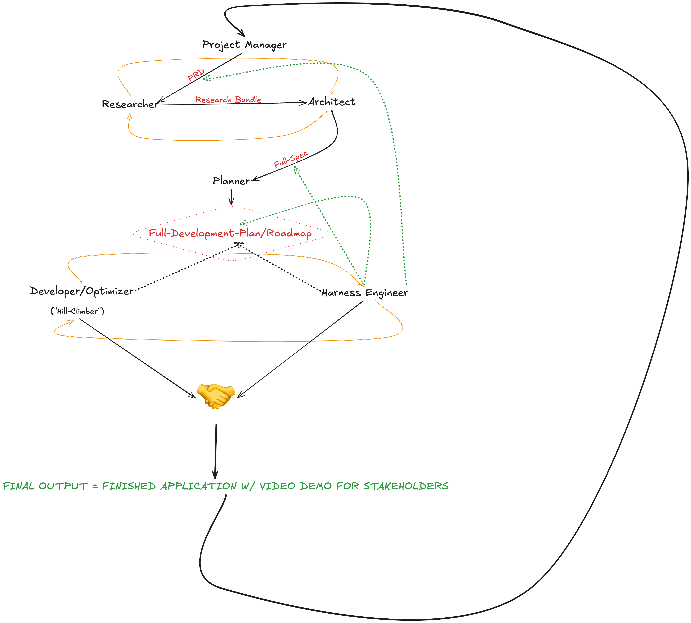

# Long Horizon Meta Harness

## Overview

In this diagram the flow of how artifacts are created and consumed by the meta-agent system is shown along with points where agents weigh in before artifacts are passed along to the next stage.

## Diagram Elements

- **Black arrows**: Show the flow of artifacts through the application.
- **Red text**: Names the artifacts that are passed along the black arrows.
- **Thin Golden arrows**: Show two agents may loop with one another to refine their work. *I.e., the researcher and architect looping in a scenario where the architect determines further research is needed to uncover new possibilities, potential tools or APIs that could be useful for designing the full architecture of the Harness and application the full system has been tasked with developing.*

## Harness Engineer Intervention Points

### Stage 1: Product Requirement Documents

At stage one the harness engineer comes into play to further refine or weigh in on the appropriate evals that are discussed between the project manager and the stakeholder (the user). 

**Key responsibilities:**
- Refine and propose effective evaluation methods for desired stakeholder behaviors
- Design the complete eval suite for behavioral and other stakeholder expectations
- Determine evaluation types:
  - Binary evals
  - Binary score evals  
  - Likert score evals
  - Evaluation categories
- Specify LLM judges and their full specifications
- Create synthetic data to shape harness behavioral criteria
- Calibrate LLM judges before development begins to ensure no need for recalibration during optimization

### Stage 2: Full Specification Artifact

In the second phase, the harness engineer weighs in when the full spec artifact is being passed along to the planner. This is critical because the architect will have introduced objects, tools, or other components into the application that did not exist when the PRD was created.

**Key responsibilities:**
- Create the evaluation suite and full evaluation harness for (but not limited to):
  - System prompts
  - Tools
  - Programmatic behaviors (middleware, etc.)
- Ensure the developer/optimizer agent can effectively hill climb during development

### Stage 3: Development Plan and Roadmap

The third and final intervention point occurs when the planner produces the full development plan and roadmap.

**Key responsibilities:**
- Dictate where evaluation harnesses and experiments should be implemented in the development plan
- Establish expectations for development phase completion
- Set evaluation criteria that must be met before progressing

## Development Process

### Shared Access and Collaboration

The full development plan and roadmap are unilaterally available to both the optimizer agent and the harness engineer (shown by black arrows from both agents to the development plan). Both agents have full access to the development plan at any time.

**Pre-Phase Development Loop:**
Before beginning any roadmap phase, the developer and harness engineer may loop to discuss:
- Contracts defining what "good" looks like
- What must be achieved before entering the phase
- Agreement on completion criteria (regardless of phase)

### Meta-Harness Paradigm

**Information Asymmetry:**
- **Harness Engineer**: Full knowledge of development plan, current phase, and complete evaluation suite (evaluation harness, scoring rubric, acceptance criteria)
- **Developer**: No access to LLM judges, their assembly, or evaluation logic. No knowledge of evaluations, criteria, harness, or scoring rubrics.

**Iterative Development Loop:**
The loop continues iterating for each phase throughout the full development plan and roadmap until:
- The application is fully built
- Both developer and harness engineer agree completion is achieved

### Final Delivery

Once development is complete:
1. A final demo is produced showing all user stories and expectations from the PRD are met
2. The full application and demo video are presented to the project manager
3. The project manager confirms project completion
4. Stakeholders (humans) are brought back into play
