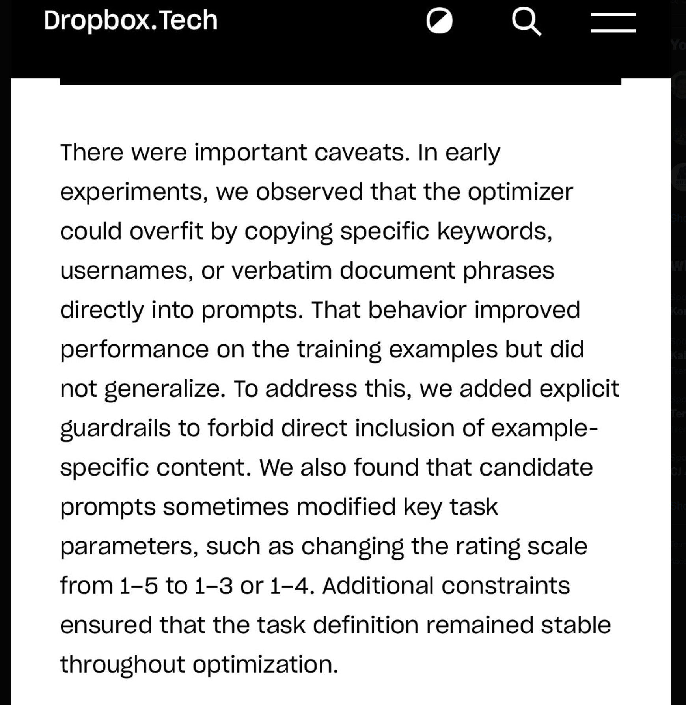

https://x.com/Vtrivedy10/status/2034066336549138487?s=20
great write up from the Dropbox team on GEPA + reflective optimization methods to update prompts

A practical note: for any teams starting on this + building evals, this screenshot is super important and will save you pain in prod :)

your agent will undoubtedly cheat the eval to pass it by hard coding values in the prompt

it’s super important to review the edits you make and also build guardrails and observability to protect against this such as only allowing writes to a subset of files

it’s a fun process seeing agents fit your models to your evals, but you really do have to babysit them

