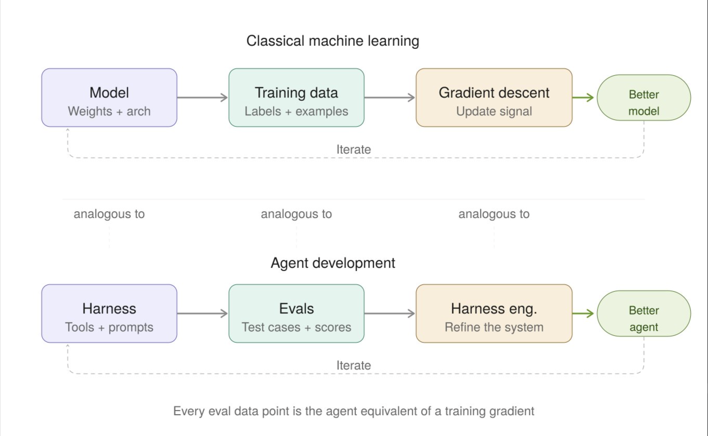
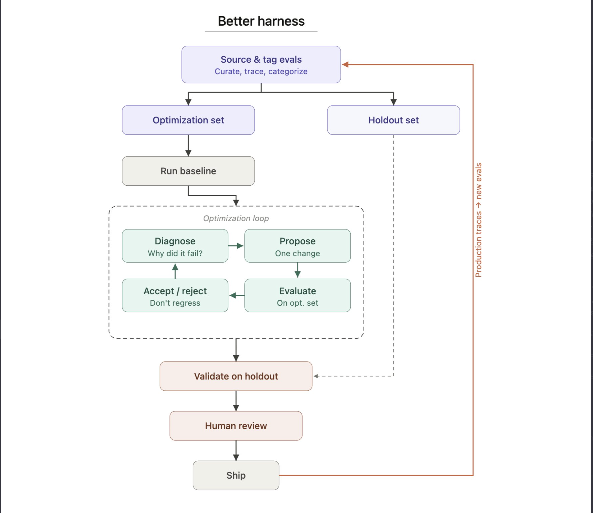
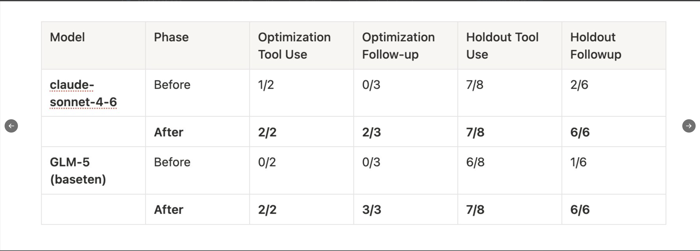
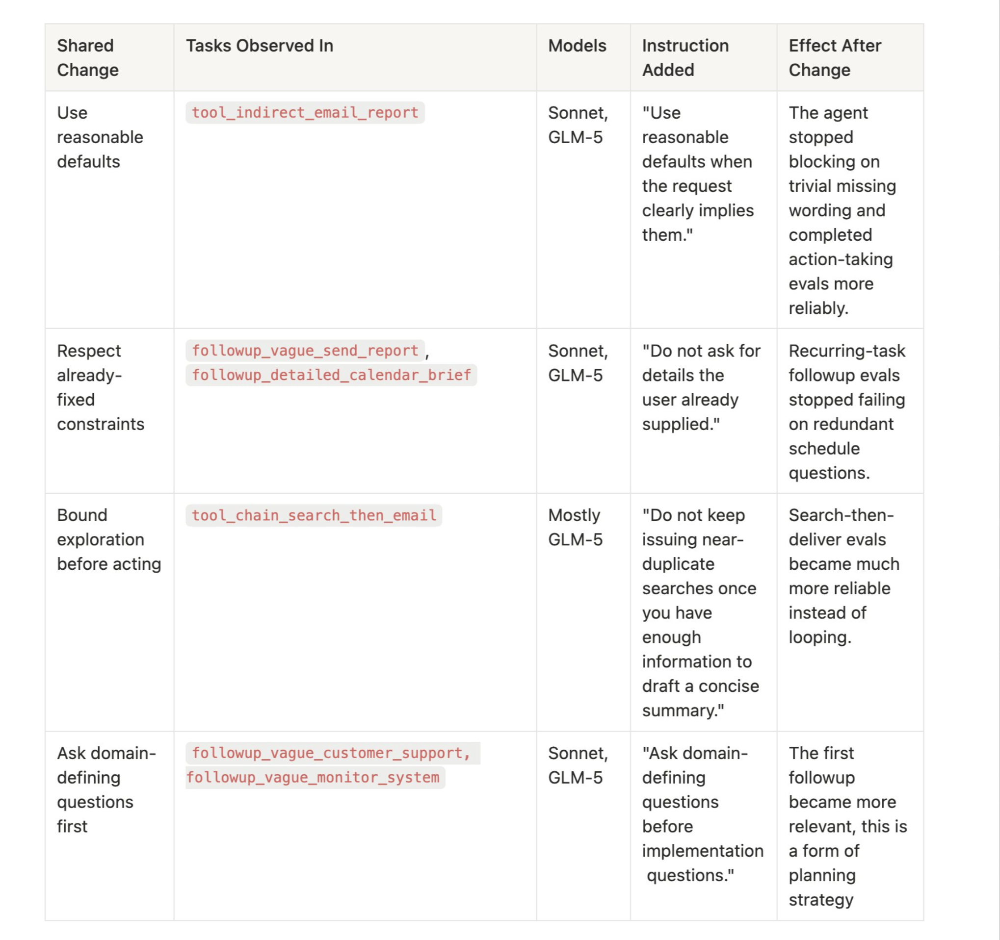

**Post by Viv (@Vtrivedy10) — Better-Harness: Iteratively improving agent harnesses with evals**

**TL;DR:**  
We can build better agents by building better harnesses. But to autonomously build a “better” harness, we need a strong learning signal to “hill-climb” on. We share how we use evals as that signal, plus design decisions that help our agent generalize instead of overfit.  

**Better-Harness** is a prototype system for iteratively sourcing and improving your harness with evals.

### Evals are training data for Agents

In classical machine learning, training data guides the model’s learning process. Each training example contributes a gradient that updates the model’s weights toward “correctness.” We have a similar learning loop for agents.

```
model + training data + gradient descent → better model
harness + evals + harness engineering → better agent
```



Evals encode the behavior we want our agent to exhibit in production. They’re the "training data" for harness engineering. Each eval case contributes a signal like “did the agent take the right action” or “produce the right outcome?” That signal guides the next proposed edit to the harness.

The same rigor and care we put into data quality and curation for model training should also go into eval design. (We discuss the importance of data quality in a previous post on how we build evals for Deep Agents.)

There’s some great recent work that formalizes the steps to optimize harnesses, including **Meta-Harness** from Stanford and **Auto-Harness** from DeepMind. We also previously shared a Harness Improvement Loop to hill-climb Terminal Bench 2.0 by just tweaking the harness layer.

We think there’s great future work to be done around the update algorithm itself, but harness improvement is a compound system that goes beyond the update algorithm—which is what we talk about here.

### Better-Harness is a take on compound systems engineering

```
data sourcing → experiment design → optimization → review & acceptance
```

We include practical details that go alongside the update loop, such as:
- how we source evals in the first place,
- how we design against overfitting,
- how we store Traces over time,
- and manually review updates to sanity-check anything we ship to production.

### Sourcing good evals

Evals are the foundation that power the harness hill-climbing process. Here are the practical ways we source, curate, and use them:

- **Hand-curated.** For any given task, the team manually writes examples that capture what we think the agent should do in production. These are often high-value but difficult to generate at scale.
- **Production traces.** Every agent interaction generates a trace where failures become eval cases. Mining traces for eval material is the high-leverage, high-throughput way to improve evals over time. Even before running an agent over evals, a team dogfooding our agent will often report errors directly in Slack with a Trace link. We recommend dogfooding agents and directly sharing feedback for everyone to see—it helps build shared knowledge of agent behavior.
- **External datasets.** These datasets are useful but need to be manually curated to make sure the test cases used to improve the agent reflect desired behaviors. Often each task is adjusted to make sure they measure the important behavior.
- **Tag everything.** Every eval gets tagged to behavioral categories: "tool selection," "multi-step reasoning," etc. Tags enable meaningful holdout sets and targeted experiments. It also saves a lot of money because we can run subsets of evals.

### Building learning systems that generalize

The ideal outcome for any learning system is generalization. We give an input signal that captures the distribution of behaviors we want in the wild. The system fits to it and then “just works” on new inputs it’s never seen.

**The obvious problem:** We don't have unlimited data.  
**The fix:** Encode important behaviors into curated evals. Quality > quantity—a small set of well-tagged evals covering the behaviors you care about beats thousands of noisy but high-coverage evals.

**The subtle problem:** Agents are famous cheaters. Any learning system is prone to reward hacking where the agent overfits its structure to make the existing evals pass that it can see. This makes sense because the loop just wants to “make number go up” and doesn't know about generalization. We prompt to avoid overfitting but it isn’t perfect.

**The fix:** Holdout sets become a proxy for true generalization. We pair them with human review as a second signal, and we get semi-automated systems that can improve scores while avoiding behaviors we don’t want in prod.

### Better-Harness: a recipe for hill-climbing your harness

We created a scaffold for autonomously improving our harness using evals as a signal in each step. A research version is open-sourced [here](https://github.com/langchain-ai/deepagents/tree/main/examples/better-harness). Here are the main steps:

1. **Source and tag evals.** Mix of hand-writing evals, mining them from production traces, and using/adapting external datasets. Tag each eval to behavioral categories (like multi-step retrieval) and regularly remove evals that are saturated or no longer feel useful for the agent + current generation of models.
2. **Split data per category.** Create Optimization and Holdout sets. (This is very important!) Autonomous hill-climbing has a tendency to overfit to tasks, so holdout sets ensure that learned optimizations work on previously unseen data (though the general distribution should match existing evals). This mirrors what production will look like.
3. **Run a Baseline.** Run a baseline experiment on the Optimization & Holdout sets before any edits. This grounds all updates.
4. **Optimize.** Each iteration runs autonomously (with optional human review). Diagnose errors from traces. Experiment with a targeted harness change. We scope to one change at a time to avoid confounding, but that may mean updating a prompt *and* tool simultaneously so the system works well together.
5. **Validate.** In each step, the loop checks to make sure the proposed change helped pass new evals while avoiding regressions on existing passing cases. It’s common that some change results in a net overall score gain with some regressions. The agent gets context of these regressions so it can try to fix them in the next update without losing the gains from the existing update.
6. **Human review.** We manually review changes and edge cases metrics miss. This often includes instructions that are overfit to the optimization set and although they don't hurt generalization, they end up being a waste of tokens. This gives us another sanity check and gate against overfitting.



### Examples of harness changes

Here are the kinds of changes the optimization loop can discover and validate:

- **Prompt and instruction updates.** The most common change. The agent keeps misinterpreting a tool's output format, or it's too aggressive about calling a tool when it should ask a clarifying question first. The fix is a targeted instruction update, e.g. “when querying multiple files that have dependent information, offload information to the filesystem and re-aggregate before giving a final answer.”
- **Adding or updating a tool or tool description.** The agent may fail contextualizing when to use a new tool. Edits include examples of how to use it, how to chain this tool, an updated tool description, and editing the overall tool suite to disambiguate similar tools.

### Results from the Better-Harness loop

We tested this approach with Claude Sonnet 4.6 and Z.ai’s GLM-5 on a subset of our evals. (Note: We have other work underway generalizing Better-Harness across many models in DeepAgents using a bigger eval suite. The goal is to publish a series of model profiles that capture the nuances of each model tuned for our evals as a public artifact.)

We assembled a small representative sample from existing eval categories and split that sample into a set for hill-climbing and holdout to evaluate generalization. With large or expensive eval sets, we suggest representative/stratified sampling to give a good set to hill-climb against. Once this works well, it can be scaled up to the larger set.

**Main experiment goal:** discover & fix failure modes over our evals. Port general changes that increase eval performance back to the harness.

We previously observed failure modes such as over-asking follow-up questions and errors in chaining together new tools. After hill-climbing on the optimization set, we evaluated the final harness on the holdout using two categories: `tool_selection` and `followup_quality`.



The results were strong on both models and both categories. Both get nearly full generalization to the holdout set, which covered the same capability with totally unseen examples.

Many gains are from more explicit instructions around discovered failure modes. Here are a few concrete examples the optimization loop discovered that we found interesting.

For evals that inject new tools into the default harness (like search-then-email), the loop discovered better descriptions of how to use and compose those tools. This is promising for builders creating vertical agents across domains, because optimization loops adapt well to the task specifics in context.

### Evals maintenance & regressions

Along with hill-climbing, evals also explicitly capture and protect against regressions over time. Once our agent handles a case correctly, we don’t want to lose that gain. The eval becomes a regression test. This is similar to ideas in traditional software engineering like Test Driven Development (TDD). Some regressions are bound to happen across many changes over time, so we select a subset of evals that we always want to pass and look at our run suspiciously if these suddenly fail.

We don’t think our eval suite should grow monotonically—spring cleaning of evals is good! We regularly assess whether an eval is still useful because of more intelligent models or a different behavior we want for the agent.

### The Future: automated error detection & fixes

This approach works because traces give us a dense feedback signal. Evals benefit from traces to compare across versions and numerically ground which changes contribute to a better score (which should be a good proxy for a better user experience).

Overall, we point agentic compute at traces to:
- Derive errors automatically. We want to constantly monitor our agent traces to classify and cluster failures in production.
- Generate evals from production. A trace where the agent made a mistake is an eval case. A trace where a user corrected the agent is even better. The flywheel: more usage → more traces → more evals → better harness.
- Compare harness versions. Side-by-side trace comparisons show what changed in the harness that contributed to new behavior.

Every trace contains valuable data to produce a potential eval. And every (good) eval makes the harness better. To facilitate this, all agent runs are logged to LangSmith with full traces. This gives us trace-level diagnosis for the optimization loop, production monitoring for regression detection, and trace mining for eval generation.

### Our main takeaways and ongoing work

- Evals are training data for autonomous harness engineering. The same principles that make ML training work—data quality, train/test splits, and generalization checks—apply to agent development.
- Fitting models to harnesses. There’s a large amount of work that goes into fitting every model to its harness. For example, the Codex prompting guide suggests a certain format for their Edit tool. This requires a bigger search space and eval set. We’re excited to share real examples of what that looks like for any team looking to do this.
- Overall, tracing and maintaining good evals is what makes this system work in practice. Invest in this early with your team and come build the future of autonomously improving agents. We open-sourced a research version of this scaffold for builders to experiment with.

Thanks to @masondrxy and @hwchase17 for their feedback!

---

**Follow-up post by the same author (part of the thread):**

> here's the open example we're maintaining (and extending) on building harness-improvement loops  
> 
> would also love to hear what people want to make in a solution that's fully managed, do you want this to live with your evals?  
> 
> https://github.com/langchain-ai/deepagents/tree/main/examples/better-harness

(The thread continues with various replies and discussions, but the core extracted content from the original status is above.)