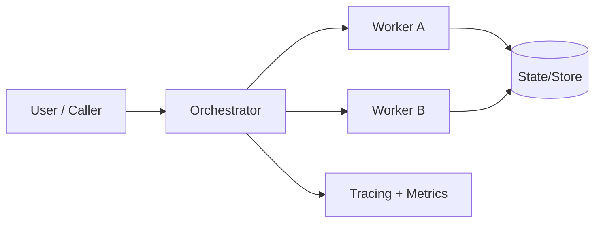
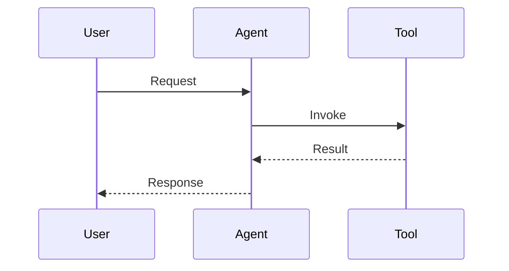

# Architecture Decision Record

> [!TIP]
> Keep this doc concise, factual, and testable. If a claim cannot be verified, add a validation step.

---

## 0) Header

| Field | Value |
|---|---|
| ADR ID | `ADR-001` |
| Title | `Meta Harness Architecture` |
| Status | `Accepted` |
| Date | `2025-10-15` |
| Author(s) | `@Jason` |
| Reviewers | `@Jason` |
| Related PRs | `#NA`, `#NA` |
| Related Docs | `[Spec](./path.md)`, `[Runbook](./runbook.md)` |

**One-liner:** `Meta Harness Architecture`

---

## 1) Decision Snapshot

```txt
We will <Adopt much of the existing ideas, state keys, artifact flow, system prompts and more TBD from the v0.0.5 release> to achieve <Quicker development and deployment>, trading <complexity for simplicity and maintainability> for <the sake of faster iteration and easier maintenance>.
```

### Decision Badge

`Status: Proposed` · `Risk: Medium` · `Impact: High`

---

## 2) Context

### Problem Statement

<What problem are we solving, for whom, and why now?>

### Constraints

- `<constraint 1>`
- `<constraint 2>`
- `<constraint 3>`

### Non-Goals

- [ ] `<Deployment at scale>`
- [ ] `<Threat modeling and security hardening>`
- [ ] `<Full web application deployment>` **[This-wll-flip-very-soon]**

---

## 3) Options Considered

| Option | Summary | Pros | Cons | Verdict |
|---|---|---|---|---|
| A | `<summary>` | `<pros>` | `<cons>` | `Rejected/Selected` |
| B | `<summary>` | `<pros>` | `<cons>` | `Rejected/Selected` |
| C | `<summary>` | `<pros>` | `<cons>` | `Rejected/Selected` |

<details>
<summary><strong>Decision rationale notes</strong> (expand)</summary>

### Why selected option wins

1. `<reason 1>`
2. `<reason 2>`
3. `<reason 3>`

### Why alternatives lose

- Option A: `<reason>`
- Option B: `<reason>`

</details>

---

## 4) Architecture

## Full Repo Structure *Proposed;subject to change.* 

```
meta-harness/
├── pyproject.toml
├── .env.example
│
├── agent.py                          # PM entry point
│
├── prompts/
│   └── project_manager.md            # PM system prompt
│
├── backends/
│   ├── __init__.py                   # make_backend() dispatcher
│   ├── local.py                      # LocalShellBackend + FilesystemBackend
│   └── daytona.py                    # DaytonaSandbox + StoreBackend composite
│
├── subagents/
│   ├── __init__.py                   # exports all sub-agent instances
│   ├── researcher/
│   │   ├── __init__.py
│   │   ├── agent.py                  # make_researcher() factory
│   │   └── system_prompt.md
│   ├── architect/
│   │   ├── __init__.py
│   │   ├── agent.py
│   │   └── system_prompt.md
│   ├── planner/
│   │   ├── __init__.py
│   │   ├── agent.py
│   │   └── system_prompt.md
│   ├── Dev/optimizer/generator/
│   │   ├── __init__.py
│   │   ├── agent.py
│   │   └── system_prompt.md
│   └── harness_engineer/
│       ├── __init__.py
│       ├── agent.py
│       └── system_prompt.md
│
└── tools/
    ├── __init__.py
    ├── research_tools.py
    ├── code_tools.py
    └── eval_tools.py
```

## Full backend memory file system structure *Proposed; subject to change.* 


~/Agents/  
├── AGENTS.md                    ← shared team memory (PM writes here)  
├── pm/  
│   ├── AGENTS.md                ← PM core memory (always loaded via memory=)  
│   ├── memory/                  ← PM on-demand memory files  (not loaded via middleware, selectively, or the agent has full agency on deciding when to load memories or certain memories.)
│   ├── skills/                  ← PM skills (SKILL.md subdirs)  
│   └── projects/                ← PM project tracking (all tagged with a project ID)
├── architect/  
│   ├── AGENTS.md  
│   ├── memory/  
│   ├── skills/  
│   └── projects/                ← Architect project specs
│       ├── specs-(Previous)     ← Previous spec versions (tagged with a project ID. The purpose for storing previous specs and designs is for being able to have a log and an archive of what was designed in the past. Also, this will provide an opportunity later in the future for the agent to review its previous specs and lessons learned, so the agent can then have better procedural knowledge or potentially persist the information to skills.)
│       └── target-spec/         ← Current target specification
├── researcher/
│   ├── AGENTS.md
│   ├── memory/
│   ├── skills/
│   └── projects/
│       └── research-bundles/      ← Compiled research artifacts (tagged with a project ID)
├── planner/
│   ├── AGENTS.md
│   ├── memory/
│   ├── skills/
│   └── projects/
│       └── plans/                   ← Generated development plans
├── dev/                             ← Developer / Generator / Optimizer
│   ├── AGENTS.md
│   ├── memory/
│   ├── skills/
│   └── projects/
│       └── wip/                     ← Work-in-progress implementations
└── harness-engineer/
    ├── AGENTS.md
    ├── memory/
    ├── skills/
    └── projects/
        ├── eval-harnesses/            ← Evaluation harness definitions
        ├── datasets/
        │   ├── public/                ← Public datasets for dev phases
        │   └── held-out/              ← Held-out datasets for final eval
        ├── rubrics/                   ← Scoring rubrics and criteria
        └── experiments/               ← Experiment logs and results  


### System Overview (This should be contain a full system architecture diagram on how the system works, from the first user interaction with PM, to artifact generation, to where and how agent intergect at certain points, where agents loop with one another, and a full system flow diagram for how the agent is deployed, how it emits to any UI/UX layer and more TBD)



### Sequence (optional)



### Data Contracts

```json
{
  "input": "<shape>",
  "output": "<shape>",
  "errors": ["<error_type>"]
}
```

---

## 5) Implementation Plan *Will have an implementation plan for each agent, and a full system implementation plan that will be documented in a separate file @ docs/spec/~~~*

### Milestones <TBD>

- [ ] M1: `<milestone name>`
- [ ] M2: `<milestone name>`
- [ ] M3: `<milestone name>`

### Rollout Strategy <TBD>

| Stage | Traffic / Scope | Guardrails | Rollback Trigger |
|---|---|---|---|
| Dev | `<scope>` | `<checks>` | `<trigger>` |
| Staging | `<scope>` | `<checks>` | `<trigger>` |
| Prod (canary) | `<scope>` | `<checks>` | `<trigger>` |

```diff
- Old behavior: <describe>
+ New behavior: <describe>
```

---

## 6) Observability & Evaluation

### Required Signals

- `<trace field 1>`
- `<metric 1>`
- `<log/event 1>`

### Success Criteria

| Metric | Baseline | Target | Window |
|---|---|---|---|
| `<metric>` | `<value>` | `<value>` | `<time>` |

### Validation Plan

1. `<unit/integration check>`
2. `<load/reliability check>`
3. `<human eval / quality check>`

---

## 7) Risks, Tradeoffs, and Mitigations

> [!WARNING]
> List realistic failure modes, not generic statements.

| Risk | Likelihood | Impact | Mitigation | Owner |
|---|---|---|---|---|
| `<risk>` | `L/M/H` | `L/M/H` | `<mitigation>` | `@owner` |

---

## 8) Security / Privacy / Compliance

- Data classification: `<public/internal/restricted>`
- PII handling: `<none / masked / encrypted>`
- Access model: `<RBAC details>`
- Retention policy: `<duration + deletion mechanism>`

---

## 9) Open Questions

- [ ] `<question 1>`
- [ ] `<question 2>`

---

## 10) Changelog

| Date | Author | Change |
|---|---|---|
| `YYYY-MM-DD` | `@name` | Initial draft |

---

## Appendix

### Links

- [Design Mock](./mock.png)
- [Issue Tracker](https://example.com)

### Image / Diagram


### Footnotes

Key assumption goes here.[^1]

[^1]: `<supporting evidence or citation>`