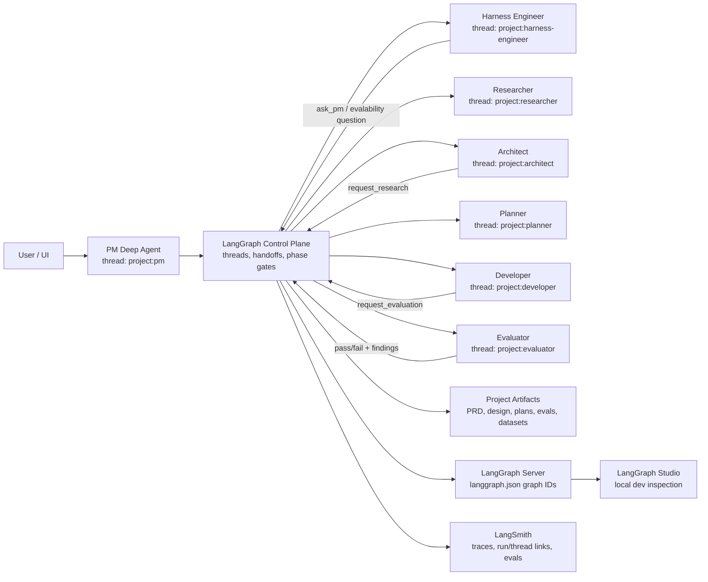
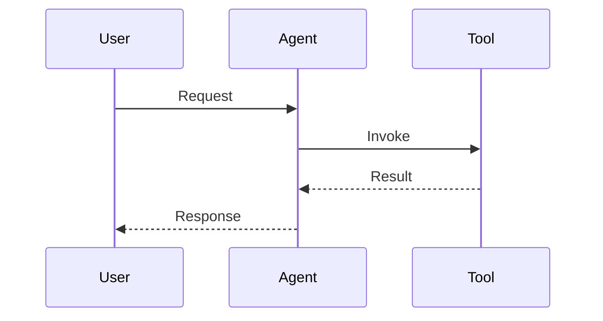

# Architecture Decision Record

> [!TIP]
> Keep this doc concise, factual, and testable. If a claim cannot be verified, add a validation step.

---

## 0) Header

| Field | Value |
|---|---|
| ADR ID | `ADR-001` |
| Title | `Meta Harness Architecture` |
| Status | `Accepted` |
| Date | `2025-10-15` |
| Author(s) | `@Jason` |
| Reviewers | `@Jason` |
| Related PRs | `#NA`, `#NA` |
| Related Docs | `[Requirements Scratch](./tmp.md)`, `[SME Transcript](./SME.md)` |

**One-liner:** `Meta Harness Architecture`

---

## 1) Decision Snapshot

```txt
We will model the PM, Harness Engineer, Researcher, Architect, Planner,
Developer, and Evaluator as peer, stateful Deep Agent graphs, coordinated by a
thin LangGraph control plane. The control plane owns project-scoped thread
identity, handoff routing, run status, and phase gates. The Deep Agent graphs own
role-specific cognition, tools, memory, skills, summarization, and artifact work.
```

### Decision Badge

`Status: Accepted` · `Risk: Medium` · `Impact: High`

---

## 2) Context

### Problem Statement

<What problem are we solving, for whom, and why now?>

### Constraints

- `<constraint 1>`
- `<constraint 2>`
- `<constraint 3>`

### Non-Goals

- [ ] `<Deployment at scale>`
- [ ] `<Threat modeling and security hardening>`
- [ ] `<Full web application deployment>` **[This-wll-flip-very-soon]**

---

## 3) Options Considered

| Option | Summary | Pros | Cons | Verdict |
|---|---|---|---|---|
| A | PM owns core roles as declarative `SubAgent` dict specs | Lowest initial wiring; uses SDK-provided `task` tool | `task` subagent calls are explicitly ephemeral and stateless; specialists cannot reliably resume project-specific trajectory | `Rejected` |
| B | PM owns core roles as `CompiledSubAgent` runnables | Can wrap full `create_deep_agent()` graphs | Stock `task` invocation passes only synthesized state, not a stable `thread_id` config; persistence would require a wrapper outside the first-class path | `Rejected as primary topology` |
| C | PM uses stock `AsyncSubAgent` for each specialist | Supports remote/background execution, status checks, and follow-up updates on the same task thread | `start_async_task` creates a new remote thread each time; not enough by itself for project-scoped specialist identity | `Use only behind a project-aware wrapper` |
| D | Peer `create_deep_agent()` graphs coordinated by a thin LangGraph control plane | Preserves per-agent state, permits direct specialist loops, keeps cognition inside Deep Agents, and makes handoffs observable | Requires a small deterministic control layer and thread/run registry | `Selected` |

<details>
<summary><strong>Decision rationale notes</strong> (expand)</summary>

### Why selected option wins

1. It matches the SDK boundary: `create_deep_agent()` already assembles the agent harness and accepts `checkpointer`, `store`, `backend`, `memory`, `skills`, `subagents`, and `name`.
2. It gives every core role a stable project-scoped thread and its own checkpoint history, rather than forcing PM to carry or restate specialist context.
3. It keeps LangGraph focused on deterministic coordination, not role cognition.

### Why alternatives lose

- Option A: Declarative `SubAgent` specs are for isolated tasks, not durable project roles.
- Option B: `CompiledSubAgent` is a useful escape hatch, but the stock `task` tool does not provide the stable runtime config required for project-scoped checkpoint resume.
- Option C: Stock `AsyncSubAgent` is useful for background execution, but the project must wrap or replace its launch path when project-scoped specialist thread IDs are required.

</details>

---

## 4) Architecture

### Runtime Topology Decision

The core topology is:

```txt
Human/UI
  -> PM Deep Agent thread
      -> LangGraph control plane
          -> Harness Engineer Deep Agent thread
          -> Researcher Deep Agent thread
          -> Architect Deep Agent thread
          -> Planner Deep Agent thread
          -> Developer Deep Agent thread
          -> Evaluator Deep Agent thread
```

The PM is the default front door and scope owner, not the container for all
specialist cognition. The specialists are peer Deep Agent graphs. Each role must
be assembled by its own `create_deep_agent()` factory with `name=` set for trace
metadata, its own tool ownership, its own prompt, its own memory sources, and a
checkpointer-backed project thread.

For project-scoped identity, use one stable thread per `(project_id,
agent_name)` pair:

```txt
thread_id = "{project_id}:{agent_name}"
```

The exact string format can change during implementation, but the invariant
cannot: re-invoking the Harness Engineer for the same project must resume the
Harness Engineer's project thread, not the PM thread and not a fresh subagent
thread.

### LangGraph Control Plane

LangGraph should be the deterministic control plane around the Deep Agent
harnesses. It should not replace the harness. Its responsibilities are:

- Resolve the target agent for a handoff.
- Compute the project-scoped target `thread_id`.
- Ensure the target thread exists, locally or remotely.
- Invoke the target Deep Agent graph with the stable `thread_id`.
- Track run IDs, handoff status, phase gates, and unresolved questions.
- Route phase transitions when a handoff completes or fails.
- Surface human-in-the-loop questions when an agent cannot proceed without stakeholder input.
- Preserve enough control-plane state to reconstruct which agent handed work to whom, why, and with which artifact references.

Its non-responsibilities are equally important:

- Do not implement research, architecture, planning, coding, or evaluation logic in LangGraph nodes.
- Do not put all specialist messages into one shared graph state.
- Do not use the PM as a pass-through for every specialist-to-specialist loop.
- Do not reimplement Deep Agents middleware for planning, memory, skills, filesystem access, summarization, or tool calling.

The control graph should be a small `StateGraph` with coarse nodes, not a large
multi-agent monolith. A reasonable conceptual node set is:

| Node | Purpose |
|---|---|
| `receive_user_input` | Accept new stakeholder input and route it to PM when project scope is still being shaped. |
| `run_agent` | Invoke a named Deep Agent with a handoff brief and stable project-scoped thread config. |
| `ensure_thread` | Idempotently create or look up the target local/remote thread before invocation. |
| `record_handoff` | Append a structured handoff record with caller, target, reason, artifact refs, and run ID. |
| `route_after_agent` | Decide whether the next step is another agent, a phase gate, a human question, or done. |
| `gate_phase` | Enforce required review/eval gates before moving from scoping to harness engineering, architecture, planning, development, and final acceptance. |
| `surface_question` | Turn a specialist question into PM or user-facing HITL, then route the answer back to the asking agent's thread. |

This node list is an architecture guide, not a final schema. The final spec
should keep the same separation: deterministic routing in LangGraph, open-ended
work inside Deep Agents.

### Handoff Protocol

All agent-to-agent communication should go through explicit handoff tools or
control-plane commands. A handoff should carry:

- `project_id`
- `from_agent`
- `to_agent`
- `reason`
- `brief`
- `artifact_refs`
- `expected_output`
- `blocking`
- `phase`

The receiving agent should get a concise brief plus artifact references, not a
dump of the caller's full conversation. The receiving agent resumes its own
project thread and decides what context to load.

Recommended handoff tools:

| Tool | Caller | Target | Use |
|---|---|---|---|
| `handoff_to_harness_engineer` | PM, Architect, Developer | Harness Engineer | Eval criteria, rubric design, calibration, public/held-out datasets, and milestone evals. |
| `request_research` | Architect, Harness Engineer, PM | Researcher | Targeted SDK/API/model capability research. |
| `handoff_to_architect` | PM, Researcher, Harness Engineer | Architect | Design synthesis from PRD, research, and eval constraints. |
| `handoff_to_planner` | Architect, Harness Engineer | Planner | Convert accepted design and public eval criteria into an implementation plan. |
| `handoff_to_developer` | Planner | Developer | Execute an approved phase plan. |
| `request_evaluation` | Developer, PM | Evaluator and/or Harness Engineer | Validate code/spec alignment and run technical evals. |
| `ask_pm` | Any specialist | PM | Ask stakeholder-facing questions without giving the specialist permanent ownership of PM scope. |

Implementation can expose these as Deep Agent tools, but the tools should call a
shared control-plane service rather than directly invoking arbitrary peers. That
keeps thread ID calculation, run tracking, and phase gating centralized.

### Local and Remote Invocation Modes

Support two invocation modes behind the same handoff interface:

1. Local-first mode: the control plane invokes an in-process compiled Deep Agent
   graph with `agent.ainvoke(input, config={"configurable": {"thread_id":
   thread_id}})`. This is the simplest path for local development and testing.
   The local development harness should also expose the graph through a
   `langgraph.json` + `langgraph dev` workflow so LangGraph Studio can inspect
   local graph behavior, thread state, checkpoints, and routing before the
   remote/sandbox layer is introduced.
2. Remote/sandbox mode: the control plane uses the LangGraph SDK. It should call
   `threads.create(thread_id=thread_id, if_exists="do_nothing", metadata=...)`
   and then `runs.create(thread_id=thread_id, assistant_id=graph_id, input=...,
   multitask_strategy=...)`.

Use `multitask_strategy="enqueue"` when a new handoff should wait behind an
active target run. Use `multitask_strategy="interrupt"` only when the new
message should replace or redirect the active run.

Stock `AsyncSubAgent` remains useful for ad hoc background tasks, but it should
not be the primary project-role topology. Its start path creates a new remote
thread and then stores that generated thread ID as the task ID. That is at odds
with the invariant that every specialist role must resume the same
project-scoped thread.

Remote/sandbox mode is a design spike, not a solved implementation detail. It
crosses at least three abstraction boundaries: Deep Agents sandbox/backends,
LangGraph server/SDK threads and runs, and LangSmith trace/run identity. The
selected architecture requires a project-aware wrapper, but the exact mechanism
should be decided after a narrow prototype proves stable thread reuse, run
queuing, artifact access, interrupt behavior, and trace correlation across one
specialist loop.

### Observability, Tracing, and Studio

LangSmith tracing is a first-class requirement for this topology. The control
plane should not rely on ad hoc logs to reconstruct agent behavior after the
fact. Every control-plane handoff and Deep Agent invocation should be searchable
by at least:

- `project_id`
- `agent_name`
- `thread_id`
- `handoff_id`
- `phase`
- `from_agent`
- `to_agent`

LangGraph Studio and LangSmith serve different jobs in the local workflow.
LangGraph Studio is the interactive local development surface for graph
behavior, thread inspection, and checkpoint debugging through `langgraph dev`.
LangSmith is the durable observability and evaluation plane for traces, run
trees, feedback, datasets, experiments, and shareable thread/run links.

Do not assume trace hierarchy will automatically remain intact across the
local/remote/sandbox boundary. The control plane must persist handoff records
and propagate correlation metadata so traces can still be stitched together
when a specialist run occurs in a separate process, server, or sandbox.

### Specialist Loops

Specialist-to-specialist loops should not require PM mediation unless the loop
needs stakeholder clarification or scope authority. Examples:

- PM -> Harness Engineer -> PM when the Harness Engineer needs stakeholder
  clarification before finalizing eval criteria, rubrics, or datasets.
- Architect -> Researcher -> Architect for SDK/API gaps.
- Architect -> Harness Engineer -> Architect for evalability questions in the design.
- Architect -> Planner only after Harness Engineer review of new eval-relevant
  tools, prompts, datasets, and target harness criteria.
- Developer -> Evaluator -> Developer at phase boundaries.
- Developer -> Harness Engineer -> Developer for eval harness failures or dataset issues.
- Developer -> Harness Engineer and Developer -> Evaluator during final
  acceptance, because both agents gate different dimensions of readiness.

The loop is not a direct shared-memory conversation. It is a sequence of
project-scoped agent thread invocations, linked by handoff records and artifact
references in the control plane.

The Developer needs explicit routing guidance because the Harness Engineer and
Evaluator can both block a development phase:

| Target | Owns | Developer should route when |
|---|---|---|
| Harness Engineer | Evaluation science: rubrics, datasets, LLM judges, calibration, experiment design, eval harness behavior, public/held-out dataset policy | A phase fails because the eval harness, metric, judge, dataset, calibration method, or target-harness measurement strategy needs expert review. |
| Evaluator | Acceptance against the accepted plan and design: code/spec alignment, naming and SDK compliance, UI/UX/TUI behavior, test execution, phase pass/fail findings | A phase needs implementation review, UX/TUI verification, design conformance checking, or a hard pass/fail against the approved task plan. |
| PM | Stakeholder scope and business acceptance | A specialist question changes requirements, success criteria, user-facing behavior, or business priority. |

This boundary belongs in the Developer prompt and tool descriptions. The AD
does not need the final schema, but the later implementation spec should encode
the distinction so Developer feedback loops do not collapse into one vague
`request_evaluation` path.

### Source Alignment Notes

- `create_deep_agent()` accepts `checkpointer`, `store`, `backend`, `memory`, `skills`, `subagents`, and `name`, and passes `checkpointer`, `store`, and `name` through to the compiled agent (`.reference/libs/deepagents/deepagents/graph.py:217-236`, `602-623`).
- Declarative `task` subagents are documented as ephemeral and stateless, and the `task` implementation invokes the subagent with synthesized state but no runtime config (`.reference/libs/deepagents/deepagents/middleware/subagents.py:152-162`, `355-376`).
- `CompiledSubAgent` runnables are used as-is, but the same `task` call path still does not provide a stable project `thread_id` config (`.reference/libs/deepagents/deepagents/middleware/subagents.py:488-493`).
- Stock `AsyncSubAgent` launches a remote thread with `client.threads.create()` and uses that generated ID as `task_id`; follow-up updates reuse that task thread (`.reference/libs/deepagents/deepagents/middleware/async_subagents.py:280-318`, `500-548`).
- LangGraph checkpoint memory is keyed by `thread_id`; reusing the same thread accumulates state across invocations (`.venv/lib/python3.11/site-packages/langgraph/graph/state.py:1038-1074`).
- The lower-level LangGraph SDK supports explicit thread creation and explicit run submission against a chosen thread (`.venv/lib/python3.11/site-packages/langgraph_sdk/_async/threads.py:98-143`, `.venv/lib/python3.11/site-packages/langgraph_sdk/_async/runs.py:435-462`, `552-585`).
- The Deep Agents CLI scaffolds `langgraph.json` for `langgraph dev` with a graph entry point and optional checkpointer path (`.reference/libs/cli/deepagents_cli/server.py:85-119`, `.reference/libs/cli/deepagents_cli/server_manager.py:92-115`).
- LangGraph SDK assistants use graph IDs that are normally set in `langgraph.json` (`.venv/lib/python3.11/site-packages/langgraph_sdk/_async/assistants.py:320-350`).
- Deep Agents CLI resolves LangSmith thread URLs only when tracing is configured, and its `/trace` flow tells users to set `LANGSMITH_API_KEY` and `LANGSMITH_TRACING=true` when unavailable (`.reference/libs/cli/deepagents_cli/config.py:1600-1745`, `.reference/libs/cli/deepagents_cli/app.py:2545-2579`).

## Full Repo Structure *Proposed;subject to change.* 

```
meta-harness/
├── pyproject.toml
├── .env.example
│
├── agent.py                          # PM entry point
│
├── prompts/
│   └── project_manager.md            # PM system prompt
│
├── backends/
│   ├── __init__.py                   # make_backend() dispatcher
│   ├── local.py                      # LocalShellBackend + FilesystemBackend
│   └── daytona.py                    # DaytonaSandbox + StoreBackend composite
│
├── subagents/
│   ├── __init__.py                   # exports all sub-agent instances
│   ├── researcher/
│   │   ├── __init__.py
│   │   ├── agent.py                  # make_researcher() factory
│   │   └── system_prompt.md
│   ├── architect/
│   │   ├── __init__.py
│   │   ├── agent.py
│   │   └── system_prompt.md
│   ├── planner/
│   │   ├── __init__.py
│   │   ├── agent.py
│   │   └── system_prompt.md
│   ├── Dev/optimizer/generator/
│   │   ├── __init__.py
│   │   ├── agent.py
│   │   └── system_prompt.md
│   └── harness_engineer/
│       ├── __init__.py
│       ├── agent.py
│       └── system_prompt.md
│
└── tools/
    ├── __init__.py
    ├── research_tools.py
    ├── code_tools.py
    └── eval_tools.py
```

## Full backend memory file system structure *Proposed; subject to change.* 


~/Agents/  
├── AGENTS.md                    ← shared team memory (PM writes here)  
├── pm/  
│   ├── AGENTS.md                ← PM core memory (always loaded via memory=)  
│   ├── memory/                  ← PM on-demand memory files  (not loaded via middleware, selectively, or the agent has full agency on deciding when to load memories or certain memories.)
│   ├── skills/                  ← PM skills (SKILL.md subdirs)  
│   └── projects/                ← PM project tracking (all tagged with a project ID)
├── architect/  
│   ├── AGENTS.md  
│   ├── memory/  
│   ├── skills/  
│   └── projects/                ← Architect project specs
│       ├── specs-(Previous)     ← Previous spec versions (tagged with a project ID. The purpose for storing previous specs and designs is for being able to have a log and an archive of what was designed in the past. Also, this will provide an opportunity later in the future for the agent to review its previous specs and lessons learned, so the agent can then have better procedural knowledge or potentially persist the information to skills.)
│       └── target-spec/         ← Current target specification
├── researcher/
│   ├── AGENTS.md
│   ├── memory/
│   ├── skills/
│   └── projects/
│       └── research-bundles/      ← Compiled research artifacts (tagged with a project ID)
├── planner/
│   ├── AGENTS.md
│   ├── memory/
│   ├── skills/
│   └── projects/
│       └── plans/                   ← Generated development plans
├── dev/                             ← Developer / Generator / Optimizer
│   ├── AGENTS.md
│   ├── memory/
│   ├── skills/
│   └── projects/
│       └── wip/                     ← Work-in-progress implementations
└── harness-engineer/
    ├── AGENTS.md
    ├── memory/
    ├── skills/
    └── projects/
        ├── eval-harnesses/            ← Evaluation harness definitions
        ├── datasets/
        │   ├── public/                ← Public datasets for dev phases
        │   └── held-out/              ← Held-out datasets for final eval
        ├── rubrics/                   ← Scoring rubrics and criteria
        └── experiments/               ← Experiment logs and results  


### System Overview (This should be contain a full system architecture diagram on how the system works, from the first user interaction with PM, to artifact generation, to where and how agent intergect at certain points, where agents loop with one another, and a full system flow diagram for how the agent is deployed, how it emits to any UI/UX layer and more TBD)



### Sequence (optional)



### Data Contracts

```json
{
  "input": "<shape>",
  "output": "<shape>",
  "errors": ["<error_type>"]
}
```

---

## 5) Implementation Plan *Will have an implementation plan for each agent, and a full system implementation plan that will be documented in a separate file @ docs/spec/~~~*

### Milestones <TBD>

- [ ] M1: `<milestone name>`
- [ ] M2: `<milestone name>`
- [ ] M3: `<milestone name>`

### Rollout Strategy <TBD>

| Stage | Traffic / Scope | Guardrails | Rollback Trigger |
|---|---|---|---|
| Dev | `<scope>` | `<checks>` | `<trigger>` |
| Staging | `<scope>` | `<checks>` | `<trigger>` |
| Prod (canary) | `<scope>` | `<checks>` | `<trigger>` |

```diff
- Old behavior: <describe>
+ New behavior: <describe>
```

---

## 6) Observability & Evaluation

### Required Signals

- LangSmith traces for PM and every specialist Deep Agent invocation.
- Control-plane handoff records keyed by `project_id`, `handoff_id`, source agent, target agent, phase, artifact refs, run ID, and resulting gate decision.
- Stable `thread_id` metadata on every project-role run.
- LangGraph Studio local inspection path through `langgraph.json` and `langgraph dev`.
- LangSmith thread/run links exposed in the UI when tracing is configured.
- Evaluation feedback from Harness Engineer and Evaluator kept separate by owner and gate type.

### Success Criteria

| Metric | Baseline | Target | Window |
|---|---|---|---|
| Project-role thread reuse | No stable baseline | Same `(project_id, agent_name)` resumes the same LangGraph thread | Every handoff |
| Handoff traceability | Manual reconstruction | Each handoff has a control-plane record and a LangSmith run/thread reference when configured | Every handoff |
| Developer gate routing | Ambiguous `request_evaluation` target | Developer can distinguish Harness Engineer scientific eval issues from Evaluator implementation/spec acceptance issues | Every phase gate |
| Local dev inspection | Ad hoc terminal logs | A local `langgraph dev` workflow can inspect the control graph in LangGraph Studio | Before remote/sandbox spike |

### Validation Plan

1. Prove local-first PM -> Harness Engineer -> PM with stable threads, visible checkpoints, and LangSmith metadata.
2. Prove Architect -> Researcher -> Architect without PM mediation.
3. Prove Developer -> Evaluator -> Developer and Developer -> Harness Engineer -> Developer route to different gate owners.
4. Only after local-first validation, run a narrow remote/sandbox spike that exercises one specialist loop with explicit thread IDs, queued runs, artifact access, and trace correlation.

---

## 7) Risks, Tradeoffs, and Mitigations

> [!WARNING]
> List realistic failure modes, not generic statements.

| Risk | Likelihood | Impact | Mitigation | Owner |
|---|---|---|---|---|
| Core specialists accidentally implemented as ephemeral `task` subagents | `M` | `H` | Treat `task` as an isolated-worker tool only. Add tests or trace checks that core roles receive stable project-scoped `thread_id`s. | `@Jason` |
| Stock `AsyncSubAgent` creates fresh remote threads for project-role work | `M` | `H` | Use a project-aware handoff wrapper that calls LangGraph SDK thread creation with explicit `thread_id` and `if_exists="do_nothing"`. | `@Jason` |
| Remote/sandbox handoff layer is underestimated | `H` | `H` | Treat as a separate spike. Prove one loop before committing to module names, tool contracts, or production async behavior. | `@Jason` |
| LangGraph control plane grows into a second agent brain | `M` | `M` | Keep LangGraph nodes deterministic and coarse. Deep Agents own cognition; LangGraph owns routing, state, and gates. | `@Jason` |
| Handoff loops become invisible or hard to debug | `M` | `H` | Persist structured handoff records with caller, target, reason, artifact refs, run ID, and resulting gate decision. | `@Jason` |
| LangSmith traces fragment across local, server, and sandbox execution | `M` | `H` | Standardize correlation metadata and expose LangSmith links from the UI. Do not depend on implicit parent/child trace structure across process boundaries. | `@Jason` |
| Developer confuses Harness Engineer feedback with Evaluator feedback | `M` | `M` | Encode the owner split in Developer prompt/tool descriptions and phase-gate records. | `@Jason` |
| Parallel updates interrupt active specialist work unexpectedly | `M` | `M` | Default to queued follow-up runs; reserve interrupt strategy for explicit redirects or stale work cancellation. | `@Jason` |

---

## 8) Security / Privacy / Compliance

- Data classification: `<public/internal/restricted>`
- PII handling: `<none / masked / encrypted>`
- Access model: `<RBAC details>`
- Retention policy: `<duration + deletion mechanism>`

---

## 9) Open Questions

- [ ] Confirm the final module naming for peer specialist agents. The current tree uses `subagents/`, but the selected architecture should not imply these roles are ephemeral SDK `SubAgent` dicts.
- [ ] Decide the production checkpointer and store backend for local-first and remote/sandbox modes.
- [ ] Decide whether the project-aware handoff wrapper is implemented as a LangGraph control graph node, a tool service, custom Deep Agents middleware, or a combination.
- [ ] Define the minimal handoff record schema and phase gate enum in the implementation spec.
- [ ] Decide how LangSmith thread/run links will be exposed in the UI for each project-role thread.
- [ ] Define the `langgraph.json` graph ID convention for PM, control plane, and specialist agents in local development.
- [ ] Spike the remote/sandbox handoff path across Deep Agents backends, LangGraph SDK thread/run APIs, and LangSmith trace correlation.
- [ ] Decide whether the Harness Engineer vs Evaluator gate-owner boundary belongs in this AD, a Developer prompt spec, or a separate evaluation architecture spec.

---

## 10) Changelog

| Date | Author | Change |
|---|---|---|
| `2026-04-11` | `@Codex` | Added LangSmith tracing, LangGraph Studio, remote/sandbox spike, and Developer gate-owner guidance. |
| `2026-04-11` | `@Codex` | Added stateful peer Deep Agents topology and LangGraph control-plane guidance. |
| `YYYY-MM-DD` | `@name` | Initial draft |

---

## Appendix

### Links

- [Design Mock](./mock.png)
- [Issue Tracker](https://example.com)

### Image / Diagram


### Footnotes

Key assumption goes here.[^1]

[^1]: `<supporting evidence or citation>`
