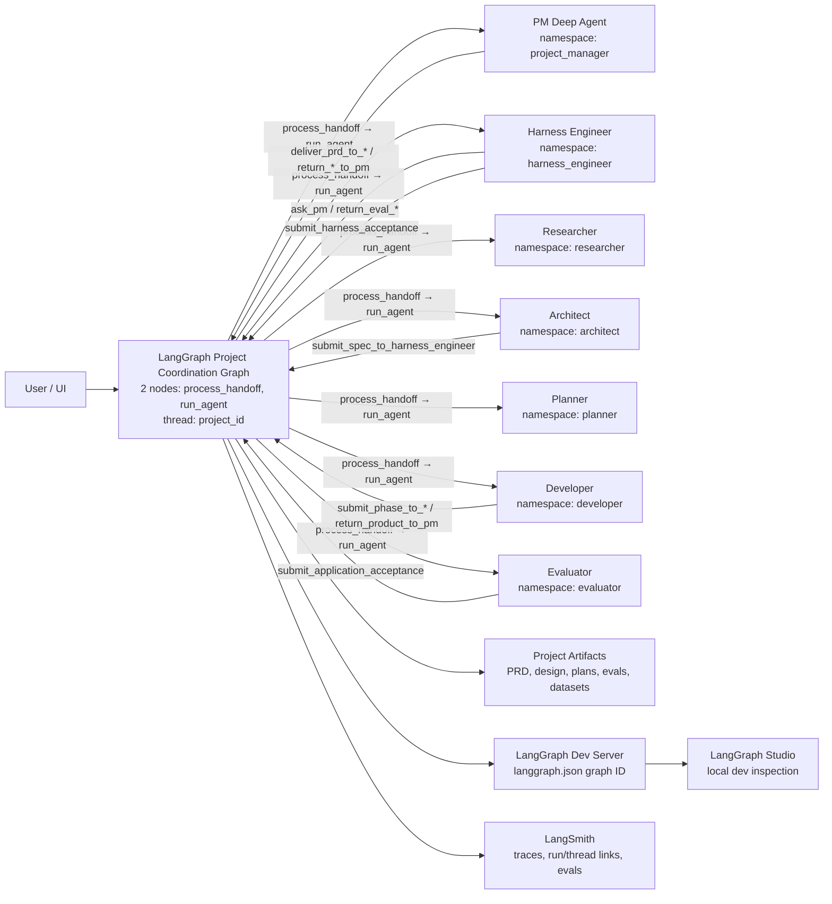
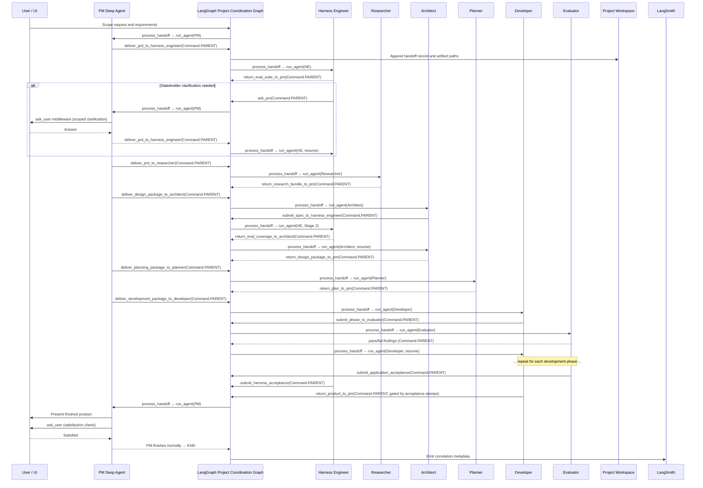

# Architecture Decision Record

> [!TIP]
> Keep this doc concise, factual, and testable. If a claim cannot be verified, add a validation step.

---

## 0) Header

| Field | Value |
|---|---|
| ADR ID | `ADR-001` |
| Title | `Meta Harness Architecture` |
| Status | `Approved for Spec` |
| Date | `2026-04-12` |
| Author(s) | `@Jason` |
| Reviewers | `@Jason` |
| Related PRs | `#NA`, `#NA` |


**One-liner:** `Meta Harness Architecture`

---

## 1) Decision Snapshot

```txt
We will model PM, Harness Engineer, Researcher, Architect, Planner, Developer,
and Evaluator as peer, stateful Deep Agent graphs mounted under a thin LangGraph
Project Coordination Graph for project execution. LangGraph/LangSmith Agent
Server is the runtime boundary for assistants, threads, runs, Store, auth,
persistence, and queueing. The product uses two LangGraph thread kinds:
`pm_session` and `project`. `thread_id` is checkpoint/conversation identity;
`project_id` is durable project identity; `project_thread_id` is the canonical
project execution thread (and may equal `project_id` in local/dev only by
convention). PM session/intake handles non-project and cross-project PM
conversation. Project creation creates a separate project thread and links it to
the parent PM session. Project threads own a project-scoped execution environment
(`project_thread_id -> execution_environment_id`) with managed sandbox/devbox as
the default execution mode (Daytona default provider). Headless and first-party
surfaces run the same lifecycle and contribution model.
```

### Decision Badge

`Status: Approved for Spec` · `Risk: Medium` · `Impact: High`

---

## 2) Context

### Problem Statement

Building, observing, and shipping LLM applications requires a multi-agent system
where specialist agents (evaluation science, research, architecture, planning,
development, quality assurance) collaborate under a project manager that owns
stakeholder communication. Existing approaches either flatten all specialist
cognition into a single agent's context window, force stateless ephemeral
sub-agent calls that cannot resume project-specific trajectories, or require a
heavy orchestration layer that duplicates agent reasoning. We need a topology
that preserves per-agent durable state, supports direct specialist-to-specialist
loops without PM mediation, keeps cognition inside Deep Agent harnesses, and
makes handoffs observable and auditable.

### Constraints

- All core agents must be stateful Deep Agents with stable checkpoint namespaces — no ephemeral `task` subagents for project roles.
- The coordination layer must be thin and deterministic — no LLM calls in PCG nodes, no routing intelligence in the graph.
- Agent-to-agent communication must go through explicit handoff tools that return `Command.PARENT` — no direct peer invocation.
- Phase gate enforcement must be middleware hooks on handoff tools, not PCG conditional edges.
- Agent Server is the runtime boundary for assistants, threads, runs, Store, auth, persistence, and queueing; Meta Harness must not fork thread/runtime identity outside that boundary.
- Meta Harness has exactly two product-level LangGraph `thread_kind` values in base architecture: `pm_session` and `project` (no base `utility` thread kind).
- The system must support project-scoped execution environments from day one with `managed_sandbox` default, plus `external_devbox` and guarded `local_workspace`.
- `managed_sandbox` default provider is Daytona for v1 production/web/headless; LangSmith sandbox can be offered as optional/future/beta.
- The system must leverage the Deep Agents SDK as the primary agent harness — do not reimplement SDK capabilities.

### Non-Goals

- [ ] Threat modeling and security hardening (v1)

---

## 3) Options Considered

| Option | Summary | Pros | Cons | Verdict |
|---|---|---|---|---|
| A | PM owns core roles as declarative `SubAgent` dict specs | Lowest initial wiring; uses SDK-provided `task` tool | `task` subagent calls are explicitly ephemeral and stateless; specialists cannot reliably resume project-specific trajectory | `Rejected` |
| B | PM owns core roles as `CompiledSubAgent` runnables | Can wrap full `create_deep_agent()` graphs | Stock `task` invocation passes only synthesized state, not a stable `thread_id` config; persistence would require a wrapper outside the first-class path | `Rejected as primary topology` |
| C | PM uses stock `AsyncSubAgent` for each specialist | Supports remote/background execution, status checks, and follow-up updates on the same task thread | `start_async_task` creates a new remote thread each time; not enough by itself for mounted project-role identity | `Use only for ad hoc background tasks` |
| D | Peer `create_deep_agent()` graphs mounted under a thin LangGraph Project Coordination Graph | Preserves per-agent state, permits direct specialist loops, keeps cognition inside Deep Agents, and makes handoffs observable | Requires a small deterministic coordination layer and project thread / role namespace registry | `Selected` |

<details>
<summary><strong>Decision rationale notes</strong> (expand)</summary>

### Why selected option wins

1. It matches the SDK boundary: `create_deep_agent()` already assembles the agent harness and accepts `checkpointer`, `store`, `backend`, `memory`, `skills`, `subagents`, and `name`.
2. It gives every core role stable project-scoped state and its own checkpoint history, rather than forcing PM to carry or restate specialist context.
3. It keeps LangGraph focused on deterministic coordination, not role cognition.

### Why alternatives lose

- Option A: Declarative `SubAgent` specs are for isolated tasks, not durable project roles.
- Option B: `CompiledSubAgent` is a useful escape hatch, but the stock `task` tool does not provide the stable runtime config required for project-scoped checkpoint resume.
- Option C: Stock `AsyncSubAgent` is useful for background execution, but it is
  not the core project-role topology because it launches generated remote task
  threads rather than mounted role graphs under the Project Coordination Graph.

</details>

---
🚨 
## Open Questions

### OQ-HO 🚨 🔔 : Highest urgency
- *jason* im not sold on the current approach of our pcg state schema meta_harness/docs/specs/pcg-data-contracts.md i want an our best agent to pick this up. i dont think this was designed intelligently, or maybe it was, sell it to me. The vision.md did not exist when this contract was made, maybe we can do better this time? im being demanding of us becasue i want this project to be written elgantley. 

*note*: this may open up the need for re designing the approach of meta_harness/docs/specs/handoff-tools.md as well, plan accordingly.

### OQ-H1 (High Priority): PM visibility into executing projects

What does the PM need to see inside executing projects so it can be helpful and insightful while in a `pm_session` thread?

### OQ-H2 (High Priority): PCG Schema 🚨 
*Jason*: I dont see the practicality in  `pending_handoff` see: meta_harness/docs/specs/pcg-data-contracts.md ; Need someone to sell me on the value of this and how it earns its place.

### OQ-H3 (High Priority): Developer optimization visibility vs. information isolation 

Vision.md promises iteration-by-iteration trendlines during development. AD §4 declares the Developer is blind to evaluation artifacts. The Harness Engineer must emit a public evaluation dashboard artifact — a sanitized trend/benchmark trail showing how the target harness is trending toward desired benchmarks — written to project memory for PM/web app visibility, while the Developer continues to receive only EBDR-1 feedback packets.

  Why This Is High Value:
Core Value Proposition: Directly enables making invisible work visible (Vision.md thesis: Headless 90% + Artifact Emitter 10%)
Scientific Integrity: Maintains critical information isolation (Developer blind to evaluation artifacts) while showing progress
User Experience: Delivers on promises from README.md: "Evaluation scores trending upward" and "Each iteration of the optimization loop with clear before/after signals"
Artifact-First Philosophy: Embodies D10: "We make the same data irresistibly readable. When you're ready to go deeper, LangSmith is one click away."
Headless-First Balance: Provides the essential progress tracking needed even when users interact primarily via Slack/Discord
Decision Scope:
What metrics to surface (sanitized trend/benchmark trail showing progress toward desired behavior)
Visualization format appropriate for the product's design language (Linear/Bloomberg/Stripe exploration mentioned in D11)
Generation mechanism by Harness Engineer that emits public artifacts without leaking scoring logic/rubrics to Developer
Consumption method via project memory for PM/web app accessibility
Information boundary defining exactly what is included in public artifact vs. what remains in EBDR-1 feedback packets
This decision is foundational to delivering Meta Harness' core promise: democratizing harness engineering by making the optimization loop visible, participatory, and provable to stakeholders while preserving the scientific rigor that makes the process work. Without solving this, you cannot deliver the key user experience of watching "an optimization curve bend toward the target" as proof that the process is working.


### OQ-1 (Medium Priority): HITL during development phases

Vision.md promises optimization tuning and taste calibration during development, but the Developer lacks `AskUserMiddleware` (only PM and Architect have it per Q8). Who owns HITL during dev phases? Options: PM relay via `ask_pm`, or add restricted-scope `AskUserMiddleware` to Developer.

### OQ-H4 (High Priority): PCG schema 🚨 

Really good oppurtunity to potentially learn/enhance understanding wich will lead to refining the approach for assertions in @pcg-data-contracts.md#L42-53 *jason* -- > we really should dig into this, its glazed over like the potential state leakage is solved; im not convinced.


---


## 4) Architecture

### Runtime Topology Decision

The core topology is:

```txt
External source or first-party UI event
  -> source identity resolution (adapter/UI)
  -> LangGraph/LangSmith Agent Server thread lookup or create
  -> run submission on selected thread
      -> if thread_kind = "pm_session": PM Deep Agent (session tools active)
      -> if thread_kind = "project": Project Coordination Graph
          -> PM Deep Agent child graph (project tools active)
          -> Harness Engineer Deep Agent child graph
          -> Researcher Deep Agent child graph
          -> Architect Deep Agent child graph
          -> Planner Deep Agent child graph
          -> Developer Deep Agent child graph
          -> Evaluator Deep Agent child graph
```

Agent Server is the runtime boundary for assistants, threads, runs, Store, auth,
persistence, and queueing. Meta Harness does not create a second thread runtime.

The PM is one Deep Agent — one `create_deep_agent()` call, one identity, one
memory source. It operates across two thread contexts distinguished by
`thread_kind` metadata: `pm_session` and `project`. The PM's tool set adapts at
runtime via middleware that reads `thread_kind` from thread metadata and
conditionally includes session tools (project status, portfolio queries) or
project tools (handoff tools, phase delivery). This is the same mechanism
`FilesystemMiddleware` uses to conditionally expose `execute` based on backend
capabilities — no separate graph compilation required.

The Project Coordination Graph remains the canonical project execution boundary.
When a `project` thread is active, the PM runs as a mounted child graph inside
the PCG. When a `pm_session` thread is active, the PM runs standalone with
session-scoped tools. Same agent, different thread context, different tool surface.

### Thread Identity Model

Meta Harness base architecture has exactly two product-level thread kinds:

- `pm_session`
- `project`

No base `utility` thread kind is defined. Utility/background work is modeled as
tools, subagent tasks, artifacts, or implementation-specific runs owned by a
`pm_session` or `project` thread.

| Identity | Meaning |
|---|---|
| `thread_id` | LangGraph checkpoint/conversation identity |
| `project_id` | Durable Meta Harness project identity |
| `project_thread_id` | Canonical LangGraph thread for one executable project |
| `pm_session_thread_id` | LangGraph thread for non-project/cross-project PM conversation |

`project_thread_id` may equal `project_id` in local/dev, but that is a
convention, not the definition of `project_id`.

`pm_session` is not a second PM identity and not a `ProjectCoordinationState`
key. It is a LangGraph thread with metadata `thread_kind = "pm_session"`. The
PM Deep Agent runs standalone on these threads with session tools active.

### PM Session And Project Entry Model

Default routing rule:

```txt
if request is explicitly bound to a project_thread_id:
    run Project Coordination Graph on that project thread
else:
    run PM Deep Agent on a pm_session thread (session tools active)
```

PM session threads do not mutate into project threads. Project creation creates a
separate project thread and records parent/active links (`parent_pm_thread_id`,
`active_project_id`, `active_project_thread_id`). PM session continues project
work via tools and project memory/registry, not by merging checkpoint threads.

### Headless Ingress vs Source Presence

Headless is a UI/ingress/source-presence paradigm over the same core app, not a
different agent application.

Separate two layers:

| Layer | Responsibility |
|---|---|
| Ingress | External event -> source identity -> LangGraph thread -> Agent Server run |
| Source presence | Tools/middleware that let PM act inside a source during a run |

Core project lifecycle, project thread, execution environment, repository
binding, contribution policy, and PR publication flow stay the same across web,
TUI, Slack, email, Discord, GitHub, Linear, and API. Source-specific channel UX
policy is deferred; this AD keeps source-neutral architecture language.

Role isolation is provided by child graph state schemas and stable checkpoint
namespaces under that project thread:

```txt
checkpoint_ns = ""                         # Project Coordination Graph state
checkpoint_ns = "project_manager"          # PM role state
checkpoint_ns = "harness_engineer"         # Harness Engineer role state
checkpoint_ns = "researcher"               # Researcher role state
checkpoint_ns = "architect"                # Architect role state
checkpoint_ns = "planner"                  # Planner role state
checkpoint_ns = "developer"                # Developer role state
checkpoint_ns = "evaluator"                # Evaluator role state
```

The exact namespace strings can change during implementation, but the invariant
cannot: re-invoking the Harness Engineer for the same project must resume the
Harness Engineer's role state, not the PM state and not a fresh ephemeral
subagent task.

### LangGraph Project Coordination Graph

The Project Coordination Graph is the thin LangGraph orchestration layer around
the Deep Agent harnesses. It should not replace the harness.

Committed naming decision: use `Project Coordination Graph` for this layer and
`ProjectCoordination*` for its concrete schemas, such as
`ProjectCoordinationState`, `ProjectCoordinationContext`,
`ProjectCoordinationInput`, and `ProjectCoordinationOutput`. Do not use bare
`ProjectState` or `ProjectContext` for this graph; those names imply ownership of
the full project domain state and would blur the boundary between deterministic
routing state, project artifacts, project memory, and agent cognition.

Its responsibilities are:

- Accept the handoff command from a Deep Agent tool via `Command.PARENT`.
- Record the handoff in Project Coordination Graph state.
- Invoke the target mounted Deep Agent child graph under its stable role namespace.
- Preserve enough Project Coordination Graph state to reconstruct which agent handed work
  to whom, why, and with which artifact references.

Phase gate enforcement and HITL question surfacing are **not** PCG responsibilities.
They are handled by middleware hooks on the handoff tools (see Handoff Protocol below).

Its non-responsibilities are equally important:

- Do not implement research, architecture, planning, coding, or evaluation logic in LangGraph nodes.
- Do not put all specialist messages into one shared graph state.
- Do not use the PM as a pass-through for every specialist-to-specialist loop.
- Do not reimplement Deep Agents middleware for planning, memory, skills, filesystem access, summarization, or tool calling.
- Do not implement phase gate logic in PCG nodes or conditional edges — phase gates are middleware hooks on handoff tools.
- Do not implement routing intelligence — the calling agent chooses its target via the handoff tool; the PCG is plumbing, not a router.

| Node | Purpose |
|---|---|
| `process_handoff` | On first invocation (no pending handoff): accept stakeholder input, set `current_agent` to PM, create a synthetic handoff record from the user's message. On subsequent invocations: record the handoff, ensure the target role's checkpoint namespace and workspace paths are initialized, and prepare the invocation payload. |
| `run_agent` | Construct a single `HumanMessage` from `pending_handoff.brief` and invoke the target mounted Deep Agent child graph under its stable role namespace. Clear `pending_handoff` on completion. |

#### PCG State Schema (decisions)

The `ProjectCoordinationState` carries only deterministic coordination data —
no agent cognition, no artifact content, no specialist messages. State tracks:
a user-facing `messages` I/O channel (lifecycle bookends only), project
identity (`project_id`, `project_thread_id`), pipeline position
(`current_phase`, `current_agent`), an append-only `handoff_log` audit
trail, and a `pending_handoff` execution cursor consumed by `run_agent`.

**Decision-level invariants:**

- `messages` is the user-facing I/O channel. Only stakeholder input and PM's
  final product response flow through it. Handoff tools do NOT write to it.
  Child agent intermediate output does NOT flow back into it.
- Child agents never see PCG state beyond `messages`. Per-child input schema
  isolation is mandatory on mounted child `add_node` calls.
- `run_agent` constructs the child's input (a single `HumanMessage` from
  `pending_handoff.brief`); the PCG never exposes raw state to children.
- Each mounted Deep Agent owns its own conversation history in its checkpoint
  namespace. PCG `messages` is not a conversation history. Child message
  compaction is handled by the SDK's `SummarizationMiddleware` within each
  agent, not by the PCG.
- `handoff_log` is append-only and acts as the acceptance record for gated
  tools (e.g. `return_product_to_pm`). v1 caps to last N records; N is a
  runtime constant, and cap mitigation is spec territory.
- `pending_handoff` is an execution cursor, not a data store — required by
  the two-node topology to flow data between `process_handoff` and
  `run_agent`.
- Graph lifecycle is PM-controlled. The PCG is transparent to interrupts —
  `ask_user` pauses the PM's child graph, which pauses the PCG node, which
  pauses the graph. Resume flows through automatically.

Field-level schema, reducer choices, cap mitigation mechanisms, and exact
Pydantic/TypedDict wire formats are spec territory.

> Implementation detail (full field table, reducer semantics, all seven
> invariants with rationale): see [`docs/specs/pcg-data-contracts.md`](./docs/specs/pcg-data-contracts.md).

The topology is linear with two nodes:

```txt
START → process_handoff → run_agent(PM)
                                │
                          PM calls handoff tool
                          middleware hook fires (phase gate)
                                │
                          gate passes → Command.PARENT emitted
                          gate fails → tool returns revision prompt to agent
                                │
                          process_handoff → run_agent(target)
                                │
                          target calls handoff or returns
                                │
                          process_handoff → run_agent(next target)  (loop)
```

There are no conditional edges. The only branching happens *before* the
`Command.PARENT` reaches the PCG: the middleware hook on the handoff tool
decides whether to allow the handoff through or return a revision prompt to
the calling agent. If the command reaches the PCG, it always flows through
`process_handoff` → `run_agent`.

### Handoff Protocol

All agent-to-agent communication goes through explicit handoff tools. A handoff
tool returns `Command(graph=Command.PARENT, goto="process_handoff",
update=<handoff_payload>)` rather than directly invoking arbitrary peers. The
PCG records the handoff and invokes the target mounted role graph.

A handoff should carry:

- `project_id`
- `project_thread_id`
- `source_agent`
- `target_agent`
- `reason` (enum: `deliver | return | submit | consult | announce | coordinate | question`)
- `brief` (prose summary for the receiving agent)
- `artifact_paths`

The `reason` enum encodes the *type of transition*, not the pipeline phase.
Middleware dispatches on the `(source_agent, target_agent, reason)` triple to
determine which gate logic to apply. For example, `(PM, HE, deliver)` triggers
the Stage 1 PRD-finalized gate, while `(Architect, HE, submit)` triggers the
Stage 2 spec-acceptance gate.

The receiving agent gets a concise brief plus artifact paths, not a dump of the
caller's full conversation. The receiving agent resumes its own role state and
decides what context to load.

Artifact paths are references by default — the receiving agent reads artifacts
from the caller's namespace via the provided paths. Each agent owns its own
filesystem namespace and tags its artifacts with the `project_id`.

#### `Command.PARENT` Update Contract (decisions)

Handoff tools return `Command(graph=Command.PARENT, goto="process_handoff",
update=...)`. The update dict writes only to PCG coordination keys
(`handoff_log`, `current_agent`, `current_phase`, `pending_handoff`) — it
does NOT include `messages`. Handoff briefs and artifact paths flow through
`handoff_log`, preserving the lifecycle-bookend invariant on `messages`.

**Caller-vs-PCG field ownership** is locked:
- The calling agent populates `project_id`, `project_thread_id`,
  `source_agent`, `target_agent`, `reason`, `brief`, and `artifact_paths`.
- The PCG fills `handoff_id`, `langsmith_run_id`, `status`, and `created_at`
  in `process_handoff`.

**Exception — PM-assembled handoff packages.** For downstream pipeline
delivery tools where the receiving agent needs the full accumulated artifact
set, the PM assembles a consolidated project handoff package — a directory
copied into the receiving agent's filesystem. The receiving agent then owns
and organizes that copy. This applies to
`deliver_planning_package_to_planner` and
`deliver_development_package_to_developer`. Early-stage deliveries remain as
references because those specialists only need a few specific artifacts from
the PM's already-organized namespace. The PM's role as organizer aligns with
its identity as the business-oriented project manager who ensures artifacts
are properly stored and structured before they flow downstream.

> Implementation detail (full update-dict shape with code sample, field
> ownership table): see [`docs/specs/pcg-data-contracts.md`](./docs/specs/pcg-data-contracts.md).

### Phase Gate Middleware

Phase gate enforcement is a middleware hook on each handoff tool, not a PCG node
or conditional edge. When an agent calls a handoff tool, the middleware hook
fires before the `Command.PARENT` is emitted:

1. Inspect the handoff tool call (`source_agent`, `target_agent`, `reason`,
   `artifact_paths`).
2. Check phase prerequisites (e.g., PRD finalized before `(PM, HE, deliver)`;
   spec approved before `(Architect, HE, submit)`;
   deliverables match plan before `(Developer, Evaluator, submit)`).
3. Gate passes → allow the `Command.PARENT` through to the PCG.
4. Gate fails → return a revision/validation prompt to the calling agent instead
   of the command. The agent reflects, revises, and re-attempts.

This keeps the PCG topology linear (no conditional edges) and makes gate logic
extensible: new phase gates are middleware additions, not PCG topology changes.
Different agents can have different gate middleware — the `(PM, HE, deliver)`
gate checks different things than the `(Architect, HE, submit)` gate. The
`(source_agent, target_agent, reason)` triple tells the middleware which gate
logic to apply.

#### Phase Gates

Phase enum values: `scoping`, `research`, `architecture`, `planning`, `development`, `acceptance`.

Two transitions require **explicit user approval**; all others auto-advance:

| Transition | What user reviews | Trigger |
|---|---|---|
| `scoping` → `research` | PRD + eval suite + business-logic datasets, rendered as stakeholder-friendly document package | PM receives completed eval suite from HE, packages it, presents to user |
| `architecture` → `planning` | Full design spec + tool schemas + system prompts, rendered as stakeholder-friendly document package | PM receives completed design from Architect, packages it, presents to user |

**Approval mechanism:** The PM owns a dedicated tool that presents the document package (docx/pdf/pptx) to the user for review. The user can accept, request revisions, or provide feedback. The PM resumes on user response. This is prompt-driven — the PM decides when to invoke the tool based on its system prompt — not a PCG-level interrupt. Exact tool schema and document rendering format are delegated to the implementation spec.

**Autonomous mode:** A runtime toggle that, when enabled, auto-advances all gates including the two approval gates. In autonomous mode the PM still packages the documents but does not pause for user review.

**All other transitions** (research → architecture, planning → development, development → acceptance, and any specialist-to-specialist handoffs) auto-advance via handoff tools. Middleware gates on handoff tools enforce prerequisite checks (e.g., PRD finalized before `(PM, HE, deliver)`) but do not require user approval.

#### PCG State Growth and Parent-to-Child Context Propagation

**Child agents do not see PCG state.** LangGraph maps parent state to child graph input by shared key names only. The Deep Agent input schema (`_InputAgentState`) defines a single key: `messages`. The implementation MUST set `input_schema=_InputAgentState` on each `add_node` call for mounted child graphs — without this, LangGraph defaults to passing the full parent state schema, which would leak PCG-private keys into child agents. The `run_agent` node controls exactly what enters the child's `messages` input (a single `HumanMessage` constructed from `pending_handoff.brief`).

**`messages` growth is bounded by design.** The `messages` key accumulates only lifecycle bookends — stakeholder input and the PM's final product response. It never grows during pipeline execution. Over a project thread's lifetime, `messages` contains at most 2 entries per lifecycle cycle (one `HumanMessage` in, one `AIMessage` out), plus any follow-up re-invocations.

**Unbounded handoff log growth is a persistence concern, not a context-flooding concern.** The handoff log accumulates in the PCG's own checkpoint state. Child agents never read it. However, an unbounded log bloats checkpoint storage over time. The AD mandates a cap strategy; the exact mechanism is delegated to the implementation spec:

- **v1:** Cap the handoff log to the last N records per project thread. The cap threshold N is a runtime constant. The mitigation mechanism for records that exceed the cap is delegated to the implementation spec (options: summarize into a string field, migrate to LangGraph Store, or discard with a count marker).
- **v2 option:** Move the full handoff history to the LangGraph `Store` (key-value) instead of the PCG state, so the PCG state never grows. The `run_agent` node and middleware can query the store on demand.

**Child agent message compaction** is handled by the Deep Agents `SummarizationMiddleware`, which is already in every agent's middleware stack. No additional compaction mechanism is needed at the PCG level for child agent context.

#### Gate-Ownership Boundary: Harness Engineer vs Evaluator

The two QA-gate roles own orthogonal dimensions of target-application quality:

| Gate Owner | Dimension | Evaluates | Does not evaluate |
|---|---|---|---|
| **Harness Engineer** | Target *harness* (LLM agent behavior) | Eval rubric validity, dataset coverage, judge calibration, trajectory quality, scenario testing (binary + Likert) | Code style, SDK conventions, UI functionality |
| **Evaluator** | Target *application* (code/software behavior) | Spec-code alignment, naming/SDK conventions, UI/UX functionality, feature completeness, integration correctness | Eval science, rubric design, judge calibration |

**Conditional scope:** The Harness Engineer only gates when the target application includes an LLM/harness component. If no target harness exists, the Evaluator covers all dimensions.

**Routing enforcement:** The Developer system prompt encodes which tool to call for which gate dimension (`submit_phase_to_harness_engineer` for target-harness concerns, `submit_phase_to_evaluator` for target-application concerns). The AD defines the boundary; the prompt owns the routing.

#### Handoff Tool Use-Case Matrix (decisions)

Tools are organized into six categories by transition type. The naming
convention is `<verb>_<artifact|phase>_package_to_<role>`: the tool name reads
as a sentence that tells both the calling agent and any maintainer exactly what
is flowing where. Single-artifact deliveries use the artifact name
(e.g. `deliver_prd_to_harness_engineer`); composite package deliveries use the
phase name plus `package` (e.g. `deliver_design_package_to_architect`) to signal
that the PM is handing off a consolidated bundle of accumulated artifacts.

Verb semantics also encode blocking behavior:
- **`deliver`** = the caller is handing off ownership of a pipeline stage (blocking)
- **`return`** = the specialist is returning completed work to the PM or calling specialist (blocking)
- **`submit`** = the caller is submitting work for review or evaluation (blocking)
- **`consult`** = the caller is requesting expert input without transferring ownership (non-blocking)
- **`announce`** = the caller is pushing intent or a heads-up without expecting a deliverable back (non-blocking)
- **`ask`** = the caller is asking a question (non-blocking)
- **`coordinate`** = QA agents are aligning with each other (non-blocking)

Meta Harness v1 ships **23 handoff tools across six categories**: Pipeline
Delivery, Pipeline Return, Acceptance, Stage Review, Phase Review, and
Specialist Consultation. Agent-scoped tool ownership (which agent owns which
tools), the full tool matrix (caller, target, artifact flow, middleware gate),
and the end-to-end pipeline flow diagram are the interface contract derived
from this protocol.

**Acceptance gate logic for `return_product_to_pm`** is a locked AD decision:
the middleware gate checks `handoff_log` for acceptance stamps. Evaluator
acceptance is always required. Harness Engineer acceptance is required only
if the HE was ever invoked in the project thread (gate derives HE relevance
by scanning `handoff_log`; no `has_target_harness` state key). If no HE
participation is found, the HE acceptance check is skipped.

> Implementation detail (full tool matrix, agent-scoped ownership table,
> pipeline flow diagram): see [`docs/specs/handoff-tools.md`](./docs/specs/handoff-tools.md).

### Project-Scoped Execution Environment

Meta Harness v1 uses a single Project Coordination Graph with peer role Deep
Agents mounted as child subgraphs. This is the only v1 project-role topology.
The PM remains the user-facing agent inside that topology.

Sandbox support does not change the graph topology. A sandbox is a backend and
runtime environment for file and shell/tool execution, not a separate top-level
agent application. A sandbox-backed role agent is still a mounted child graph; it
just receives a sandbox-capable backend.

Terminology is locked as follows: **project memory/artifact filesystem** means
Deep Agents file/memory storage for one project's artifacts and context;
**global memory** is limited to procedural skills, org-level preferences, and
minimal project registry entries; **execution environment** means the agent's
actual computer for code work. For any project that requires implementation,
evaluation, or publication, Meta Harness resolves a project-scoped execution
environment from the project thread.

Project-scoped environment binding model:

```txt
project_thread_id -> execution_environment_id -> provider sandbox/devbox/local root
```

The default v1 production/web/headless execution mode is `managed_sandbox` with
Daytona as the default provider. LangSmith sandbox may remain available as an
optional/future/beta provider. Enterprise deployments may use `external_devbox`
through a customer-managed provider such as Runloop, Modal, LangSmith, Daytona,
or internal infrastructure. `local_workspace` remains explicit opt-in and must be
guarded because shell access runs on the user's machine.

PM session threads do not receive execution environments by default. Environment
resolution happens for project threads.

The execution environment must support the full contribution path:

```txt
resolve environment
  -> resolve existing repo or create greenfield workspace
  -> clone/refresh repo when a remote repo exists
  -> create or checkout working branch when git publication is selected
  -> implement and run checks/evals
  -> publish according to policy: VM-only, artifact export, staging repo,
     client repo, or draft PR
  -> attach artifact/repo/PR/check evidence to project memory and PM handoff
```

Brownfield contribution flow must support clone existing repo, create/select
working branch, run checks/evals, commit, push, and open draft PR.

Greenfield projects may start in VM/devbox and publish later to a Meta Harness
staging repo, client repo, or archive artifact. Immediate remote GitHub repo
creation is not required.

This workflow is not headless-only. Headless channels, the web app, the TUI, and
local-first mode all route to the same project thread and execution environment
contract. The interaction surface changes; the repo contribution mechanism does
not.

#### Native Web App Execution Environment Invariant

From day one, the web app must expose the project-scoped computer and its state:

- repo binding and branch
- files and diffs
- command/check/eval logs
- previews/artifacts
- PR URL/status and commit SHA
- environment health/reconnect state

The web app is not a separate runtime model; it is a first-party surface over
the same project thread and execution environment contract.

#### GitHub Credentials For Sandbox Work

At architecture level, follow Open SWE's credential pattern:

- GitHub App/OAuth-style access resolution
- short-lived or auth-proxied credentials for sandbox/devbox operations
- never persist long-lived GitHub secrets in sandbox filesystems

Exact broker/token wiring remains implementation-spec territory.

LangGraph thread state does not live inside the sandbox. In local mode it lives
in the local checkpointer; in LangGraph Platform cloud it lives in managed
LangGraph/LangSmith infrastructure; in hybrid/self-hosted deployments it lives
in the customer's configured infrastructure. The sandbox/devbox is separate
runtime infrastructure referenced by project thread metadata. PM session threads
must access project information through permissioned project memory, artifact
indexes, project-thread runs, or authenticated sandbox file APIs, not by
unrestricted cross-thread VM access.

Separate remotely deployed role assistants are out of scope for v1. That topology
would communicate through LangGraph SDK thread/run APIs rather than native
`Command.PARENT`, and it should not be treated as the default Meta Harness
handoff model.

The local development harness should expose the Project Coordination Graph
through `langgraph.json` + `langgraph dev` so LangGraph Studio can inspect graph
behavior, project thread state, child checkpoint namespaces, and routing.

Stock `AsyncSubAgent` remains useful for ad hoc background tasks, but it should
not be the primary project-role topology. Its start path creates a new remote
thread and then stores that generated thread ID as the task ID. That is at odds
with the invariant that every core role is a mounted, stateful Deep Agent child
graph under the Project Coordination Graph.

### Observability, Tracing, and Studio

LangSmith tracing is a first-class requirement for this topology. The
Project Coordination Graph should not rely on ad hoc logs to reconstruct agent behavior
after the fact. Every Project Coordination Graph handoff and Deep Agent invocation should
be searchable by at least:

- `project_id`
- `agent_name`
- `thread_id`
- `handoff_id`
- `phase`
- `from_agent`
- `to_agent`

LangGraph Studio and LangSmith serve different jobs in the local workflow.
LangGraph Studio is the interactive local development surface for graph
behavior, thread inspection, and checkpoint debugging through `langgraph dev`.
LangSmith is the durable observability and evaluation plane for traces, run
trees, feedback, datasets, experiments, and shareable thread/run links.

Do not assume trace hierarchy alone is enough to reconstruct project behavior.
The Project Coordination Graph must persist handoff records and propagate
correlation metadata so sandbox-backed tool work, role graph runs, and phase-gate
decisions can be stitched together in LangSmith.

#### Local Development Tracing — Configuration and Architecture


- `LANGSMITH_TRACING=true` must be explicit. Neither `langgraph dev` nor the
  Deep Agents CLI auto-enables tracing — both check for `LANGSMITH_API_KEY` and
  `LANGSMITH_TRACING` before activating the tracing pipeline
  (`.reference/libs/cli/deepagents_cli/config.py:1622-1628`).
- `LANGSMITH_PROJECT=meta-harness` is the v1 project name. All local dev, CI,
  and production runs flow to the same LangSmith project; environment is
  distinguished by `metadata` on the run, not by project name.
- `LANGCHAIN_CALLBACKS_BACKGROUND=false` is required for eval and experiment
  runs to flush traces synchronously before process exit. Safe to leave on for
  interactive dev sessions.

**Trace hierarchy — no explicit wiring required:**

LangGraph Pregel automatically propagates a child callback manager (scoped to
`graph:step:<N>`) into every node's `RunnableConfig` via
`manager.get_child(f"graph:step:{step}")` (`.venv/lib/python3.11/site-packages/langgraph/pregel/_algo.py:694-698`).
When a mounted Deep Agent child graph executes as a subgraph node inside the
Project Coordination Graph, it inherits the parent's LangSmith run context
through this mechanism. Each role agent invocation appears as a nested run
under the PCG root run automatically. No `parent_run_id` threading in
application code is needed or appropriate.

**Role identity in traces — free via `name=`:**

`create_deep_agent(name=<role>)` passes the name to `create_agent()` as the
graph run name and also embeds it as `lc_agent_name` in the `metadata` block
on every run from that agent
(`.reference/libs/deepagents/deepagents/graph.py:617-622`). Every role
(e.g. `"pm"`, `"developer"`, `"harness-engineer"`) will be identifiable by
name in LangSmith without additional instrumentation.

**Correlation metadata placement:**

The seven required searchable fields are split across two concerns:

- `project_id`, `agent_name`, `thread_id` — set once on the PCG's
  `.with_config({"metadata": {...}})` at graph initialization time, scoped to
  the project thread.
- `handoff_id`, `phase`, `from_agent`, `to_agent` — handoff-scoped fields;
  carried by the handoff record schema and not set as LangSmith run metadata
  directly. These are retrieved by querying handoff records, not by filtering
  LangSmith runs.

### Specialist Loops

Specialist-to-specialist loops should not require PM mediation unless the loop
needs stakeholder clarification or scope authority. Examples:

- PM -> Harness Engineer -> PM when the Harness Engineer needs stakeholder
  clarification before finalizing eval criteria, rubrics, or datasets.
- Architect -> Researcher -> Architect for SDK/API gaps.
- Architect -> Harness Engineer -> Architect for evalability questions in the design.
- Architect -> Planner only after Harness Engineer review of new eval-relevant
  tools, prompts, datasets, and target harness criteria.
- Developer -> Evaluator -> Developer at phase boundaries.
- Developer -> Harness Engineer -> Developer for eval harness failures or dataset issues.
- Developer -> Harness Engineer and Developer -> Evaluator during final
  acceptance, because both agents gate different dimensions of readiness.

The loop is not a direct shared-memory conversation. It is a sequence of mounted
role graph invocations under the project thread, linked by handoff records and
artifact references in the Project Coordination Graph.

The Developer needs explicit routing guidance because the Harness Engineer and
Evaluator can both block a development phase:

| Target | Owns | Developer should route when |
|---|---|---|
| Harness Engineer | Evaluation science: rubrics, datasets, LLM judges, calibration, experiment design, eval harness behavior, public/held-out dataset policy | A phase fails because the eval harness, metric, judge, dataset, calibration method, or target-harness measurement strategy needs expert review. |
| Evaluator | Acceptance against the accepted plan and design: code/spec alignment, naming and SDK compliance, UI/UX/TUI behavior, test execution, phase pass/fail findings | A phase needs implementation review, UX/TUI verification, design conformance checking, or a hard pass/fail against the approved task plan. |
| PM | Stakeholder scope and business acceptance | A specialist question changes requirements, success criteria, user-facing behavior, or business priority. |

This boundary belongs in the Developer prompt and tool descriptions. The AD
does not need the final schema, but the later implementation spec should encode
the distinction so Developer feedback loops do not collapse into one vague
`request_evaluation` path.

### Agent Primitive Decisions

The following per-agent configuration decisions extend the base architecture. They were resolved as Q8–Q13 in the agent primitives round (2026-04-13). Full rationale, design detail, and parameter tables are in [DECISIONS.md](./DECISIONS.md).

**Locked constraints (summary):**

- **Universal middleware baseline (all 7 agents):** `CollapseMiddleware`, `ContextEditingMiddleware`, `SummarizationToolMiddleware`, `ModelCallLimitMiddleware`, `StagnationGuardMiddleware`. Per-agent variation: PM and Architect additionally receive `AskUserMiddleware`; PM, Developer, and Architect receive phase gate middleware. Per-agent call limits and stagnation thresholds are configured at agent factory time — see `agents/catalog.py` for values.
- **29 distinct `(source, target, reason)` triples** from 23 tools. Gate types: 19 ungated, 6 prerequisite-only, 2 prerequisite+user-approval, 2 stamp-only. `handoff_log` is the append-only ground truth for gate dispatch; `current_phase` is a fast-fail optimization only.
- **Tool schema:** 2 common LLM-facing parameters (`brief: str`, `artifact_paths: list[str]`). 6 tools add one extra parameter: acceptance tools add `accepted: bool`; phase review tools add `phase: str`. `HandoffRecord` extended with `accepted: bool | None`.
- **Model selection:** Model-agnostic, per-agent, thread-scoped (immutable for project lifespan). v1 experimental defaults: PM/Researcher/Planner/Evaluator → Opus 4.6; Architect/HE/Developer → TBD (experimentation required).
- **System prompts:** External `.md` files next to each agent factory. AD locks behavioral invariants (must-recognize, must-not-do, self-awareness trigger) per agent; prompt text is spec territory. Autonomous mode: PM auto-approves the two user-approval gates by creating `(PM, PM, submit, accepted=true)` records.
- **Anthropic provider profile:** Adopts `ClaudeBashToolMiddleware` and `FilesystemClaudeMemoryMiddleware`. Rejects text-editor and file-search middleware (overlap with `FilesystemMiddleware`). Requires v1 server-side tools (`web_search`, `web_fetch`, `code_execution`, `tool_search`) injected via `AnthropicServerSideToolsMiddleware`. Per-agent tool assignments: Researcher/Architect primary for `web_search`/`web_fetch`; Developer/HE/Evaluator for `code_execution`; Developer for `tool_search`. See DECISIONS.md Q13 for full rationale.
- **Per-agent skill allocation (Q17):** Each agent's `skills=[]` list on `create_deep_agent()` is fixed at factory time. PM: `doc-coauthoring`, `internal-comms`, `prompt-architect` (to-be-created). Architect: `langchain`, `langsmith`, `web-artifacts-builder`, `theme-factory`, `frontend-design`, `doc-coauthoring`, `claude-api`, `openai-docs`. Planner: `doc-coauthoring`. Developer: `langchain`, `langsmith`, `remember`. Evaluator: `langsmith-evaluator-feedback`, `remember`, `playwright`, `webapp-testing`. Harness Engineer: `langsmith-evaluator-feedback`, `langsmith`, `remember`. Researcher: none allocated (web research delivered via tools, not skills; open question tracked in §5). **Document rendering for PM stakeholder deliverables (`pdf`, `pptx`, `docx`) is explicitly not a PM skill** — those capabilities are delegated to a narrowly-scoped rendering subagent owned outside the seven peer roles, and must not be re-added to the PM skill list. See DECISIONS.md Q17 for per-agent rationale and the prompt-vs-skill boundary.

### Per-Agent Skill Allocation (Q17)

v1 skill allocation per agent. Paths are relative to the project root.

| Agent | Skills | Purpose |
|---|---|---|
| PM | `doc-coauthoring`, `internal-comms`, `prompt-architect` | Structured PRD/eval/stakeholder co-authoring; standardized stakeholder and team communication; prompt engineering for downstream agents. |
| Architect | `langchain`, `langsmith`, `web-artifacts-builder`, `theme-factory`, `frontend-design`, `doc-coauthoring`, `claude-api`, `openai-docs` | LangChain/LangGraph/Deep Agents reference; observability patterns; TUI and artifact design; spec authoring; model-family reference. |
| Planner | `doc-coauthoring` | Structured task-document authoring. |
| Developer | `langchain`, `langsmith`, `remember` | SDK implementation reference; tracing integration; persistent dev-session memory. |
| Evaluator | `langsmith-evaluator-feedback`, `remember`, `playwright`, `webapp-testing` | Evaluator feedback standard; cross-session evaluation memory; UI/UX verification via browser automation and local webapp interaction. |
| Harness Engineer | `langsmith-evaluator-feedback`, `langsmith`, `remember` | Evaluator feedback standard; full LangSmith knowledge (datasets, experiments, tracing, evaluation pipelines); cross-session experiment memory. |
| Researcher | *(none at v1)* | Research capabilities are delivered through tools (`web_search`, `web_fetch`) rather than skills. Open question on adding `web-research` and/or `remember` is tracked in §5. |

**Prompt-vs-skill boundary.** Two knowledge domains are explicitly *not* skills and must be encoded as system-prompt behavioral invariants under Q12:

- **Architect model-behavior awareness.** The Architect's system prompt must encode awareness that its primary model knowledge covers Opus 4.6, ChatGPT 5.4, and GPT 5.4 Pro. For any model outside that set, the Architect must request the Researcher to investigate behavior and provider documentation before designing for it.
- **Harness Engineer `agentevals` SDK knowledge.** The HE's system prompt must encode full working knowledge of the `agentevals` SDK — `EvaluatorResult`, LLM-as-judge, trajectory scoring, `GraphTrajectory`, tool-call matching. This is always-active domain expertise, not progressively disclosed via skill.

**Rendering subagent delegation.** PM document rendering for stakeholder deliverables (Word/PDF/PowerPoint) is delegated to a narrowly-scoped rendering subagent, not embedded as PM skills. The corresponding Anthropic rendering skills (`docx`, `pdf`, `pptx`) are therefore absent from the PM `skills=[]` list by design. The rendering subagent's contract is out of scope for Q17 and is picked up separately.

Full rationale, path table, and the skill-vs-prompt decision record are in [DECISIONS.md](./DECISIONS.md) Q17.

### User Interface Surface (Q14)

v1 ships a Textual TUI launched via `langgraph dev`. The Deep Agents CLI TUI is adopted as the base layer — same framework, same brand theme, same widget patterns — extended for multi-agent pipeline awareness.

**Adopted from CLI (direct reuse):** `AskUserMenu`, `ApprovalMenu`, `ChatInput`, message rendering widgets, status bar, loading widgets, theme system.

**Adapted from CLI:** `ThreadSelector` → project selector, `ModelSelector` → per-agent model config, `WelcomeBanner` → Meta Harness branding.

**Novel extension — pipeline awareness:** Active agent indicator, phase progress, handoff progress visualization, approval gate status, autonomous mode toggle. No reference implementation exists; spec team owns the widget design.

**AD locks information requirements, not visual design.** The TUI must surface: active agent, current phase, handoff log, user messages, `ask_user` prompts, approval gates, autonomous mode, model selections, LangSmith trace links. How these render is spec territory.

**Deployment evolution:** v1 ships two parallel first-party surfaces: (1) a Textual TUI launched via `langgraph dev` for local development and (2) a web app (Next.js + `@langchain/react`) connecting to a LangGraph Platform deployment for artifact emission and stakeholder interaction. The TUI is the builder's surface; the web app is the product's public face and artifact emitter (see Vision.md D1, D10). Both use the same PM session/project-thread model. Project execution surfaces run the same PCG backend on `project_thread_id`; local/dev may set `project_thread_id = project_id` by convention, but `project_id` remains the durable domain identity. Web-app auth and deployment configuration will be specified when web app development begins. Later distribution can add `pip install meta-harness` and expanded public headless ingress without changing the project execution model.

### Source Alignment Notes

SDK design rationale and canonical source paths are documented in [AGENTS.md](./AGENTS.md) → `local-docs/SDK_REFERENCE.md`. Verify exact SDK behavior there before reimplementing. The architecture decisions above are grounded in these SDK invariants with architectural implications:

- Declarative `task` subagents are ephemeral and stateless — no stable `thread_id` config (rejects Option A).
- `AsyncSubAgent` creates a new remote task thread per invocation — not the v1 mounted-graph model (rejects Option C).
- Mounted subgraph persistence uses the parent `thread_id` with stable child `checkpoint_ns` (enables Option D).
- Meta Harness must import/adapt SDK patterns, not mirror them as first-pass app-owned modules (`runtime/`, `checkpointers.py`, `stores.py`, `model_policy.py`).

## Repo and Workspace Layout (decisions)

The v1 repo is organized around peer Deep Agent factories, not around a
PM-owned `subagents/` bucket. The root `graph.py` is the approved LangGraph
application entrypoint and the self-contained deterministic Project
Coordination Graph factory. The selected topology makes `agents/` the
approved module name for core roles. SDK `SubAgent` dicts, if any are later
needed for ephemeral isolated tasks, are reserved for a narrowly named
`task_agents/` module inside the owning role, not at the top level.

**Locked naming decisions:**

- Use `agents/` for PM and peer specialists. Do not use top-level
  `subagents/` for core roles.
- Use `developer/` as the canonical module. Generator and optimizer are
  responsibilities inside the Developer prompt and tool descriptions, not
  module names.
- Use root `graph.py` for the deterministic PCG — mirrors the LangGraph and
  Deep Agents CLI graph-entrypoint convention and prevents premature
  package sprawl before the first implementation proves its shape.
- Use `integrations/` for sandbox provider wiring, following the Deep
  Agents CLI convention (`sandbox_provider.py` + `sandbox_factory.py`).
- Do not add first-pass `runtime/`, `checkpointers.py`, `stores.py`,
  `model_policy.py`, or `middleware_profiles.py` packages. Construct
  backend, checkpointer, store, model, and middleware configuration at
  the SDK boundary that consumes it. Import SDK abstractions directly
  instead of wrapping them behind app-owned convention files.
- Keep `tools/` for now, but do not name nested tool modules until concrete
  tool contracts exist.

### LangGraph Project Coordination Graph Factory Contract (decisions)

The PCG is a LangGraph application boundary. It is not a Deep Agent and it
is not an agent registry. `langgraph.json` points to either
`./graph.py:graph` or `./graph.py:make_graph`; prefer `make_graph` if
runtime config is needed. Role factories are `create_<role>_agent()`
returning Deep Agent graphs via `create_deep_agent()`.

PCG nodes do deterministic plumbing only: `process_handoff` records the
handoff and prepares the invocation payload; `run_agent` constructs a
`HumanMessage` from the handoff brief and invokes the mounted child graph,
then clears `pending_handoff`. Phase gate enforcement, HITL question
surfacing, and routing intelligence are NOT PCG responsibilities. The PCG
must not implement research, architecture, planning, development,
eval-science, prompt composition, phase gate logic, or provider/model
request policy. Those remain in peer Deep Agent factories, SDK
configuration calls, tool/prompt contracts, and middleware hooks.

### Project Workspace and Memory Structure (decisions)

The memory filesystem is role-scoped. Each role owns its own `AGENTS.md`
memory file, `memory/` on-demand files, `skills/` directory, and
`projects/` artifact directory. A shared team memory file at the workspace
root is writable by the PM. Backend routing maps this layout onto disk or
sandbox storage through SDK backends; the AD defines workspace semantics,
not backend layers.

**Locked decisions:**

- Per-role memory namespaces, not a flat shared memory.
- The `dev/` path is a workspace bucket (Developer's role), not a Python
  module naming decision.
- The Harness Engineer owns held-out datasets in its own namespace; public
  datasets are shared only via PM-delivered packages.
- The Architect retains prior spec versions alongside a current
  `target-spec/` pointer.

> Implementation detail (full repo tree, factory code sample, naming
> rationale, workspace tree): see
> [`docs/specs/repo-and-workspace-layout.md`](./docs/specs/repo-and-workspace-layout.md).

### System Overview



### Sequence (optional)



### Data Contracts (decisions)

The `HandoffRecord` field set and enum values are locked as AD decisions:

- **Fields:** `project_id`, `project_thread_id`, `handoff_id`, `source_agent`,
  `target_agent`, `reason`, `brief`, `artifact_paths`, `langsmith_run_id`,
  `status`, `created_at`.
- **`source_agent` / `target_agent` enum:**
  `project-manager | harness-engineer | researcher | architect | planner | developer | evaluator`.
- **`reason` enum:** `deliver | return | submit | consult | announce | coordinate | question`.
- **`status` enum:** `queued | running | completed | failed`.
- **`created_at`:** RFC3339 timestamp set by the PCG when the handoff is
  recorded.
- **`target_agent` maps 1:1 to the checkpoint namespace** in v1; no separate
  `target_role_namespace` field needed.
- **`reason` encodes the *type of transition*, not the pipeline phase.**
  Middleware dispatches on the `(source_agent, target_agent, reason)` triple.
  The `question` reason covers specialist-to-PM stakeholder questions — no
  separate `question` field needed.

Exact Pydantic/TypedDict wire format and JSON rendering are spec territory.

> Implementation detail (full JSON schema, field-level notes): see
> [`docs/specs/pcg-data-contracts.md`](./docs/specs/pcg-data-contracts.md).

---

## 5) Spec Derivation Model

Implementation contracts derived from this AD live in `docs/specs/`. Each
spec:

- Derives from one or more AD sections via a provenance header.
- Is registered in `§9 Decision Index → Derived Specs`.
- Is referenced from its parent AD section by a one-line pointer.

Specs never introduce new architectural decisions. If spec writing surfaces
a decision, it is escalated to AD first, the AD change lands, then the spec
updates and bumps `last_synced`.

Governance for `docs/` (creation rules, provenance requirements,
co-modification, deprecation, folder growth) is defined in
[`AGENTS.md`](./AGENTS.md) → **Documentation Hierarchy**.

This model replaces the prior Requirements/Design/Task three-document spec
handoff. Specs emerge from AD decision clusters as they reach critical mass;
there is no predetermined spec-document count or order.

---

## 6) Observability & Evaluation

### Required Signals

- LangSmith traces for PM and every specialist Deep Agent invocation.
- Project Coordination Graph handoff records keyed by `project_id`, `handoff_id`, source agent, target agent, phase, artifact refs, run ID, and resulting gate decision.
- Stable project `thread_id`, role `checkpoint_ns`, and `agent_name` metadata on every mounted role invocation.
- LangGraph Studio local inspection path through `langgraph.json` and `langgraph dev`.
- LangSmith thread/run links exposed in the UI when tracing is configured.
- Evaluation feedback from Harness Engineer and Evaluator kept separate by owner and gate type.

### Success Criteria

| Metric | Baseline | Target | Window |
|---|---|---|---|
| Project-role state reuse | No stable baseline | Same `(project_id, agent_name)` resumes the same mounted role graph state | Every handoff |
| Handoff traceability | Manual reconstruction | Each handoff has a Project Coordination Graph record and a LangSmith run/thread reference when configured | Every handoff |
| Developer gate routing | Ambiguous `request_evaluation` target | Developer can distinguish Harness Engineer scientific eval issues from Evaluator implementation/spec acceptance issues | Every phase gate |
| Local dev inspection | Ad hoc terminal logs | A local `langgraph dev` workflow can inspect the Project Coordination Graph, project thread, and role namespaces in LangGraph Studio | Before v1 implementation hardening |

### Validation Plan

1. Prove Project Coordination Graph -> PM -> Harness Engineer -> PM with a stable project thread, visible role checkpoint namespaces, and LangSmith metadata.
2. Prove Architect -> Researcher -> Architect without PM mediation.
3. Prove Developer -> Evaluator -> Developer and Developer -> Harness Engineer -> Developer route to different gate owners.
4. Prove a sandbox-backed role agent preserves the same mounted graph topology while using a sandbox-capable backend for file and shell/tool execution.

---

## 7) Risks, Tradeoffs, and Mitigations

> [!WARNING]
> List realistic failure modes, not generic statements.

| Risk | Likelihood | Impact | Mitigation | Owner |
|---|---|---|---|---|
| Core specialists accidentally implemented as ephemeral `task` subagents | `M` | `H` | Treat `task` as an isolated-worker tool only. Add tests or trace checks that core roles run as mounted child graphs with stable role checkpoint namespaces. | `@Jason` |
| Stock `AsyncSubAgent` becomes the primary project-role topology | `M` | `H` | Keep `AsyncSubAgent` limited to ad hoc background tasks. Core roles must stay mounted under the Project Coordination Graph for v1. | `@Jason` |
| Sandbox support is mistaken for a separate agent topology | `M` | `H` | Treat sandbox as backend/runtime configuration for mounted role agents, not as a reason to split roles into separate top-level assistants. | `@Jason` |
| LangGraph Project Coordination Graph grows into a second agent brain | `M` | `M` | Keep LangGraph nodes deterministic and coarse. Deep Agents own cognition; LangGraph owns routing, state, and gates. | `@Jason` |
| Handoff loops become invisible or hard to debug | `M` | `H` | Persist structured handoff records with caller, target, reason, artifact refs, run ID, and resulting gate decision. | `@Jason` |
| LangSmith traces are insufficient to reconstruct graph behavior by themselves | `M` | `H` | Standardize correlation metadata and persist Project Coordination Graph handoff records; do not depend on implicit trace hierarchy alone. | `@Jason` |
| Developer confuses Harness Engineer feedback with Evaluator feedback | `M` | `M` | Encode the owner split in Developer prompt/tool descriptions and phase-gate records. | `@Jason` |
| Parallel updates interrupt active specialist work unexpectedly | `M` | `M` | Route updates through explicit handoff records and reserve cancellation or interruption for explicit redirects or stale work cancellation. | `@Jason` |

---

## 8) Security / Privacy / Compliance

v1 is a local-first CLI TUI application running on the user's machine. Security and compliance considerations for v1:

- Data classification: `internal` by default — project artifacts, eval datasets, and agent state live on the user's local filesystem or in a locally-managed sandbox.
- PII handling: Agent prompts and tools must not log or transmit stakeholder PII to external services beyond the LLM API call. The AD does not mandate PII detection in v1; this is a prompt/tool design concern for the spec.
- Access model: Single-user local execution. No multi-tenant access control in v1.
- Retention policy: User-managed. The local SqliteSaver checkpoint database and filesystem artifacts persist until the user deletes them. No automatic retention policy in v1.

Web application deployment and compliance hardening are in fact intended for v1. Multi-tenant access control is specified as a v1 harness deliverable.

> **Update 2026-04-14:** Multi-tenant access control for the web app is a v1 harness deliverable, not a v2+ concern. Implementation details (auth handlers, `langgraph.json`, CORS) will be specified when web app development begins.

---
 
## 9) Decision Index

This index maps closed architecture questions to their primary location in this
document and detailed rationale in [DECISIONS.md](./DECISIONS.md). Open questions
(`OQ-H1`, `OQ-3`, `OQ-4`) are tracked in §Open Questions. **Changelog** is archived
in [CHANGELOG.md](./CHANGELOG.md).

**Topology and protocol round (Q1–Q8, 2026-04-11/12):**

| Q# | Topic | AD section | Detail |
|---|---|---|---|
| Q1 | Repo structure naming | §4 Repo Structure | [DECISIONS.md](./DECISIONS.md) |
| Q2 | Checkpointer and store backend | §4 Project-Scoped Execution Environment, §4 Factory Contract | [DECISIONS.md](./DECISIONS.md) |
| Q3 | Handoff wrapper implementation | §4 Handoff Protocol | [DECISIONS.md](./DECISIONS.md) |
| Q4 | PCG node set | §4 PCG | [DECISIONS.md](./DECISIONS.md) |
| Q5 | Handoff tool use-case matrix | §4 Tool Use-Case Matrix | [DECISIONS.md](./DECISIONS.md) |
| Q6 | Handoff record schema | §4 Data Contracts | [DECISIONS.md](./DECISIONS.md) |
| Q7 | Phase gate enum and approval | §4 Phase Gates | [DECISIONS.md](./DECISIONS.md) |
| Q8 | Sandbox topology impact | §4 Project-Scoped Execution Environment | [DECISIONS.md](./DECISIONS.md) |

**Agent primitives round (Q8–Q13, 2026-04-13):**

| Q# | Topic | AD section | Detail |
|---|---|---|---|
| Q8 | Extended middleware per agent | §4 Agent Primitives (Q8) | [DECISIONS.md](./DECISIONS.md) |
| Q9 | Middleware dispatch table | §4 Agent Primitives (Q9) | [DECISIONS.md](./DECISIONS.md) |
| Q10 | Tool schema contracts | §4 Agent Primitives (Q10) | [DECISIONS.md](./DECISIONS.md) |
| Q11 | Model selection per agent | §4 Agent Primitives (Q11) | [DECISIONS.md](./DECISIONS.md) |
| Q12 | System prompt behavioral contracts | §4 Agent Primitives (Q12) | [DECISIONS.md](./DECISIONS.md) |
| Q13 | Anthropic provider-specific middleware | §4 Agent Primitives (Q13) | [DECISIONS.md](./DECISIONS.md) |

**Interface surface round (Q14, 2026-04-13):**

| Q# | Topic | AD section | Detail |
|---|---|---|---|
| Q14 | User interface surface | §4 User Interface Surface (Q14) | [DECISIONS.md](./DECISIONS.md) |

**Headless and execution environment round (Q15-Q16, 2026-04-20):**

| Q# | Topic | AD section | Detail |
|---|---|---|---|
| Q15 | Headless PM session and thread identity | §4 Runtime Topology, §4 Thread Identity Model, §4 PM Session And Project Entry Model, §4 Headless Ingress vs Source Presence | [DECISIONS.md](./DECISIONS.md) |
| Q16 | Project-scoped execution environment / agent computer | §4 Project-Scoped Execution Environment, §4 User Interface Surface | [DECISIONS.md](./DECISIONS.md) |

**Skill allocation round (Q17, 2026-04-22):**

| Q# | Topic | AD section | Detail |
|---|---|---|---|
| Q17 | Per-agent skill allocation | §4 Agent Primitive Decisions, §4 Per-Agent Skill Allocation (Q17) | [DECISIONS.md](./DECISIONS.md) |

### Derived Specs

Implementation contracts extracted from AD decisions under `docs/specs/`. See
§5 Spec Derivation Model for the governance model; full rules are in
[`AGENTS.md`](./AGENTS.md) → **Documentation Hierarchy**.

| Spec | Derives From | Status | Last Synced |
|---|---|---|---|
| [`docs/specs/handoff-tools.md`](./docs/specs/handoff-tools.md) | §4 Handoff Protocol, §4 Handoff Tool Use-Case Matrix, §4 Pipeline Flow Diagram | Active | 2026-04-22 |
| [`docs/specs/pcg-data-contracts.md`](./docs/specs/pcg-data-contracts.md) | §4 LangGraph Project Coordination Graph (State Schema), §4 Handoff Protocol (Command.PARENT Update Contract), §4 Data Contracts | Active | 2026-04-22 |
| [`docs/specs/repo-and-workspace-layout.md`](./docs/specs/repo-and-workspace-layout.md) | §4 Repo and Workspace Layout, §4 LangGraph Project Coordination Graph Factory Contract, §4 Project Workspace and Memory Structure | Active | 2026-04-22 |

---

## 10) Web App & Deployment Contract

Architectural decision: the web app uses LangGraph Platform custom auth with Supabase JWTs. Implementation details (handler schemas, `langgraph.json` requirements, CORS config) will be specified when web app development begins.

---

## Appendix

### Links

- [Design Mock](./mock.png)
- [Issue Tracker](https://example.com)

### Image / Diagram


### Footnotes

Key assumption goes here.[^1]

[^1]: `<supporting evidence or citation>`
