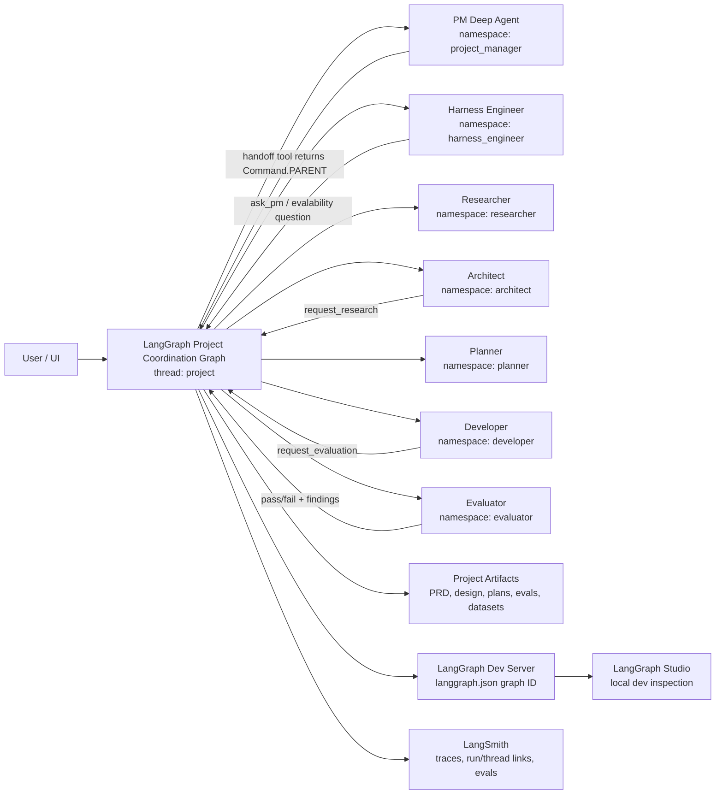
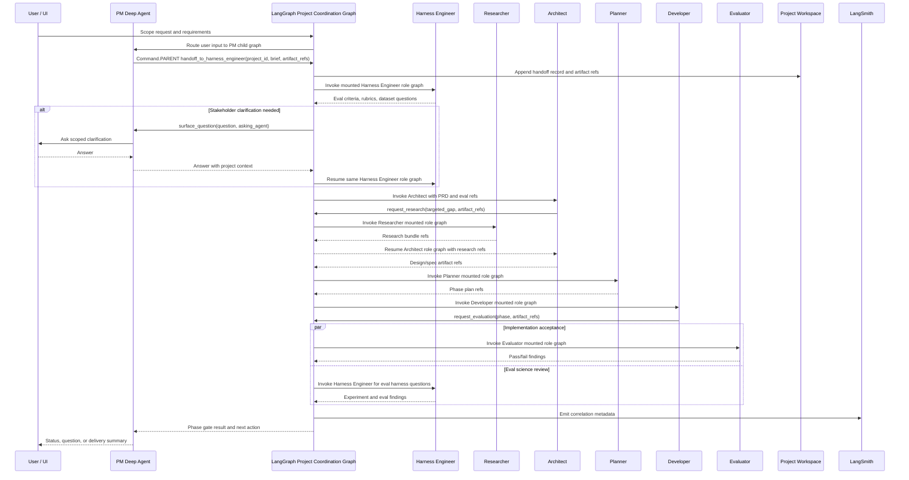

# Architecture Decision Record

> [!TIP]
> Keep this doc concise, factual, and testable. If a claim cannot be verified, add a validation step.

---

## 0) Header

| Field | Value |
|---|---|
| ADR ID | `ADR-001` |
| Title | `Meta Harness Architecture` |
| Status | `Proposed` |
| Date | `2025-10-15` |
| Author(s) | `@Jason` |
| Reviewers | `@Jason` |
| Related PRs | `#NA`, `#NA` |
| Related Docs | `[Requirements Scratch](./tmp.md)`, `[SME Transcript](./SME.md)` |

**One-liner:** `Meta Harness Architecture`

---

## 1) Decision Snapshot

```txt
We will model the PM, Harness Engineer, Researcher, Architect, Planner,
Developer, and Evaluator as peer, stateful Deep Agent graphs mounted under a thin
LangGraph Project Coordination Graph. The Project Coordination Graph owns the
project thread, parent-mediated handoff routing, run status, and phase gates. The
Deep Agent graphs own role-specific cognition, tools, memory, skills,
summarization, artifact work, and private role state through child graph
checkpoint namespaces.
```

### Decision Badge

`Status: Proposed` · `Risk: Medium` · `Impact: High`

---

## 2) Context

### Problem Statement

<What problem are we solving, for whom, and why now?>

### Constraints

- `<constraint 1>`
- `<constraint 2>`
- `<constraint 3>`

### Non-Goals

- [ ] `<Deployment at scale>`
- [ ] `<Threat modeling and security hardening>`
- [ ] `<Full web application deployment>` **[This-wll-flip-very-soon]**

---

## 3) Options Considered

| Option | Summary | Pros | Cons | Verdict |
|---|---|---|---|---|
| A | PM owns core roles as declarative `SubAgent` dict specs | Lowest initial wiring; uses SDK-provided `task` tool | `task` subagent calls are explicitly ephemeral and stateless; specialists cannot reliably resume project-specific trajectory | `Rejected` |
| B | PM owns core roles as `CompiledSubAgent` runnables | Can wrap full `create_deep_agent()` graphs | Stock `task` invocation passes only synthesized state, not a stable `thread_id` config; persistence would require a wrapper outside the first-class path | `Rejected as primary topology` |
| C | PM uses stock `AsyncSubAgent` for each specialist | Supports remote/background execution, status checks, and follow-up updates on the same task thread | `start_async_task` creates a new remote thread each time; not enough by itself for mounted project-role identity | `Use only for ad hoc background tasks` |
| D | Peer `create_deep_agent()` graphs mounted under a thin LangGraph Project Coordination Graph | Preserves per-agent state, permits direct specialist loops, keeps cognition inside Deep Agents, and makes handoffs observable | Requires a small deterministic coordination layer and project thread / role namespace registry | `Selected` |

<details>
<summary><strong>Decision rationale notes</strong> (expand)</summary>

### Why selected option wins

1. It matches the SDK boundary: `create_deep_agent()` already assembles the agent harness and accepts `checkpointer`, `store`, `backend`, `memory`, `skills`, `subagents`, and `name`.
2. It gives every core role stable project-scoped state and its own checkpoint history, rather than forcing PM to carry or restate specialist context.
3. It keeps LangGraph focused on deterministic coordination, not role cognition.

### Why alternatives lose

- Option A: Declarative `SubAgent` specs are for isolated tasks, not durable project roles.
- Option B: `CompiledSubAgent` is a useful escape hatch, but the stock `task` tool does not provide the stable runtime config required for project-scoped checkpoint resume.
- Option C: Stock `AsyncSubAgent` is useful for background execution, but it is
  not the core project-role topology because it launches generated remote task
  threads rather than mounted role graphs under the Project Coordination Graph.

</details>

---

## 4) Architecture

### Runtime Topology Decision

The core topology is:

```txt
Human/UI
  -> LangGraph Project Coordination Graph
      -> PM Deep Agent child graph
      -> Harness Engineer Deep Agent child graph
      -> Researcher Deep Agent child graph
      -> Architect Deep Agent child graph
      -> Planner Deep Agent child graph
      -> Developer Deep Agent child graph
      -> Evaluator Deep Agent child graph
```

The Project Coordination Graph is the LangGraph application entrypoint. The PM is
still the default user-facing agent and scope owner, but it is not the container
for all specialist cognition. The PM and specialists are peer Deep Agent child
graphs. Each role must be assembled by its own `create_deep_agent()` factory with
`name=` set for trace metadata, its own tool ownership, its own prompt, its own
memory sources, and its own child graph state.

For local mounted-graph execution, use one stable root thread per project:

```txt
thread_id = "{project_id}"
```

Role isolation is provided by child graph state schemas and stable checkpoint
namespaces under that project thread:

```txt
checkpoint_ns = ""                         # Project Coordination Graph state
checkpoint_ns = "project_manager"          # PM role state
checkpoint_ns = "harness_engineer"         # Harness Engineer role state
checkpoint_ns = "researcher"               # Researcher role state
checkpoint_ns = "architect"                # Architect role state
checkpoint_ns = "planner"                  # Planner role state
checkpoint_ns = "developer"                # Developer role state
checkpoint_ns = "evaluator"                # Evaluator role state
```

The exact namespace strings can change during implementation, but the invariant
cannot: re-invoking the Harness Engineer for the same project must resume the
Harness Engineer's role state, not the PM state and not a fresh ephemeral
subagent task.

### LangGraph Project Coordination Graph

The Project Coordination Graph is the thin LangGraph orchestration layer around
the Deep Agent harnesses. It should not replace the harness.

Committed naming decision: use `Project Coordination Graph` for this layer and
`ProjectCoordination*` for its concrete schemas, such as
`ProjectCoordinationState`, `ProjectCoordinationContext`,
`ProjectCoordinationInput`, and `ProjectCoordinationOutput`. Do not use bare
`ProjectState` or `ProjectContext` for this graph; those names imply ownership of
the full project domain state and would blur the boundary between deterministic
routing state, project artifacts, project memory, and agent cognition.

Its responsibilities are:

- Resolve the target agent for a handoff.
- Route the handoff through the parent graph using `Command.PARENT`.
- Invoke the target mounted Deep Agent child graph under its stable role namespace.
- Track run IDs, handoff status, phase gates, and unresolved questions.
- Route phase transitions when a handoff completes or fails.
- Surface human-in-the-loop questions when an agent cannot proceed without stakeholder input.
- Preserve enough Project Coordination Graph state to reconstruct which agent handed work
  to whom, why, and with which artifact references.

Its non-responsibilities are equally important:

- Do not implement research, architecture, planning, coding, or evaluation logic in LangGraph nodes.
- Do not put all specialist messages into one shared graph state.
- Do not use the PM as a pass-through for every specialist-to-specialist loop.
- Do not reimplement Deep Agents middleware for planning, memory, skills, filesystem access, summarization, or tool calling.

The Project Coordination Graph should be a small `StateGraph` with coarse nodes,
not a large multi-agent monolith. The first conceptual node set is still
discussion-needed; the table below is a working candidate for co-authoring, not
an accepted implementation contract:

| Node | Purpose |
|---|---|
| `receive_user_input` | Accept new stakeholder input and route it to PM when project scope is still being shaped. |
| `run_agent` | Invoke a named mounted Deep Agent child graph with a handoff brief and stable role namespace. |
| `ensure_role_state` | Ensure the target role has an initialized checkpoint namespace and project workspace paths before invocation. |
| `record_handoff` | Append a structured handoff record with caller, target, reason, artifact refs, and run ID. |
| `route_after_agent` | Decide whether the next step is another agent, a phase gate, a human question, or done. |
| `gate_phase` | Enforce required review/eval gates before moving from scoping to harness engineering, architecture, planning, development, and final acceptance. |
| `surface_question` | Turn a specialist question into PM or user-facing HITL, then route the answer back to the asking role graph. |

This node list is an architecture guide, not a final schema. Before this AD is
treated as accepted, Jason and Codex should scope the first node set together:
which nodes are genuinely separate, which are implementation details inside one
node, and what each node is allowed to read, write, and route. The final spec
should keep the same separation: deterministic routing in LangGraph, open-ended
work inside Deep Agents.

### Handoff Protocol

All agent-to-agent communication should go through explicit handoff tools or
Project Coordination Graph commands. A handoff should carry:

- `project_id`
- `from_agent`
- `to_agent`
- `reason`
- `brief`
- `artifact_refs`
- `expected_output`
- `blocking`
- `phase`

The receiving agent should get a concise brief plus artifact references, not a
dump of the caller's full conversation. The receiving agent resumes its own
role state and decides what context to load.

Provisional handoff tool names, still discussion-needed:

Jason likes the self-explanatory direction of these names, but the use cases are
not fully scoped yet. Before downstream implementation, each tool needs an
approved use-case matrix: allowed callers, target role, triggering scenarios,
required payload fields, blocking behavior, expected outputs, and whether the
tool is available in normal flow, phase gates, exception handling, or final
acceptance.

| Tool | Caller | Target | Use |
|---|---|---|---|
| `handoff_to_harness_engineer` | PM, Architect, Developer | Harness Engineer | Eval criteria, rubric design, calibration, public/held-out datasets, and milestone evals. |
| `request_research` | Architect, Harness Engineer, PM | Researcher | Targeted SDK/API/model capability research. |
| `handoff_to_architect` | PM, Researcher, Harness Engineer | Architect | Design synthesis from PRD, research, and eval constraints. |
| `handoff_to_planner` | Architect, Harness Engineer | Planner | Convert accepted design and public eval criteria into an implementation plan. |
| `handoff_to_developer` | Planner | Developer | Execute an approved phase plan. |
| `request_evaluation` | Developer, PM | Evaluator and/or Harness Engineer | Validate code/spec alignment and run technical evals. |
| `ask_pm` | Any specialist | PM | Ask stakeholder-facing questions without giving the specialist permanent ownership of PM scope. |

Implementation can expose these as Deep Agent tools, but each handoff tool should
return `Command(graph=Command.PARENT, goto=<coordination_node>,
update=<handoff_payload>)` rather than directly invoking arbitrary peers. The
Project Coordination Graph records the handoff, applies routing and phase-gate
policy, and invokes the target mounted role graph.

### Mounted Graph Execution and Sandbox Semantics

Meta Harness v1 uses a single Project Coordination Graph with peer role Deep
Agents mounted as child subgraphs. This is the only v1 project-role topology.
The PM remains the user-facing agent inside that topology.

Sandbox support does not change the graph topology. A sandbox is a backend and
runtime environment for file and shell/tool execution, not a separate top-level
agent application. A sandbox-backed role agent is still a mounted child graph; it
just receives a sandbox-capable backend.

Separate remotely deployed role assistants are out of scope for v1. That topology
would communicate through LangGraph SDK thread/run APIs rather than native
`Command.PARENT`, and it should not be treated as the default Meta Harness
handoff model.

The local development harness should expose the Project Coordination Graph
through `langgraph.json` + `langgraph dev` so LangGraph Studio can inspect graph
behavior, project thread state, child checkpoint namespaces, and routing.

Stock `AsyncSubAgent` remains useful for ad hoc background tasks, but it should
not be the primary project-role topology. Its start path creates a new remote
thread and then stores that generated thread ID as the task ID. That is at odds
with the invariant that every core role is a mounted, stateful Deep Agent child
graph under the Project Coordination Graph.

### Observability, Tracing, and Studio

LangSmith tracing is a first-class requirement for this topology. The
Project Coordination Graph should not rely on ad hoc logs to reconstruct agent behavior
after the fact. Every Project Coordination Graph handoff and Deep Agent invocation should
be searchable by at least:

- `project_id`
- `agent_name`
- `thread_id`
- `handoff_id`
- `phase`
- `from_agent`
- `to_agent`

LangGraph Studio and LangSmith serve different jobs in the local workflow.
LangGraph Studio is the interactive local development surface for graph
behavior, thread inspection, and checkpoint debugging through `langgraph dev`.
LangSmith is the durable observability and evaluation plane for traces, run
trees, feedback, datasets, experiments, and shareable thread/run links.

Do not assume trace hierarchy alone is enough to reconstruct project behavior.
The Project Coordination Graph must persist handoff records and propagate
correlation metadata so sandbox-backed tool work, role graph runs, and phase-gate
decisions can be stitched together in LangSmith.

### Specialist Loops

Specialist-to-specialist loops should not require PM mediation unless the loop
needs stakeholder clarification or scope authority. Examples:

- PM -> Harness Engineer -> PM when the Harness Engineer needs stakeholder
  clarification before finalizing eval criteria, rubrics, or datasets.
- Architect -> Researcher -> Architect for SDK/API gaps.
- Architect -> Harness Engineer -> Architect for evalability questions in the design.
- Architect -> Planner only after Harness Engineer review of new eval-relevant
  tools, prompts, datasets, and target harness criteria.
- Developer -> Evaluator -> Developer at phase boundaries.
- Developer -> Harness Engineer -> Developer for eval harness failures or dataset issues.
- Developer -> Harness Engineer and Developer -> Evaluator during final
  acceptance, because both agents gate different dimensions of readiness.

The loop is not a direct shared-memory conversation. It is a sequence of mounted
role graph invocations under the project thread, linked by handoff records and
artifact references in the Project Coordination Graph.

The Developer needs explicit routing guidance because the Harness Engineer and
Evaluator can both block a development phase:

| Target | Owns | Developer should route when |
|---|---|---|
| Harness Engineer | Evaluation science: rubrics, datasets, LLM judges, calibration, experiment design, eval harness behavior, public/held-out dataset policy | A phase fails because the eval harness, metric, judge, dataset, calibration method, or target-harness measurement strategy needs expert review. |
| Evaluator | Acceptance against the accepted plan and design: code/spec alignment, naming and SDK compliance, UI/UX/TUI behavior, test execution, phase pass/fail findings | A phase needs implementation review, UX/TUI verification, design conformance checking, or a hard pass/fail against the approved task plan. |
| PM | Stakeholder scope and business acceptance | A specialist question changes requirements, success criteria, user-facing behavior, or business priority. |

This boundary belongs in the Developer prompt and tool descriptions. The AD
does not need the final schema, but the later implementation spec should encode
the distinction so Developer feedback loops do not collapse into one vague
`request_evaluation` path.

### Source Alignment Notes

- `create_deep_agent()` accepts `checkpointer`, `store`, `backend`, `memory`, `skills`, `subagents`, and `name`, and passes `checkpointer`, `store`, and `name` through to the compiled agent (`.reference/libs/deepagents/deepagents/graph.py:217-236`, `602-623`).
- Declarative `task` subagents are documented as ephemeral and stateless, and the `task` implementation invokes the subagent with synthesized state but no runtime config (`.reference/libs/deepagents/deepagents/middleware/subagents.py:152-162`, `355-376`).
- `CompiledSubAgent` runnables are used as-is, but the same `task` call path still does not provide a stable project `thread_id` config (`.reference/libs/deepagents/deepagents/middleware/subagents.py:488-493`).
- Stock `AsyncSubAgent` launches a remote thread with `client.threads.create()` and uses that generated ID as `task_id`; follow-up updates reuse that task thread (`.reference/libs/deepagents/deepagents/middleware/async_subagents.py:280-318`, `500-548`).
- LangGraph checkpoint memory is keyed by `thread_id`; reusing the same thread accumulates state across invocations (`.venv/lib/python3.11/site-packages/langgraph/graph/state.py:1038-1074`).
- LangGraph `Command.PARENT` targets the closest parent graph, and parent-command bubbling is handled by LangGraph runtime internals (`.venv/lib/python3.11/site-packages/langgraph/types.py:652-702`, `.venv/lib/python3.11/site-packages/langgraph/graph/state.py:1540-1550`).
- `ToolNode` supports tool-returned `Command` values, and LangChain `create_agent()` wires tools through `ToolNode`, which keeps this path compatible with Deep Agents because `create_deep_agent()` delegates to `create_agent()` (`.venv/lib/python3.11/site-packages/langgraph/prebuilt/tool_node.py:857-899`, `.venv/lib/python3.11/site-packages/langchain/agents/factory.py:920-939`, `.reference/libs/deepagents/deepagents/graph.py:602-623`).
- Mounted subgraph persistence can use the parent project `thread_id` with stable child checkpoint namespaces when the child graph is compiled for subgraph checkpointing; root graphs cannot use `checkpointer=True` (`.venv/lib/python3.11/site-packages/langgraph/pregel/main.py:2416`, `2613-2615`, `.venv/lib/python3.11/site-packages/langgraph/_internal/_config.py:34-45`).
- The lower-level LangGraph SDK supports explicit thread creation and explicit run submission against a chosen thread; this matters for any future split-assistant deployment, but it is not the v1 mounted-graph default (`.venv/lib/python3.11/site-packages/langgraph_sdk/_async/threads.py:98-143`, `.venv/lib/python3.11/site-packages/langgraph_sdk/_async/runs.py:435-462`, `552-585`).
- The Deep Agents CLI scaffolds `langgraph.json` for `langgraph dev` with a graph entry point and optional checkpointer path (`.reference/libs/cli/deepagents_cli/server.py:85-119`, `.reference/libs/cli/deepagents_cli/server_manager.py:92-115`).
- The Deep Agents CLI server graph is a module-level graph entrypoint: `server_graph.py` builds the graph from environment-backed server config and exports `graph = make_graph()` for the generated `langgraph.json` reference (`.reference/libs/cli/deepagents_cli/server_graph.py:1-10`, `93-196`).
- The Deep Agents CLI server path creates sandbox backends through `deepagents_cli.integrations.sandbox_factory.create_sandbox(...)`, keeps the sandbox context manager open for the server process lifetime, and passes the resulting backend into `create_cli_agent(...)` (`.reference/libs/cli/deepagents_cli/server_graph.py:117-170`, `.reference/libs/cli/deepagents_cli/integrations/sandbox_factory.py:1-134`).
- The Deep Agents CLI names its sandbox integration package `integrations/` and keeps the provider boundary in `sandbox_provider.py`; Meta Harness should follow that package convention instead of inventing a `runtime/sandbox.py` shape (`.reference/libs/cli/deepagents_cli/integrations/__init__.py`, `.reference/libs/cli/deepagents_cli/integrations/sandbox_provider.py:1-49`).
- `create_cli_agent(...)` chooses SDK backends directly: local mode uses `LocalShellBackend` or `FilesystemBackend`, sandbox mode uses the supplied sandbox backend, and any `CompositeBackend` use is an SDK import for routing generated/temporary file areas rather than an app-owned backend module (`.reference/libs/cli/deepagents_cli/agent.py:1104-1218`, `.reference/libs/deepagents/deepagents/backends/composite.py:119-158`).
- The Deep Agents deploy template also uses a graph factory entrypoint: generated `langgraph.json` points to `./deploy_graph.py:make_graph`, and the generated module exposes `graph = make_graph` for runtime factory loading (`.reference/libs/cli/deepagents_cli/deploy/bundler.py:192-201`, `.reference/libs/cli/deepagents_cli/deploy/templates.py:430-469`).
- The deploy template is where the CLI builds a generated backend factory with an SDK `CompositeBackend`, a sandbox default, and store-backed `/memories/` and `/skills/` routes; that pattern should be imported or adapted from the SDK/CLI after focused implementation validation, not mirrored as a first-pass `runtime/` package or app-owned `checkpointers.py`, `stores.py`, or `model_policy.py` modules (`.reference/libs/cli/deepagents_cli/deploy/templates.py:199-207`, `405-424`).
- LangGraph API treats callable graph exports as factories, compiles exported `StateGraph` builders automatically, and accepts already-compiled Pregel graphs (`.venv/lib/python3.11/site-packages/langgraph_api/graph.py:330-379`, `730-765`).
- LangGraph SDK assistants use graph IDs that are normally set in `langgraph.json` (`.venv/lib/python3.11/site-packages/langgraph_sdk/_async/assistants.py:320-350`).
- LangGraph local development docs show `langgraph.json` using `"dependencies": ["."]` and graph refs shaped like `"my_agent": "./my_agent/agent.py:graph"`, so a root `./graph.py:graph` or `./graph.py:make_graph` entrypoint is a valid project layout when the root is the app boundary ([LangGraph local development docs](https://docs.langchain.com/langsmith/local-dev-testing)).
- Deep Agents CLI resolves LangSmith thread URLs only when tracing is configured, and its `/trace` flow tells users to set `LANGSMITH_API_KEY` and `LANGSMITH_TRACING=true` when unavailable (`.reference/libs/cli/deepagents_cli/config.py:1600-1745`, `.reference/libs/cli/deepagents_cli/app.py:2545-2579`).

## Full Repo Structure Naming Decision

The v1 repo is organized around peer Deep Agent factories, not around a PM-owned
`subagents/` bucket. The root `graph.py` is the approved LangGraph application
entrypoint and the self-contained deterministic Project Coordination Graph
factory. The selected topology makes `agents/` the approved module name for core
roles. SDK `SubAgent` dicts, if any are later needed for ephemeral isolated
tasks, are reserved for a narrowly named `task_agents/` module inside the owning
role, not at the top level.

```txt
meta-harness/
├── pyproject.toml
├── README.md
├── AGENTS.md
├── AD.md
├── langgraph.json
├── graph.py                          # LangGraph Project Coordination Graph entrypoint/factory
├── docs/
│   ├── architecture/
│   └── specs/
├── src/
│   └── meta_harness/
│       ├── __init__.py
│       ├── agents/
│       │   ├── __init__.py
│       │   ├── catalog.py                  # one source of truth for role identity
│       │   ├── project_manager/
│       │   │   ├── __init__.py
│       │   │   ├── agent.py                # create_deep_agent(name="project-manager", ...)
│       │   │   └── system_prompt.md
│       │   ├── harness_engineer/
│       │   │   ├── __init__.py
│       │   │   ├── agent.py
│       │   │   └── system_prompt.md
│       │   ├── researcher/
│       │   │   ├── __init__.py
│       │   │   ├── agent.py
│       │   │   └── system_prompt.md
│       │   ├── architect/
│       │   │   ├── __init__.py
│       │   │   ├── agent.py
│       │   │   └── system_prompt.md
│       │   ├── planner/
│       │   │   ├── __init__.py
│       │   │   ├── agent.py
│       │   │   └── system_prompt.md
│       │   ├── developer/
│       │   │   ├── __init__.py
│       │   │   ├── agent.py
│       │   │   └── system_prompt.md
│       │   └── evaluator/
│       │       ├── __init__.py
│       │       ├── agent.py
│       │       └── system_prompt.md
│       ├── integrations/
│       │   ├── __init__.py
│       │   ├── sandbox_factory.py          # follow deepagents_cli.integrations
│       │   └── sandbox_provider.py         # provider boundary if wrappers are needed
│       └── tools/
└── tests/
    ├── contract/
    ├── integration/
    └── eval/
```

Naming choices embedded in this tree:

- Use `agents/` for PM and peer specialists.
- Do not use top-level `subagents/` for core roles.
- Use `developer/` as the canonical module. Generator and optimizer are
  responsibilities inside the Developer prompt and tool descriptions, not module
  names.
- Use root `graph.py` for the deterministic LangGraph Project Coordination Graph. This
  mirrors the LangGraph and Deep Agents CLI graph-entrypoint convention while
  preventing a premature `project_coordination_graph/` package from spreading the routing
  logic across files before the first implementation proves its shape.
- Put the Project Coordination Graph `StateGraph` state schema, node functions, conditional
  routing, handoff record helpers, phase-gate transitions, project thread and
  role checkpoint namespace helpers, and compile call in root `graph.py` initially. Split only
  after the file has a concrete pressure point, such as shared typed contracts
  needed outside graph tests, sandbox integration wiring, or a production
  persistence adapter.
- Use `integrations/` for sandbox provider wiring. Mirror the Deep Agents CLI
  convention: keep the provider interface in `sandbox_provider.py`, create or
  connect to sandbox backends through `sandbox_factory.py`, and pass the resulting
  SDK backend into the owning agent/Project Coordination Graph construction path.
- Do not add a first-pass `runtime/` package, `runtime/backends/`, `runtime/sandbox.py`,
  `checkpointers.py`, `stores.py`, `model_policy.py`, or `middleware_profiles.py`.
  Those are not SDK/CLI conventions for this boundary. Add a module only after a
  concrete SDK-aligned need appears and its name is approved.
- Construct backend, checkpointer, store, model, and middleware configuration at
  the SDK boundary that consumes it: the role Deep Agent factory, the root
  Project Coordination Graph factory, or the CLI-aligned sandbox integration package.
  Import SDK abstractions directly instead of wrapping them behind app-owned
  convention files.
- Keep `tools/` for now, but do not name nested tool modules until concrete tool
  contracts exist.

### LangGraph Project Coordination Graph Factory Contract

The Project Coordination Graph is a LangGraph application boundary. It is not a
Deep Agent and it is not an agent registry. A tasteful first implementation
should keep this in root `graph.py`:

```python
def make_graph(...) -> CompiledStateGraph:
    builder = StateGraph(
        ProjectCoordinationState,
        context_schema=ProjectCoordinationContext,
        input_schema=ProjectCoordinationInput,
        output_schema=ProjectCoordinationOutput,
    )
    builder.add_node("record_handoff", record_handoff)
    builder.add_node("ensure_role_state", ensure_role_state)
    builder.add_node("run_agent", run_agent)
    builder.add_node("gate_phase", gate_phase)
    builder.add_edge(START, "record_handoff")
    builder.add_edge("record_handoff", "ensure_role_state")
    builder.add_edge("ensure_role_state", "run_agent")
    builder.add_conditional_edges("run_agent", route_after_agent)
    return builder.compile(
        checkpointer=checkpointer,
        store=store,
        name="meta-harness-project-coordination-graph",
    )


graph = make_graph
```

`make_graph()` is proposed because the Deep Agents deploy template uses an async
`make_graph(config, runtime)` factory shape when graph construction needs runtime
config, while the CLI server also supports a module-level `graph` export. The
root `langgraph.json` can point to either `./graph.py:graph` or
`./graph.py:make_graph`; prefer `./graph.py:make_graph` if the Project Coordination Graph
needs invocation-time config/runtime, otherwise `./graph.py:graph` is simpler.
The role factories should use `create_<role>_agent()` because those modules return
Deep Agent graphs via `create_deep_agent()`.

The Project Coordination Graph nodes should only do deterministic coordination:

- `record_handoff`: persist or append a handoff record.
- `ensure_role_state`: initialize or look up the target role checkpoint namespace
  and project workspace paths.
- `run_agent`: invoke a mounted peer Deep Agent child graph using the parent
  project thread and target role namespace.
- `gate_phase`: enforce deterministic pass/fail transition policy from recorded
  Evaluator or Harness Engineer results.
- `surface_question`: route a specialist's stakeholder question to PM or UI.

The Project Coordination Graph must not implement research, architecture, planning,
development, eval-science, prompt composition, or provider/model request policy.
Those remain in peer Deep Agent factories, SDK configuration calls, and
tool/prompt contracts. Do not create a runtime policy package before a concrete
SDK-aligned need appears.

## Project Workspace and Memory Structure Proposal

The memory filesystem should keep the original role-scoped structure. This tree
preserves a shared team memory file at the root plus per-role `AGENTS.md`,
`memory/`, `skills/`, and project artifact directories. Backend routing can still
map this layout onto disk or sandbox storage through SDK backends; the tree below
describes the desired workspace semantics, not a new app-owned backend layer.
The `dev/` path is a workspace bucket, not a Python module naming decision.

```txt
~/Agents/
├── AGENTS.md                         # shared team memory; PM writes here
├── pm/
│   ├── AGENTS.md                     # PM core memory loaded via memory=
│   ├── memory/                       # PM on-demand memory files
│   ├── skills/                       # PM skills; SKILL.md subdirs
│   └── projects/                     # PM project tracking, tagged by project ID
├── architect/
│   ├── AGENTS.md
│   ├── memory/
│   ├── skills/
│   └── projects/                     # Architect project specs
│       ├── specs-(Previous)          # Previous spec versions, tagged by project ID
│       └── target-spec/              # Current target specification
├── researcher/
│   ├── AGENTS.md
│   ├── memory/
│   ├── skills/
│   └── projects/
│       └── research-bundles/         # Compiled research artifacts, tagged by project ID
├── planner/
│   ├── AGENTS.md
│   ├── memory/
│   ├── skills/
│   └── projects/
│       └── plans/                    # Generated development plans
├── dev/                              # Developer / Generator / Optimizer
│   ├── AGENTS.md
│   ├── memory/
│   ├── skills/
│   └── projects/
│       └── wip/                      # Work-in-progress implementations
└── harness-engineer/
    ├── AGENTS.md
    ├── memory/
    ├── skills/
    └── projects/
        ├── eval-harnesses/           # Evaluation harness definitions
        ├── datasets/
        │   ├── public/               # Public datasets for dev phases
        │   └── held-out/             # Held-out datasets for final eval
        ├── rubrics/                  # Scoring rubrics and criteria
        └── experiments/              # Experiment logs and results
```


### System Overview



### Sequence (optional)



### Data Contracts

The exact Pydantic or `TypedDict` contracts should be defined in the
implementation spec. For this AD, the minimum proposed Project Coordination Graph handoff
record is:

```json
{
  "project_id": "string",
  "handoff_id": "string",
  "source_agent": "project-manager|harness-engineer|researcher|architect|planner|developer|evaluator",
  "target_agent": "project-manager|harness-engineer|researcher|architect|planner|developer|evaluator",
  "project_thread_id": "{project_id}",
  "target_role_namespace": "project_manager|harness_engineer|researcher|architect|planner|developer|evaluator",
  "reason": "string",
  "artifact_refs": ["string"],
  "run_id": "string|null",
  "status": "queued|running|blocked|failed|completed",
  "question": "string|null",
  "created_at": "RFC3339 timestamp"
}
```

This is a proposed minimum, not a final wire format.

---

## 5) Implementation Plan *Will have an implementation plan for each agent, and a full system implementation plan that will be documented in a separate file @ docs/spec/~~~*

### Milestones <TBD>

- [ ] M1: `<milestone name>`
- [ ] M2: `<milestone name>`
- [ ] M3: `<milestone name>`

### Rollout Strategy <TBD>

| Stage | Traffic / Scope | Guardrails | Rollback Trigger |
|---|---|---|---|
| Dev | `<scope>` | `<checks>` | `<trigger>` |
| Staging | `<scope>` | `<checks>` | `<trigger>` |
| Prod (canary) | `<scope>` | `<checks>` | `<trigger>` |

```diff
- Old behavior: <describe>
+ New behavior: <describe>
```

---

## 6) Observability & Evaluation

### Required Signals

- LangSmith traces for PM and every specialist Deep Agent invocation.
- Project Coordination Graph handoff records keyed by `project_id`, `handoff_id`, source agent, target agent, phase, artifact refs, run ID, and resulting gate decision.
- Stable project `thread_id`, role `checkpoint_ns`, and `agent_name` metadata on every mounted role invocation.
- LangGraph Studio local inspection path through `langgraph.json` and `langgraph dev`.
- LangSmith thread/run links exposed in the UI when tracing is configured.
- Evaluation feedback from Harness Engineer and Evaluator kept separate by owner and gate type.

### Success Criteria

| Metric | Baseline | Target | Window |
|---|---|---|---|
| Project-role state reuse | No stable baseline | Same `(project_id, agent_name)` resumes the same mounted role graph state | Every handoff |
| Handoff traceability | Manual reconstruction | Each handoff has a Project Coordination Graph record and a LangSmith run/thread reference when configured | Every handoff |
| Developer gate routing | Ambiguous `request_evaluation` target | Developer can distinguish Harness Engineer scientific eval issues from Evaluator implementation/spec acceptance issues | Every phase gate |
| Local dev inspection | Ad hoc terminal logs | A local `langgraph dev` workflow can inspect the Project Coordination Graph, project thread, and role namespaces in LangGraph Studio | Before v1 implementation hardening |

### Validation Plan

1. Prove Project Coordination Graph -> PM -> Harness Engineer -> PM with a stable project thread, visible role checkpoint namespaces, and LangSmith metadata.
2. Prove Architect -> Researcher -> Architect without PM mediation.
3. Prove Developer -> Evaluator -> Developer and Developer -> Harness Engineer -> Developer route to different gate owners.
4. Prove a sandbox-backed role agent preserves the same mounted graph topology while using a sandbox-capable backend for file and shell/tool execution.

---

## 7) Risks, Tradeoffs, and Mitigations

> [!WARNING]
> List realistic failure modes, not generic statements.

| Risk | Likelihood | Impact | Mitigation | Owner |
|---|---|---|---|---|
| Core specialists accidentally implemented as ephemeral `task` subagents | `M` | `H` | Treat `task` as an isolated-worker tool only. Add tests or trace checks that core roles run as mounted child graphs with stable role checkpoint namespaces. | `@Jason` |
| Stock `AsyncSubAgent` becomes the primary project-role topology | `M` | `H` | Keep `AsyncSubAgent` limited to ad hoc background tasks. Core roles must stay mounted under the Project Coordination Graph for v1. | `@Jason` |
| Sandbox support is mistaken for a separate agent topology | `M` | `H` | Treat sandbox as backend/runtime configuration for mounted role agents, not as a reason to split roles into separate top-level assistants. | `@Jason` |
| LangGraph Project Coordination Graph grows into a second agent brain | `M` | `M` | Keep LangGraph nodes deterministic and coarse. Deep Agents own cognition; LangGraph owns routing, state, and gates. | `@Jason` |
| Handoff loops become invisible or hard to debug | `M` | `H` | Persist structured handoff records with caller, target, reason, artifact refs, run ID, and resulting gate decision. | `@Jason` |
| LangSmith traces are insufficient to reconstruct graph behavior by themselves | `M` | `H` | Standardize correlation metadata and persist Project Coordination Graph handoff records; do not depend on implicit trace hierarchy alone. | `@Jason` |
| Developer confuses Harness Engineer feedback with Evaluator feedback | `M` | `M` | Encode the owner split in Developer prompt/tool descriptions and phase-gate records. | `@Jason` |
| Parallel updates interrupt active specialist work unexpectedly | `M` | `M` | Route updates through explicit handoff records and reserve cancellation or interruption for explicit redirects or stale work cancellation. | `@Jason` |

---

## 8) Security / Privacy / Compliance

- Data classification: `<public/internal/restricted>`
- PII handling: `<none / masked / encrypted>`
- Access model: `<RBAC details>`
- Retention policy: `<duration + deletion mechanism>`

---

## 9) Open Questions

- [x] Jason approval: adopt the section 4 repo-structure naming decision that uses root `graph.py` for the LangGraph Project Coordination Graph entrypoint, uses `agents/` for peer role modules, reserves `task_agents/` only for future role-owned ephemeral SDK `SubAgent` helpers, uses `developer/` as the canonical Developer module name, and follows the Deep Agents CLI `integrations/` sandbox convention. Approved by Jason on `2026-04-11`.
- [ ] Decide the production checkpointer and store backend for local-first and sandbox-backed mounted graph execution.
- [x] Decide whether the project-aware handoff wrapper is implemented as a LangGraph Project Coordination Graph node, a tool service, custom Deep Agents middleware, or a combination. Decision: v1 handoffs are explicit Deep Agent tools that return `Command(graph=Command.PARENT, goto=<coordination_node>, update=<handoff_payload>)`; Project Coordination Graph nodes record and route the handoff; custom handoff middleware is out of v1. Approved by Jason on `2026-04-12`.
- [ ] Co-author and approve the first Project Coordination Graph node set, including exact node names, responsibilities, and read/write/routing boundaries.
- [ ] Co-author and approve the handoff tool use-case matrix, including allowed callers, triggering scenarios, payload requirements, blocking behavior, expected outputs, and phase-gate relevance.
- [ ] Define the minimal handoff record schema and phase gate enum in the implementation spec.
- [ ] Decide how LangSmith thread/run links will be exposed in the UI for each project and mounted role invocation.
- [ ] Define the `langgraph.json` graph ID convention for PM, Project Coordination Graph, and specialist agents in local development.
- [x] Decide whether sandbox execution changes the v1 graph topology. Decision: sandbox support is backend/runtime configuration for mounted role agents and does not split roles into separate top-level assistants. Separate remotely deployed role assistants are out of scope for v1. Approved by Jason on `2026-04-12`.
- [ ] Decide whether the Harness Engineer vs Evaluator gate-owner boundary belongs in this AD, a Developer prompt spec, or a separate evaluation architecture spec.

---

## 10) Changelog

| Date | Author | Change |
|---|---|---|
| `2026-04-12` | `@Codex` | Marked the Project Coordination Graph node set and handoff tool use-case matrix as discussion-needed before AD acceptance. |
| `2026-04-12` | `@Codex` | Locked the mounted Project Coordination Graph handoff decision: PM remains UI-facing, role agents are child graphs, handoff tools return `Command.PARENT`, and sandbox support does not change topology. |
| `2026-04-11` | `@Codex` | Closed Jason approval on the repo-structure naming decision for `graph.py`, `agents/`, `developer/`, `task_agents/`, and `integrations/`. |
| `2026-04-11` | `@Codex` | Locked the committed `Project Coordination Graph` naming decision and `ProjectCoordination*` schema prefix. |
| `2026-04-11` | `@Codex` | Replaced the placeholder data-contract block with a proposed Project Coordination Graph handoff record shape. |
| `2026-04-11` | `@Codex` | Adopted `Project Coordination Graph` as the name for the thin LangGraph orchestration layer. |
| `2026-04-11` | `@Codex` | Restored Jason's original role-scoped memory filesystem proposal. |
| `2026-04-11` | `@Codex` | Changed ADR status to Proposed and replaced the generic sequence diagram with the Meta Harness handoff flow. |
| `2026-04-11` | `@Codex` | Replaced first-pass `runtime/` module proposal with the Deep Agents CLI `integrations/` sandbox convention. |
| `2026-04-11` | `@Codex` | Revised repo proposal to use root `graph.py` as the LangGraph Project Coordination Graph entrypoint and added graph factory evidence from Deep Agents CLI and LangGraph API source. |
| `2026-04-11` | `@Codex` | Proposed peer-agent repo structure and project workspace layout for Jason review. |
| `2026-04-11` | `@Codex` | Added LangSmith tracing, LangGraph Studio, and Developer gate-owner guidance. |
| `2026-04-11` | `@Codex` | Added stateful peer Deep Agents topology and LangGraph Project Coordination Graph guidance. |
| `YYYY-MM-DD` | `@name` | Initial draft |

---

## Appendix

### Links

- [Design Mock](./mock.png)
- [Issue Tracker](https://example.com)

### Image / Diagram


### Footnotes

Key assumption goes here.[^1]

[^1]: `<supporting evidence or citation>`
