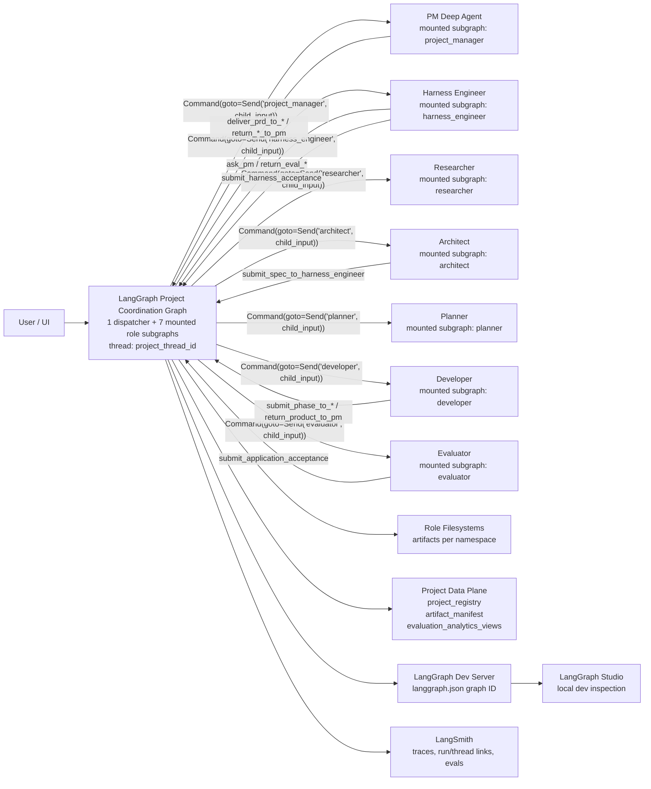

# Architecture Decision Record

> [!TIP]
> Keep this doc concise, factual, and testable. If a claim cannot be verified, add a validation step.

---

## 0) Header

| Field | Value |
|---|---|
| ADR ID | `ADR-001` |
| Title | `Meta Harness Architecture` |
| Status | `Approved for Spec` |
| Date | `2026-04-12` |
| Author(s) | `@Jason` |
| Reviewers | `@Jason` |
| Related PRs | `#NA`, `#NA` |


**One-liner:** `Meta Harness Architecture`

---

## 1) Decision Snapshot

```txt
We will model PM, Harness Engineer, Researcher, Architect, Planner, Developer,
and Evaluator as peer, stateful Deep Agent graphs mounted under a thin LangGraph
Project Coordination Graph (PCG) envelope. The PCG runs in two modes keyed by
LangGraph thread metadata: `pm_session` routes to the mounted PM child graph
with the session tool surface active; `project` routes through the full
project-execution topology with all mounted role graphs available. LangGraph /
LangSmith Agent Server is the runtime boundary for assistants, threads, runs,
Store, auth, persistence, and queueing. `thread_id` is checkpoint/conversation
identity; `project_id` is durable project identity; `project_thread_id` is the
canonical project execution thread (and may equal `project_id` in local/dev only
by convention). PM session/intake handles non-project and cross-project PM
conversation. Project creation creates a separate project thread and links it to
the parent PM session. Project threads own a project-scoped execution
environment (`project_thread_id -> execution_environment_id`) with managed
sandbox/devbox as the default execution mode (Daytona default provider).
Headless and first-party surfaces run the same lifecycle and contribution model.
```

### Decision Badge

`Status: Approved for Spec` · `Risk: Medium` · `Impact: High`

---

## 2) Context

### Problem Statement

Building, observing, and shipping LLM applications requires a multi-agent system
where specialist agents (evaluation science, research, architecture, planning,
development, quality assurance) collaborate under a project manager that owns
stakeholder communication. Existing approaches either flatten all specialist
cognition into a single agent's context window, force stateless ephemeral
sub-agent calls that cannot resume project-specific trajectories, or require a
heavy orchestration layer that duplicates agent reasoning. We need a topology
that preserves per-agent durable state, supports direct specialist-to-specialist
loops without PM mediation, keeps cognition inside Deep Agent harnesses, and
makes handoffs observable and auditable.

### Constraints

- All core agents must be stateful Deep Agents with stable checkpoint namespaces — no ephemeral `task` subagents for project roles.
- The coordination layer must be thin and deterministic — no LLM calls in PCG nodes, no routing intelligence in the graph.
- Agent-to-agent communication must go through explicit handoff tools that return `Command.PARENT` — no direct peer invocation.
- Phase gate enforcement must be middleware hooks on handoff tools, not PCG conditional edges.
- Agent Server is the runtime boundary for assistants, threads, runs, Store, auth, persistence, and queueing; Meta Harness must not fork thread/runtime identity outside that boundary.
- Meta Harness has exactly two product-level LangGraph `thread_kind` values in base architecture: `pm_session` and `project` (no base `utility` thread kind).
- The system must support project-scoped execution environments from day one with `managed_sandbox` default, plus `external_devbox` and guarded `local_workspace`.
- `managed_sandbox` default provider is Daytona for v1 production/web/headless; LangSmith sandbox can be offered as optional/future/beta.
- The system must leverage the Deep Agents SDK as the primary agent harness — do not reimplement SDK capabilities.

### Non-Goals

- [ ] Threat modeling and security hardening (v1)

---

## 3) Options Considered

| Option | Summary | Pros | Cons | Verdict |
|---|---|---|---|---|
| A | PM owns core roles as declarative `SubAgent` dict specs | Lowest initial wiring; uses SDK-provided `task` tool | `task` subagent calls are explicitly ephemeral and stateless; specialists cannot reliably resume project-specific trajectory | `Rejected` |
| B | PM owns core roles as `CompiledSubAgent` runnables | Can wrap full `create_deep_agent()` graphs | Stock `task` invocation passes only synthesized state, not a stable `thread_id` config; persistence would require a wrapper outside the first-class path | `Rejected as primary topology` |
| C | PM uses stock `AsyncSubAgent` for each specialist | Supports remote/background execution, status checks, and follow-up updates on the same task thread | `start_async_task` creates a new remote thread each time; not enough by itself for mounted project-role identity | `Use only for ad hoc background tasks` |
| D | Peer `create_deep_agent()` graphs mounted under a thin LangGraph Project Coordination Graph | Preserves per-agent state, permits direct specialist loops, keeps cognition inside Deep Agents, and makes handoffs observable | Requires a small deterministic coordination layer and project thread / role namespace registry | `Selected` |

<details>
<summary><strong>Decision rationale notes</strong> (expand)</summary>

### Why selected option wins

1. It matches the SDK boundary: `create_deep_agent()` already assembles the agent harness and accepts `checkpointer`, `store`, `backend`, `memory`, `skills`, `subagents`, and `name`.
2. It gives every core role stable project-scoped state and its own checkpoint history, rather than forcing PM to carry or restate specialist context.
3. It keeps LangGraph focused on deterministic coordination, not role cognition.

### Why alternatives lose

- Option A: Declarative `SubAgent` specs are for isolated tasks, not durable project roles.
- Option B: `CompiledSubAgent` is a useful escape hatch, but the stock `task` tool does not provide the stable runtime config required for project-scoped checkpoint resume.
- Option C: Stock `AsyncSubAgent` is useful for background execution, but it is
  not the core project-role topology because it launches generated remote task
  threads rather than mounted role graphs under the Project Coordination Graph.

</details>

---
🚨
## Open Questions

### OQ-1 (Medium Priority): HITL during development phases

Vision.md promises optimization tuning and taste calibration during development, but the Developer lacks `AskUserMiddleware` (only PM and Architect have it per Q8). Who owns HITL during dev phases? Options: PM relay via `ask_pm`, or add restricted-scope `AskUserMiddleware` to Developer.

### OQ-H5 (Resolved 2026-04-24): Project Data Plane source-of-truth and uniform read/write contract

**Decision.** Meta Harness owns a Project Data Plane for durable cross-thread
project facts. The product database is the authoritative substrate for
`project_registry`, `artifact_manifest`, `evaluation_analytics_views`,
`project_data_events`, and `project_snapshots`. Role filesystems, sandboxes,
object storage, and external URLs remain the content substrate named by
`artifact_manifest.content_ref`; they are not the discovery or permission
surface for product readers. LangGraph Store may hold write-through caches,
queues, or agent memory, but it is not the product source of truth and is not
the authorization boundary.

**Why.** Local SDK/source evidence supports keeping Store out of the product
permission layer: LangGraph `BaseStore` is a hierarchical key-value API
without a per-role/per-field ACL contract; `InMemoryStore` is explicitly
process-lifetime storage; Deep Agents `StoreBackend` validates namespace
strings but does not provide tenant authorization. Open SWE's local reference
uses Store for an active-thread message queue and uses thread metadata/backend
APIs for sandbox identity and credentials; that is a better precedent for
bounded runtime coordination than for product-wide source-of-truth data.

**Read/write contract.** PM session tools, web, TUI, headless adapters, and
project roles all use the same backend-owned data-plane operations. Project
status and portfolio reads go through `list_projects` and
`get_project_status`; artifact reads go through `list_project_artifacts` and
`get_project_artifact`; evaluation analytics reads go through
`list_evaluation_analytics_views` and `get_evaluation_analytics_view`; live project inspection goes through
`capture_project_snapshot`. Handoff/artifact helpers write
`register_artifact`; `dispatch_handoff` writes `update_project_progress`;
Harness Engineer analytics helpers write `publish_analytics_view` and `update_analytics_view`.

**Security and tenant boundary.** Every data-plane row carries `org_id` and
`project_id`; first-party user reads are filtered by organization membership;
agent writes carry `thread_id`, `project_thread_id`, `role_name`, and trace
context. Developer-role runtime does not receive private analytics views, HE-private,
Evaluator-private, or live-snapshot read tools, and backend data-access policy
also rejects those reads for `role_name="developer"`. Analytics view summaries are
structured enums plus bounded generated values; free-form notes are forbidden.

**Live file boundary.** PM sessions, web, TUI, and headless adapters never read
raw cross-thread mutable filesystems. They request brokered read-only
snapshots. Snapshot capture validates project membership and execution mode,
registers a `live_snapshot` artifact, and records an access event. `local_workspace`
snapshot capture is rejected unless the project has explicit opt-in.

> Implementation detail (schemas, indexes, operations, auth/tenant rules,
> retention, trace metadata, and conformance tests): see
> [`docs/specs/project-data-contracts.md`](./docs/specs/project-data-contracts.md).

### OQ-PM1 (High Priority): Project-scoped memory injection into pm_session context

**Problem.** The PM Deep Agent shares the same root memory across `pm_session` and `project` modes (AD §4 PM Session And Project Entry Model). Root memory covers user prefs and cross-project knowledge. But each project also owns **project-scoped memory** (`/project_memory/`, PRD, research notes, phase deliverables) that lives in the project thread's filesystem and in Project Data Plane-indexed artifacts. When a user on a `pm_session` thread asks the PM about a specific project (e.g. *"what's the status of project X?"*, *"summarise the latest Developer iteration on Y"*, *"what did the Architect decide about caching in project Z?"*), the PM needs access to that project's scoped memory — but the PM is running on a different LangGraph thread with a different checkpoint namespace and filesystem view.

**Decision space.**

- **(a) Direct file-read tool.** PM calls `read_project_memory(project_id, path)` explicitly. Token-visible, LLM-controlled, no hidden injection. Tradeoffs: adds latency per read; PM must know which files exist (requires a companion `list_project_memory` tool); doubles the cognitive load for simple status questions.
- **(b) State-injection middleware.** A `before_model` hook detects project references in the user turn, loads relevant project memory snippets, and injects them as a system message. Fast and low-friction. Tradeoffs: risks context bloat; duplicate-injection across consecutive turns about the same project; hard for the PM to know *which* memory it's reading vs its own.
- **(c) Registry-as-file pattern.** The Project Data Plane `project_registry` plus each project's scoped memory tree is surfaced as a virtual filesystem subtree (e.g. `/projects/{project_id}/memory/...`) in the PM's filesystem on `pm_session` threads. PM reads via standard filesystem tools; loads only what it needs; the boundary between "my memory" (`/AGENT.md`, `/memories/`) and "project memory I'm reading on behalf of the user" (`/projects/.../`) is structural.
- **(d) Hybrid.** Registry-as-file for shallow status (always surfaced), tool-call for deep memory reads (on demand).

**Constraints.**

- Must compose with Deep Agents' `MemoryMiddleware` (AGENT.md + `/memories/` load-on-invocation pattern) without confusing identity.
- Must not leak project-scoped memory between projects (cross-project contamination).
- Must respect `CompositeBackend` routing — project memory lives in the project's filesystem namespace, not the PM's.
- Must be observable in LangSmith so PM behaviour is debuggable.

**Pickup hint.** Study `@/Users/Jason/2026/v4/meta-agent-v5.6.0/.reference/libs/deepagents/deepagents/middleware/filesystem.py` for `FilesystemMiddleware` virtual-path routing patterns and `CompositeBackend` namespace composition. `MemoryMiddleware`'s load-on-invocation mechanism defines the constraint surface this decision must fit within.

### OQ-PM2 (High Priority): pm_session observability mechanism for Project Data Plane reads

**Problem.** `OQ-H5` resolved the Project Data Plane substrate and the backend read APIs for `project_registry`, `artifact_manifest`, and `evaluation_analytics_views`, but the PM-on-`pm_session` ergonomic mechanism still needs to be chosen. Being a "helpful product manager" depends on being able to answer *"which projects are active?"*, *"what phase is project X in?"*, *"what artifacts has the Harness Engineer produced for project Y?"*, *"what do the evaluation analytics show for project Z this week?"* — all without the PM having to context-switch to a project thread.

**Decision space.**

- **(a) Pure tool-based.** Dedicated session tools: `list_projects()`, `get_project_status(project_id)`, `list_artifacts(project_id, type=None)`, `list_evaluation_analytics_views(project_id, filters=None)`, `get_evaluation_analytics_view(project_id, analytics_view_id)`. Explicit, bounded, token-visible. Tradeoffs: PM must remember to call them; requires system prompt conditioning to prime "always check registry when user mentions a project."
- **(b) Middleware-injected context.** A `before_model` hook queries Project Data Plane `project_registry` each turn and injects a compact summary (active projects, current phases, last-handoff timestamps) as a system message. Tradeoffs: context bloat; stale if not refreshed; no on-demand deep query for specific artifacts.
- **(c) Registry-as-file pattern.** Surface Project Data Plane projections of `project_registry` (and optionally scoped slices of `artifact_manifest` and `evaluation_analytics_views`) as live-refreshing virtual files in the PM's filesystem on `pm_session` threads. PM reads on demand via standard tools.
- **(d) Hybrid.** Always-injected compact registry summary (top N active projects, current phase, last activity) + on-demand tools for deep queries (artifact listing, analytics view details).

**Constraints.**

- Must not create cognitive load that degrades the PM into a tool-calling bureaucrat. The PM should feel aware without being a constant query-issuer.
- Must bound injected context so long-running `pm_session` threads don't accumulate context bloat.
- Must compose cleanly with `OQ-PM1` (project-scoped memory injection) — likely the same mechanism.
- Must be observable in LangSmith so the PM's "how did you know that?" chain is traceable.

**Pickup hint.** Study `@/Users/Jason/2026/v4/meta-agent-v5.6.0/.reference/apps/open-swe` for how a production coding agent surfaces cross-thread context. Study `@/Users/Jason/2026/v4/meta-agent-v5.6.0/.reference/libs/deepagents/deepagents/middleware/memory.py` for load-on-invocation injection patterns. Decision likely co-resolves with `OQ-PM1`.

### OQ-PM3 (High Priority): pm_session live-file access boundary for active project execution environments

**Problem.** (Restatement of the "live-file access boundary" open question flagged in `DECISIONS.md` Q15(6) as "the single high-priority open question in `AD.md`", now narrowed by `OQ-H5`.) When a user on a `pm_session` thread asks about the **current live state** of an actively-running project — e.g. *"what's in `src/handlers.py` in project X right now?"*, *"what did the Developer just write?"*, *"did the tests pass in the sandbox?"* — the base data-plane boundary is brokered read-only snapshots, not raw cross-thread filesystem reads. The remaining question is how that snapshot capability is surfaced to PM session tools and UX.

The tension: pm_session is architecturally **not** a participant in the target project's project-mode PCG run. Raw cross-thread filesystem access would read a potentially mutating sandbox from outside the owning run. But limiting pm_session to committed artifacts and checkpointed memory undercuts its usefulness in autonomous/long-running/headless scenarios where the user is monitoring a live project from Slack or the web app.

**Decision space.**

- **(a) No live access.** `pm_session` can only read Project Data Plane artifacts (`artifact_manifest`, `evaluation_analytics_views`, `project_registry`) and project-scoped memory indexed at the last checkpoint. Strictest information isolation. PM replies *"I can see committed artifacts and checkpointed memory; check the project thread UI for live sandbox state."* Simplest to implement; preserves clean thread-boundary invariants.
- **(b) Explicit snapshot tool.** `pm_session` gets a `capture_project_snapshot(project_id, path, snapshot_kind)` session tool backed by the Project Data Plane operation of the same name. It validates execution mode, captures a read-only artifact, and returns the artifact reference.
- **(c) Snapshot history surface.** PM session, web, TUI, and headless adapters can list recent `project_snapshots`/`live_snapshot` artifacts when monitoring long-running projects.
- **(d) Hybrid.** (a) as the default for project-memory questions; (b) for explicitly named "live status" requests; (c) for autonomous monitoring where historical snapshots are valuable evidence.

**Constraints.**

- Must not violate the project's execution-environment isolation model (AD §4 Project-Scoped Execution Environment, Q16 DECISIONS.md).
- Must respect the execution mode's trust boundary: `local_workspace` is user-owned and cross-thread reads are higher-risk; `managed_sandbox` is externally inspectable by design.
- Must be observable in LangSmith — every live read must be traceable back to the `pm_session` user turn that triggered it.
- Must not create write paths from `pm_session` to a live project sandbox. Read-only boundary is non-negotiable at the base level (write paths require `project` thread context).

**Pickup hint.** Study `@/Users/Jason/2026/v4/meta-agent-v5.6.0/.reference/apps/open-swe` for how a production coding agent handles cross-thread sandbox access — specifically how ingress-triggered runs inspect running sandboxes without cross-contaminating. Study `@/Users/Jason/2026/v4/meta-agent-v5.6.0/.reference/libs/deepagents/deepagents/backends/` for backend filesystem probe patterns. This decision blocks headless PM's ability to be a useful project monitor from Slack/email/web surfaces.


---


## 4) Architecture

### Runtime Topology Decision

The core topology is:

```txt
External source or first-party UI event
  -> source identity resolution (adapter/UI)
  -> LangGraph/LangSmith Agent Server thread lookup or create
  -> run submission on selected thread
      -> Project Coordination Graph envelope
          -> if thread_kind = "pm_session": PM Deep Agent child graph (session tools active)
          -> if thread_kind = "project": dispatch_handoff coordination node
              -> PM Deep Agent child graph (project tools active)
              -> Harness Engineer Deep Agent child graph
              -> Researcher Deep Agent child graph
              -> Architect Deep Agent child graph
              -> Planner Deep Agent child graph
              -> Developer Deep Agent child graph
              -> Evaluator Deep Agent child graph
```

Agent Server is the runtime boundary for assistants, threads, runs, Store, auth,
persistence, and queueing. Meta Harness does not create a second thread runtime.

The PM is one Deep Agent — one `create_deep_agent()` call, one identity, one
memory source. It operates across two thread contexts distinguished by
`thread_kind` metadata: `pm_session` and `project`. In both contexts, the PM is
mounted as the `project_manager` child graph inside the PCG envelope. The PM's
tool set adapts at runtime via middleware that reads `thread_kind` from thread
metadata and conditionally includes session tools (project status, portfolio
queries) or project tools (handoff tools, phase delivery). This is the same
mechanism `FilesystemMiddleware` uses to conditionally expose `execute` based on
backend capabilities — no separate PM graph compilation required.

The Project Coordination Graph remains the canonical LangGraph application
boundary. When a `project` thread is active, the PCG runs in project mode: its
`dispatch_handoff` coordination node routes into the mounted PM via
`Command(goto=Send("project_manager", child_input))` and may route among the
other mounted role graphs (see `AD.md §4 LangGraph Project Coordination Graph`).
When a `pm_session` thread is active, the same PCG envelope runs in session
mode: it routes to the mounted PM child graph with session-scoped tools active
and does not enter the project handoff topology unless the PM creates or
switches into a `project` thread. Same agent, different thread context,
different tool surface.

Ticket 7 closes the topology question in favor of this PCG-envelope session
mode. `pm_session` is just another `thread_kind` on the same PCG assistant. The
session-mode parent PCG state is limited to PM terminal `messages` and `org_id`;
it does not carry fake `project_id`, `project_thread_id`, `handoff_log`, or
`acceptance_stamps` values. Project visibility from a PM session comes through
Project Data Plane reads and explicit project creation, not through project
state on the session thread.

### Thread Identity Model

Meta Harness base architecture has exactly two product-level thread kinds:

- `pm_session`
- `project`

No base `utility` thread kind is defined. Utility/background work is modeled as
tools, subagent tasks, artifacts, or implementation-specific runs owned by a
`pm_session` or `project` thread.

| Identity | Meaning |
|---|---|
| `thread_id` | LangGraph checkpoint/conversation identity |
| `project_id` | Durable Meta Harness project identity |
| `project_thread_id` | Canonical LangGraph thread for one executable project |
| `pm_session_thread_id` | LangGraph thread for non-project/cross-project PM conversation |

`project_thread_id` may equal `project_id` in local/dev, but that is a
convention, not the definition of `project_id`.

Every Meta Harness thread also carries `org_id` in thread metadata. `org_id` is
tenant identity for Project Data Plane authorization and is not a checkpoint or
project identity substitute.

`pm_session` is not a second PM identity and not a `ProjectCoordinationState`
key. It is a LangGraph thread with metadata `thread_kind = "pm_session"`. The
PCG runs on these threads in session mode and routes to the mounted PM child
graph with session tools active.

### PM Session And Project Entry Model

`pm_session` is the **default landing state** for every first-party and future
headless surface (TUI, web app, and downstream Slack/email/Discord/GitHub/Linear
adapters). Any entry event that is not explicitly bound to an existing
`project_thread_id` runs the PCG on a `pm_session` thread; the PCG session-mode
entry path routes to the mounted PM child graph with session-scoped tools
active.

The PM Deep Agent reached through a PCG `pm_session` thread and the PM Deep
Agent reached through a PCG `project` thread **share the same root memory** —
user preferences, cross-project knowledge, and session continuity are not
fragmented across modes. The runtime difference between the two modes is the
**tool and skill surface** made available by the `thread_kind`-reading
middleware, plus the PCG route set made reachable by the active thread kind:
session tools (e.g. project status, portfolio queries, project creation) on
`pm_session`; project tools (handoff tools, phase delivery) and project role
handoffs on `project`. System prompt conditioning is spec-level detail, but the
memory invariant is architectural.

#### Entry Routing

```txt
if request is explicitly bound to a project_thread_id:
    run Project Coordination Graph in project mode on that project thread
else:
    run Project Coordination Graph in session mode on a pm_session thread
    route to mounted PM child graph (session tools active)
```

#### Project Creation Transition

Project creation never mutates a `pm_session` thread into a `project` thread.
It always spawns a new LangGraph thread with `thread_kind = "project"` and
continues the `pm_session` thread in parallel. Two creation paths are
supported:

- **UI-onboarding path.** A surface (v1: the web app) offers an explicit
  onboarding flow that collects enough intent to pre-seed a project. The
  surface's backend calls the LangGraph Agent Server thread-create API
  directly to materialise a `project` thread with `thread_kind = "project"`
  metadata, pre-seeded initial state (e.g. a bootstrap stakeholder input or
  initial handoff brief), and a link back to the originating `pm_session`
  thread if one existed. The user lands in the project thread immediately.

- **Chat-driven path.** The user chats with the PM on a `pm_session` thread.
  When the PM perceives readiness, it calls a session-scoped
  `spawn_project`-class tool. The tool body calls the Agent Server
  thread-create API from inside its execution context, returning
  `{project_id, project_thread_id, status}` to the PM and (via tool output)
  to the surface. The surface then navigates the user's active thread
  pointer to the new `project_thread_id`, which preserves the scoping
  context via the pre-seeded initial state.

Both paths converge on the same primitive: the Agent Server
`threads.create(...)` API with `thread_kind = "project"` metadata and a
pre-seeded initial state. Exact SDK call, pre-seed payload shape, and
idempotency guards are spec territory (see `docs/specs/pcg-server-contract.md`
for input/context/output schemas and bootstrap behavior; see
`docs/specs/pcg-data-contracts.md` for internal state contracts).

#### Identity Linkage and Cardinality

Canonical identifiers:

- `pm_session_thread_id` — LangGraph thread with `thread_kind = "pm_session"`.
- `project_thread_id` — LangGraph thread with `thread_kind = "project"`.

No `parent_*`, `source_*`, `origin_*`, or `active_*` prefix is used for
thread identifiers. The link from a project back to its originating
`pm_session` (if any) lives in the Project Data Plane `project_registry`
record as a nullable `pm_session_thread_id` field. A
`null` value denotes a project created via the UI-onboarding path (no
originating session).

A single `pm_session` thread **may spawn multiple `project` threads over its
lifetime**. The relationship is one-to-many: append, never overwrite.
Reverse lookup ("what projects did this pm_session spawn?") is a filtered
query on `project_registry` keyed by `pm_session_thread_id`. No active-project
pointer is kept in `pm_session` checkpoint state — the Project Data Plane is
the source of truth for cross-project spawn lineage.

The PM session continues to exist after project spawn. Cross-thread
continuity is achieved through the Project Data Plane, project memory, artifact
indexes, and (future) project-thread run submissions — never by merging checkpoints.
PM session threads and project threads are fully independent LangGraph
threads; they do not share a Pregel namespace hierarchy.

> Implementation detail (thread identity linkage and `pm_session_thread_id` storage): see [`docs/specs/pcg-server-contract.md`](./docs/specs/pcg-server-contract.md) and [`docs/specs/project-data-contracts.md`](./docs/specs/project-data-contracts.md).

### Headless Ingress vs Source Presence

Headless is a UI/ingress/source-presence paradigm over the same core app, not a
different agent application.

Separate two layers:

| Layer | Responsibility |
|---|---|
| Ingress | External event -> source identity -> LangGraph thread -> Agent Server run |
| Source presence | Tools/middleware that let PM act inside a source during a run |

Core project lifecycle, project thread, execution environment, repository
binding, contribution policy, and PR publication flow stay the same across web,
TUI, Slack, email, Discord, GitHub, Linear, and API. Source-specific channel UX
policy is deferred; this AD keeps source-neutral architecture language.

Role isolation is provided by child graph state schemas and stable checkpoint
namespaces under that project thread:

```txt
checkpoint_ns = ""                         # Project Coordination Graph state
checkpoint_ns = "project_manager"          # PM role state
checkpoint_ns = "harness_engineer"         # Harness Engineer role state
checkpoint_ns = "researcher"               # Researcher role state
checkpoint_ns = "architect"                # Architect role state
checkpoint_ns = "planner"                  # Planner role state
checkpoint_ns = "developer"                # Developer role state
checkpoint_ns = "evaluator"                # Evaluator role state
```

**Persistence contract.** The PCG receives a concrete `BaseCheckpointSaver` instance (e.g., `PostgresSaver` in production, `SqliteSaver` in local/dev) from the Agent Server runtime configuration in hosted mode or from an explicit factory function in headless mode, and compiles with `checkpointer=<saver>`. Each role Deep Agent is compiled with `checkpointer=None` (inherits from parent). LangGraph's mounted-subgraph persistence uses the parent `thread_id` with a stable child `checkpoint_ns` derived from the node name. The stable namespace is the recast checkpoint namespace (role name without task ID), which LangGraph uses when resolving checkpoint storage for subgraphs with inherited checkpointers. Repeated handoffs to the same role resume from that stable namespace under the same `project_thread_id`.

> Implementation detail (checkpointer mode, namespace semantics, SDK citations): see [`docs/specs/pcg-data-contracts.md`](./docs/specs/pcg-data-contracts.md) invariant #6 and [`docs/specs/repo-and-workspace-layout.md`](./docs/specs/repo-and-workspace-layout.md) §3.

### LangGraph Project Coordination Graph

The Project Coordination Graph is the thin LangGraph orchestration layer around
the Deep Agent harnesses. It should not replace the harness.

Committed naming decision: use `Project Coordination Graph` for this layer and
`ProjectCoordination*` for its concrete schemas, such as
`ProjectCoordinationState`, `ProjectCoordinationContext`,
`ProjectCoordinationInput`, and `ProjectCoordinationOutput`. Do not use bare
`ProjectState` or `ProjectContext` for this graph; those names imply ownership of
the full project domain state and would blur the boundary between deterministic
routing state, project artifacts, project memory, and agent cognition.

Its responsibilities are:

- Accept the handoff command from a Deep Agent tool via `Command.PARENT`.
- Record the handoff in Project Coordination Graph state.
- Route to the target role Deep Agent by emitting
  `Command(goto=Send(<target_agent_name>, child_input))`.
  Role Deep Agents are mounted as LangGraph subgraph nodes; routing is by
  explicit `Send` input, not by direct invocation.
- Preserve enough Project Coordination Graph state to reconstruct which agent handed work
  to whom, why, and with which artifact references.

Phase gate enforcement and HITL question surfacing are **not** PCG responsibilities.
They are handled by middleware hooks on the handoff tools (see Handoff Protocol below).

Its non-responsibilities are equally important:

- Do not implement research, architecture, planning, coding, or evaluation logic in LangGraph nodes.
- Do not put all specialist messages into one shared graph state.
- Do not use the PM as a pass-through for every specialist-to-specialist loop.
- Do not reimplement Deep Agents middleware for planning, memory, skills, filesystem access, summarization, or tool calling.
- Do not implement phase gate logic in PCG nodes or conditional edges — phase gates are middleware hooks on handoff tools.
- Do not implement routing intelligence — the calling agent chooses its target via the handoff tool; the PCG is plumbing, not a router.
- Do not attempt to invoke role Deep Agents via a dispatcher-calls-`.ainvoke()` pattern. That approach breaks `Command.PARENT` bubbling: a child `.ainvoke()`'d from inside a plain Python node runs in its own top-level Pregel context and `map_command` raises `InvalidUpdateError("There is no parent graph")` when the child emits `Command.PARENT` (verified at `.venv/lib/python3.11/site-packages/langgraph/pregel/_io.py:56-59`). The canonical mechanism for peer handoffs with persistent per-role checkpoint state is subgraph mounting. Role Deep Agents are therefore mounted as subgraph nodes in the PCG, and the `Command.PARENT` emitted by their handoff tools bubbles back through Pregel's namespace hierarchy (`.venv/lib/python3.11/site-packages/langgraph/pregel/_retry.py:136-138`).

| Node | Purpose |
|---|---|
| `dispatch_handoff` | The sole coordination node. On first invocation (empty `handoff_log`): synthesize an initial handoff record from stakeholder input, validate, call Project Data Plane `update_project_progress`, and return `Command(goto=Send(target_agent, child_input), update={handoff_log, current_agent, current_phase})`. On re-entry triggered by a child's `Command(graph=PARENT, goto="dispatch_handoff", update={...})`: read `handoff_log[-1]`, validate the handoff, call `update_project_progress`, and return `Command(goto=Send(target_agent, child_input))`. `child_input` always carries `messages: [handoff_message]` and carries `pcg_gate_context` for gated roles. The `Send` primitive passes `packet.arg` as task input (`.venv/lib/python3.11/site-packages/langgraph/pregel/_io.py:66-67`; `.venv/lib/python3.11/site-packages/langgraph/pregel/_algo.py:1002`). Never invokes role graphs directly — LangGraph handles routing through the Pregel loop. |
| `project_manager` | Mounted PM Deep Agent subgraph (`create_deep_agent()` result). Entered via `Command(goto=Send("project_manager", child_input))`. Receives handoff as `messages` input and gate context as `pcg_gate_context` when applicable. Exits via a handoff tool (`Command(graph=PARENT, goto="dispatch_handoff", update={...})`), `request_approval` (`Command(graph=PARENT, goto=Send("project_manager", {...}), update={"acceptance_stamps": ...})`), or the terminal `finish_to_user` tool (`Command(graph=PARENT, goto=END, update={"messages": [AIMessage(...)]})`). |
| `harness_engineer` | Mounted HE Deep Agent subgraph. Entered via `Command(goto=Send("harness_engineer", child_input))`. Receives handoff as `messages` input. Exits via a handoff tool. |
| `researcher` | Mounted Researcher Deep Agent subgraph. Entered via `Command(goto=Send("researcher", child_input))`. Receives handoff as `messages` input. Exits via a handoff tool. |
| `architect` | Mounted Architect Deep Agent subgraph. Entered via `Command(goto=Send("architect", child_input))`. Receives handoff as `messages` input and gate context as `pcg_gate_context`. Exits via a handoff tool. |
| `planner` | Mounted Planner Deep Agent subgraph. Entered via `Command(goto=Send("planner", child_input))`. Receives handoff as `messages` input. Exits via a handoff tool. |
| `developer` | Mounted Developer Deep Agent subgraph. Entered via `Command(goto=Send("developer", child_input))`. Receives handoff as `messages` input and gate context as `pcg_gate_context`. Exits via a handoff tool. |
| `evaluator` | Mounted Evaluator Deep Agent subgraph. Entered via `Command(goto=Send("evaluator", child_input))`. Receives handoff as `messages` input. Exits via a handoff tool. |

#### PCG State Schema (decisions)

The `ProjectCoordinationState` carries only deterministic coordination data —
no agent cognition, no artifact content, no specialist messages. State
tracks: a user-facing `messages` I/O channel (LangGraph convention, written
only by the PM's `finish_to_user` terminal tool), tenant identity (`org_id`),
project identity (`project_id`,
`project_thread_id`), pipeline position (`current_phase`, `current_agent`),
an append-only `handoff_log` audit trail, and a first-class
`acceptance_stamps` channel keyed by stamp type. Durable cross-thread project
data (project registry, artifact manifest, evaluation analytics views) lives in
the Project Data Plane, not in PCG state.

**Architectural invariants:**

- `messages` is the user-facing I/O channel, written only by PM's `finish_to_user` terminal tool
- Child isolation is structural at the Deep Agent SDK layer via `input_schema`/`output_schema` declarations
- `handoff_log` uses `operator.add` append reducer (not `add_messages`)
- `acceptance_stamps` is a first-class channel for gate logic (not derived from scanning `handoff_log`)
- `current_phase` is a denormalization fast-path, not an independent source of truth
- Each role Deep Agent owns its own conversation history in its checkpoint namespace
- Durable cross-thread product data lives in the Project Data Plane, not PCG state

> Implementation detail (full field table, reducer semantics, all PCG-owned invariants with rationale): see [`docs/specs/pcg-data-contracts.md`](./docs/specs/pcg-data-contracts.md). Project Data Contracts schemas and APIs live in [`docs/specs/project-data-contracts.md`](./docs/specs/project-data-contracts.md).

The topology is 1 coordination node + 7 mounted role subgraph nodes. All
routing is driven by `Command(goto=...)` emissions; there are zero static
edges between dispatcher and roles and zero conditional edges.

Every role turn terminates by emitting `Command(graph=PARENT, ...)`. Natural
completion (the role's last node returns without emitting a command) is an
error condition that a thin final-turn-guard middleware catches by
re-prompting the agent. This invariant prevents the child's full
conversation history from merging into PCG `messages` through LangGraph's
default subgraph-output→parent-state mapping.

> Implementation detail (topology diagram, mount-and-route protocol, dispatch_handoff contract): see [`docs/specs/pcg-data-contracts.md`](./docs/specs/pcg-data-contracts.md) §2 and §8.

### Handoff Protocol

All agent-to-agent communication goes through explicit handoff tools. A handoff
tool returns `Command(graph=Command.PARENT, goto="dispatch_handoff",
update=<handoff_payload>)` rather than directly invoking arbitrary peers. The
PARENT command bubbles up through the Pregel namespace hierarchy; the PCG
absorbs the update; `dispatch_handoff` re-enters and returns
`Command(goto=Send(<target_agent>, child_input))` to route into the next
mounted role subgraph. `child_input` includes a `pcg_gate_context` projection
for gated roles.

A handoff should carry:

- `project_id`
- `project_thread_id`
- `source_agent`
- `target_agent`
- `reason` (enum: `deliver | return | submit | consult | announce | coordinate | question`)
- `brief` (prose summary for the receiving agent)
- `artifact_paths`

The `reason` enum encodes the *type of transition*, not the pipeline phase.
Middleware dispatches on the `(source_agent, target_agent, reason)` triple to
determine which gate logic to apply. For example, `(PM, HE, deliver)` triggers
the Stage 1 PRD-finalized gate, while `(Architect, HE, submit)` triggers the
Stage 2 spec-acceptance gate.

The receiving agent gets a concise brief plus artifact paths, not a dump of the
caller's full conversation. The receiving agent resumes its own role state and
decides what context to load.

Artifact paths are references by default — the receiving agent reads artifacts
from the caller's namespace via the provided paths. Each agent owns its own
filesystem namespace and tags its artifacts with the `project_id`.

> Implementation detail (concrete tool definitions, model-visible API, runtime-injected fields, return shapes): see [`docs/specs/handoff-tool-definitions.md`](./docs/specs/handoff-tool-definitions.md).

#### `Command.PARENT` Update Contract (decisions)

Handoff tools return `Command(graph=Command.PARENT, goto="dispatch_handoff",
update=...)`. The update dict writes only to PCG coordination channels
(`handoff_log`, `current_agent`, `current_phase` conditional on lifecycle
phase transition, and `acceptance_stamps` for the two `submit_*_acceptance`
tools) — it does NOT include `messages`. Handoff briefs and artifact paths
flow through the appended `HandoffRecord` in `handoff_log`, keeping
`messages` reserved for the user-facing PM response.

> Implementation detail (full update-dict shape with code sample, field ownership table): see [`docs/specs/pcg-data-contracts.md`](./docs/specs/pcg-data-contracts.md).

> Implementation detail (concrete handoff tool descriptions, visible schemas,
runtime-injected fields, fixed source/target/reason values, and role-scoped
membership): see [`docs/specs/handoff-tool-definitions.md`](./docs/specs/handoff-tool-definitions.md).

### Phase Gate Middleware

Phase gate enforcement is a middleware hook on each handoff tool, not a PCG node
or conditional edge. When an agent calls a handoff tool, the middleware hook
fires before the `Command.PARENT` is emitted:

1. Inspect the handoff tool call (`source_agent`, `target_agent`, `reason`,
   `artifact_paths`).
2. Check phase prerequisites (e.g., PRD finalized before `(PM, HE, deliver)`;
   spec approved before `(Architect, HE, submit)`;
   deliverables match plan before `(Developer, Evaluator, submit)`).
3. Gate passes → allow the `Command.PARENT` through to the PCG.
4. Gate fails → return a revision/validation prompt to the calling agent instead
   of the command. The agent reflects, revises, and re-attempts.

This keeps the PCG topology linear (no conditional edges) and makes gate logic
extensible: new phase gates are middleware additions, not PCG topology changes.
Different agents can have different gate middleware — the `(PM, HE, deliver)`
gate checks different things than the `(Architect, HE, submit)` gate. The
`(source_agent, target_agent, reason)` triple tells the middleware which gate
logic to apply.

Mounted role middleware does not receive parent PCG state directly. LangGraph
filters a mounted subgraph's input through that subgraph's declared
`input_schema`, so gate middleware reads a projected `pcg_gate_context` child
input prepared by `dispatch_handoff`, not `ProjectCoordinationState` itself.
The gate middleware state schema accepts this projection as non-model-visible
input and omits it from output. Direct parent-state reads from role middleware
are invalid.

> Implementation detail (full gate and approval contract): see [`docs/specs/approval-and-gate-contracts.md`](./docs/specs/approval-and-gate-contracts.md).

#### Phase Gates

Phase enum values: `scoping`, `research`, `architecture`, `planning`, `development`, `acceptance`.

Two transitions require **explicit user approval**; all others auto-advance:

| Transition | What user reviews | Trigger |
|---|---|---|
| `scoping` → `research` | PRD + eval suite + business-logic datasets, rendered as stakeholder-friendly document package | PM receives completed eval suite from HE, packages it, presents to user |
| `architecture` → `planning` | Full design spec + tool schemas + system prompts, rendered as stakeholder-friendly document package | PM receives completed design from Architect, packages it, presents to user |

**Approval mechanism:** The PM owns a dedicated tool that presents the document
package (docx/pdf/pptx) to the user for review. The user can accept, request
revisions, or provide feedback. The tool persists a gate-specific stamp in
`acceptance_stamps` and re-enters the mounted PM role with an explicit
approval-result message; it does not append a handoff record or route through
`dispatch_handoff`. This is prompt-driven — the PM decides when to invoke the
tool based on its system prompt — not a PCG-level interrupt. Exact tool schema
and document rendering format are delegated to the implementation spec.

**Autonomous mode:** A runtime toggle that, when enabled, auto-advances all gates including the two approval gates. In autonomous mode the PM still packages the documents but does not pause for user review.

**All other transitions** (research → architecture, planning → development, development → acceptance, and any specialist-to-specialist handoffs) auto-advance via handoff tools. Middleware gates on handoff tools enforce prerequisite checks (e.g., PRD finalized before `(PM, HE, deliver)`) but do not require user approval.

#### PCG State Growth and Parent-to-Child Context Propagation

**Child isolation is structural at the Deep Agent SDK layer.** Every role is
a `create_deep_agent()` compiled graph. The base input schema accepts
`messages`; gated roles extend their agent state schema with a
non-model-visible `pcg_gate_context` input so middleware can evaluate PCG
prerequisites after LangGraph filters the mounted subgraph input. The field is
omitted from output. `todos`, `files`, `jump_to`, and middleware-private state
carry `PrivateStateAttr` / `OmitFromOutput` annotations and are dropped
structurally at the child's compile time. When mounted via
`add_node(role, role_graph)`, LangGraph reads the subgraph's own declared input
schema — no `input_schema=` parameter is needed on `add_node`, and no
convention filter has to be enforced at runtime.

**Output isolation is enforced by the handoff protocol.** Every role turn
terminates by emitting `Command(graph=Command.PARENT, ...)` — specialists via
their handoff tools, PM via handoff tools or the `finish_to_user` terminal
tool. Command.PARENT emissions carry an explicit `update={...}` dict, and
only the keys in that dict reach PCG state. The child's in-progress
conversation history never auto-merges into parent `messages` via subgraph
completion semantics because the role never completes via the
natural-completion path. A thin final-turn-guard middleware re-prompts any
role whose last AIMessage lacks a handoff tool call, making the invariant
observable and enforceable rather than a silent convention.

**`messages` growth is naturally bounded.** PCG writes to `messages` only
when the PM calls `finish_to_user`, which intentionally emits the final
user-facing `AIMessage` via `Command.PARENT`. Headless ingress may produce
multiple lifecycle cycles across
the project thread lifetime, so the `add_messages` reducer is retained on
the `messages` channel as the idiomatic LangGraph conduit. No invariant
restricts it to "exactly 2 entries per cycle" — the headless-ready-infra
policy explicitly expects multi-cycle conversation continuity.

**Handoff log growth is a persistence concern with no correctness impact.**
Since gate dispatch now reads the first-class `acceptance_stamps` channel,
not `handoff_log`, trimming or migrating the log never affects gate logic.
v1 keeps `handoff_log` in state with no artificial cap. If checkpoint size
becomes a measured problem in v2, durable handoff history moves into the
Project Data Plane and gate logic reads a data-plane operation instead of
checkpoint state.

**Child agent message compaction** is handled by the Deep Agents
`SummarizationMiddleware`, which is already in every agent's middleware
stack. No additional compaction mechanism is needed at the PCG level.

#### Gate-Ownership Boundary: Harness Engineer vs Evaluator

The two QA-gate roles own orthogonal dimensions of target-application quality:

| Gate Owner | Dimension | Evaluates | Does not evaluate |
|---|---|---|---|
| **Harness Engineer** | Target *harness* (LLM agent behavior) | Eval rubric validity, dataset coverage, judge calibration, trajectory quality, scenario testing (binary + Likert) | Code style, SDK conventions, UI functionality |
| **Evaluator** | Target *application* (code/software behavior) | Spec-code alignment, naming/SDK conventions, UI/UX functionality, feature completeness, integration correctness | Eval science, rubric design, judge calibration |

**Conditional scope:** The Harness Engineer only gates when the target application includes an LLM/harness component. If no target harness exists, the Evaluator covers all dimensions.

**Routing enforcement:** The Developer system prompt encodes which tool to call for which gate dimension (`submit_phase_to_harness_engineer` for target-harness concerns, `submit_phase_to_evaluator` for target-application concerns). The AD defines the boundary; the prompt owns the routing.

#### Handoff Tool Use-Case Matrix (decisions)

Tools are organized into six categories by transition type. The naming
convention is `<verb>_<artifact|phase>_package_to_<role>`: the tool name reads
as a sentence that tells both the calling agent and any maintainer exactly what
is flowing where. Verb semantics encode blocking behavior (deliver/return/submit = blocking; consult/announce/ask/coordinate = non-blocking).

Meta Harness v1 ships **25 model-visible tools total**: 23 handoff tools across
six categories (Pipeline Delivery, Pipeline Return, Acceptance, Stage Review,
Phase Review, Specialist Consultation), 1 terminal-emission tool
(`finish_to_user`, PM-only), and 1 structured approval tool
(`request_approval`, PM-only).

**Acceptance gate logic for `return_product_to_pm`** reads the first-class
`acceptance_stamps` channel through the `pcg_gate_context` projection.
`pcg_gate_context.acceptance_stamps["application"]` must be present with
`accepted is True` (Evaluator stamp; always required).
`pcg_gate_context.acceptance_stamps["harness"]` is required with
`accepted is True` only if the HE participated in the project thread; HE
participation is derived by scanning `pcg_gate_context.handoff_log` for any
record with `source_agent == "harness_engineer"` or
`target_agent == "harness_engineer"`.

> Implementation detail (full tool matrix, agent-scoped ownership table, pipeline flow diagram): see [`docs/specs/handoff-tools.md`](./docs/specs/handoff-tools.md).

> Implementation detail (concrete model-visible parameter families and per-tool
definition rows): see [`docs/specs/handoff-tool-definitions.md`](./docs/specs/handoff-tool-definitions.md).

### Project-Scoped Execution Environment

Meta Harness v1 uses a single Project Coordination Graph with 1 coordination
node (`dispatch_handoff`) plus 7 mounted role Deep Agent subgraph nodes.
The dispatcher routes via
`Command(goto=Send(<role_name>, child_input))`; roles re-enter the
dispatcher via `Command(graph=PARENT, goto="dispatch_handoff", update={...})`.
This is the only v1 project-role topology. The PM remains the user-facing
agent inside that topology.

Sandbox support does not change the graph topology. A sandbox is a backend and
runtime environment for file and shell/tool execution, not a separate top-level
agent application. A sandbox-backed role agent is still a mounted Deep Agent
subgraph node in the PCG; it just receives a sandbox-capable backend when its
Deep Agent factory is constructed.

Terminology is locked as follows: **project memory/artifact filesystem** means
Deep Agents file/memory storage for one project's artifacts and context;
**global memory** is limited to procedural skills, org-level preferences, and
minimal project registry entries; **execution environment** means the agent's
actual computer for code work. For any project that requires implementation,
evaluation, or publication, Meta Harness resolves a project-scoped execution
environment from the project thread.

Project-scoped environment binding model:

```txt
project_thread_id -> execution_environment_id -> provider sandbox/devbox/local root
```

The default v1 production/web/headless execution mode is `managed_sandbox` with
Daytona as the default provider. LangSmith sandbox may remain available as an
optional/future/beta provider. Enterprise deployments may use `external_devbox`
through a customer-managed provider such as Runloop, Modal, LangSmith, Daytona,
or internal infrastructure. `local_workspace` remains explicit opt-in and must be
guarded because shell access runs on the user's machine.

PM session threads do not receive execution environments by default. Environment
resolution happens for project threads.

The execution environment must support the full contribution path:

```txt
resolve environment
  -> resolve existing repo or create greenfield workspace
  -> clone/refresh repo when a remote repo exists
  -> create or checkout working branch when git publication is selected
  -> implement and run checks/evals
  -> publish according to policy: VM-only, artifact export, staging repo,
     client repo, or draft PR
  -> attach artifact/repo/PR/check evidence to project memory and PM handoff
```

Brownfield contribution flow must support clone existing repo, create/select
working branch, run checks/evals, commit, push, and open draft PR.

Greenfield projects may start in VM/devbox and publish later to a Meta Harness
staging repo, client repo, or archive artifact. Immediate remote GitHub repo
creation is not required.

This workflow is not headless-only. Headless channels, the web app, the TUI, and
local-first mode all route to the same project thread and execution environment
contract. The interaction surface changes; the repo contribution mechanism does
not.

#### Native Web App Execution Environment Invariant

From day one, the web app must expose the project-scoped computer and its state:

- repo binding and branch
- files and diffs
- command/check/eval logs
- previews/artifacts
- PR URL/status and commit SHA
- environment health/reconnect state

The web app is not a separate runtime model; it is a first-party surface over
the same project thread and execution environment contract.

#### GitHub Credentials For Sandbox Work

At architecture level, follow Open SWE's credential pattern:

- GitHub App/OAuth-style access resolution
- short-lived or auth-proxied credentials for sandbox/devbox operations
- never persist long-lived GitHub secrets in sandbox filesystems

Exact broker/token wiring remains implementation-spec territory.

LangGraph thread state does not live inside the sandbox. In local mode it lives
in the local checkpointer; in LangGraph Platform cloud it lives in managed
LangGraph/LangSmith infrastructure; in hybrid/self-hosted deployments it lives
in the customer's configured infrastructure. The sandbox/devbox is separate
runtime infrastructure referenced by project thread metadata. PM session threads
must access project information through permissioned project memory, artifact
indexes, project-thread runs, or authenticated sandbox file APIs, not by
unrestricted cross-thread VM access.

Separate remotely deployed role assistants are out of scope for v1. That topology
would communicate through LangGraph SDK thread/run APIs rather than native
`Command.PARENT`, and it should not be treated as the default Meta Harness
handoff model.

The local development harness should expose the Project Coordination Graph
through `langgraph.json` + `langgraph dev` so LangGraph Studio can inspect graph
behavior, project thread state, child checkpoint namespaces, and routing.

Stock `AsyncSubAgent` remains useful for ad hoc background tasks, but it should
not be the primary project-role topology. Its start path creates a new remote
thread and then stores that generated thread ID as the task ID. That is at odds
with the invariant that every core role is a mounted, stateful Deep Agent child
graph under the Project Coordination Graph.

### Observability, Tracing, and Studio

LangSmith tracing is a first-class requirement for this topology. The
Project Coordination Graph should not rely on ad hoc logs to reconstruct agent behavior
after the fact. Every Project Coordination Graph handoff and Deep Agent invocation should
be searchable by at least:

- `project_id`
- `agent_name`
- `thread_id`
- `handoff_id`
- `project_phase`
- `plan_phase_id`
- `source_agent`
- `target_agent`

LangGraph Studio and LangSmith serve different jobs in the local workflow.
LangGraph Studio is the interactive local development surface for graph
behavior, thread inspection, and checkpoint debugging through `langgraph dev`.
LangSmith is the durable observability and evaluation plane for traces, run
trees, feedback, datasets, experiments, and shareable thread/run links.

Do not assume trace hierarchy alone is enough to reconstruct project behavior.
The Project Coordination Graph must persist handoff records and propagate
correlation metadata so sandbox-backed tool work, role graph runs, and phase-gate
decisions can be stitched together in LangSmith.

#### Local Development Tracing — Configuration and Architecture


- `LANGSMITH_TRACING=true` must be explicit. Neither `langgraph dev` nor the
  Deep Agents CLI auto-enables tracing — both check for `LANGSMITH_API_KEY` and
  `LANGSMITH_TRACING` before activating the tracing pipeline
  (`.reference/libs/cli/deepagents_cli/config.py:1622-1628`).
- `LANGSMITH_PROJECT=meta-harness` is the v1 project name. All local dev, CI,
  and production runs flow to the same LangSmith project; environment is
  distinguished by `metadata` on the run, not by project name.
- `LANGCHAIN_CALLBACKS_BACKGROUND=false` is required for eval and experiment
  runs to flush traces synchronously before process exit. Safe to leave on for
  interactive dev sessions.

**Trace hierarchy — no explicit wiring required:**

LangGraph Pregel automatically propagates a child callback manager (scoped to
`graph:step:<N>`) into every node's `RunnableConfig` via
`manager.get_child(f"graph:step:{step}")` (`.venv/lib/python3.11/site-packages/langgraph/pregel/_algo.py:694-698`).
Role Deep Agents are mounted as subgraph nodes under the PCG, so their runs
inherit the PCG root run's LangSmith context through native subgraph
callback propagation. Each role agent invocation appears as a nested run
under the PCG root run automatically. No `parent_run_id` threading in
application code is needed or appropriate.

**Role identity in traces — free via `name=`:**

`create_deep_agent(name=<role>)` passes the name to `create_agent()` as the
graph run name and also embeds it as `lc_agent_name` in the `metadata` block
on every run from that agent
(`.reference/libs/deepagents/deepagents/graph.py:617-622`). Every role
(e.g. `"pm"`, `"developer"`, `"harness-engineer"`) will be identifiable by
name in LangSmith without additional instrumentation.

**Correlation metadata placement:**

The required searchable fields are split across two concerns:

- `project_id`, `agent_name`, `thread_id` — set once on the PCG's
  `.with_config({"metadata": {...}})` at graph initialization time, scoped to
  the project thread.
- `handoff_id`, `project_phase`, `plan_phase_id`, `source_agent`,
  `target_agent` — handoff-scoped fields carried by the handoff record schema
  and not set as LangSmith run metadata directly. These are retrieved by
  querying handoff records, not by filtering LangSmith runs.

### Specialist Loops

Specialist-to-specialist loops should not require PM mediation unless the loop
needs stakeholder clarification or scope authority. Examples:

- PM -> Harness Engineer -> PM when the Harness Engineer needs stakeholder
  clarification before finalizing eval criteria, rubrics, or datasets.
- Architect -> Researcher -> Architect for SDK/API gaps.
- Architect -> Harness Engineer -> Architect for evalability questions in the design.
- Architect -> Planner only after Harness Engineer review of new eval-relevant
  tools, prompts, datasets, and target harness criteria.
- Developer -> Evaluator -> Developer at phase boundaries.
- Developer -> Harness Engineer -> Developer for eval harness failures or dataset issues.
- Developer -> Harness Engineer and Developer -> Evaluator during final
  acceptance, because both agents gate different dimensions of readiness.

The loop is not a direct shared-memory conversation. It is a sequence of mounted
role graph invocations under the project thread, linked by handoff records and
artifact references in the Project Coordination Graph.

The Developer needs explicit routing guidance because the Harness Engineer and
Evaluator can both block a development phase:

| Target | Owns | Developer should route when |
|---|---|---|
| Harness Engineer | Evaluation science: rubrics, datasets, LLM judges, calibration, experiment design, eval harness behavior, public/held-out dataset policy | A phase fails because the eval harness, metric, judge, dataset, calibration method, or target-harness measurement strategy needs expert review. |
| Evaluator | Acceptance against the accepted plan and design: code/spec alignment, naming and SDK compliance, UI/UX/TUI behavior, test execution, phase pass/fail findings | A phase needs implementation review, UX/TUI verification, design conformance checking, or a hard pass/fail against the approved task plan. |
| PM | Stakeholder scope and business acceptance | A specialist question changes requirements, success criteria, user-facing behavior, or business priority. |

This boundary belongs in the Developer prompt and tool descriptions. The AD
does not need the final schema, but the later implementation spec should encode
the distinction so Developer feedback loops do not collapse into one vague
`request_evaluation` path.

### Agent Primitive Decisions

The following per-agent configuration decisions extend the base architecture. They were resolved as Q8–Q13 in the agent primitives round (2026-04-13). Full rationale, design detail, and parameter tables are in [DECISIONS.md](./DECISIONS.md).

**Locked constraints (summary):**

- **Universal middleware baseline (all 7 agents):** `CollapseMiddleware`, `ContextEditingMiddleware`, `SummarizationToolMiddleware`, `ModelCallLimitMiddleware`, `StagnationGuardMiddleware`. Per-agent variation: PM and Architect additionally receive `AskUserMiddleware`; PM, Developer, and Architect receive phase gate middleware. Per-agent call limits and stagnation thresholds are configured at agent factory time — see `agents/catalog.py` for values.
- **29 distinct `(source, target, reason)` triples** from 23 handoff tools, plus PM-only `finish_to_user` and `request_approval` tools. Gate types: ungated handoffs, prerequisite-only gates, two prerequisite+user-approval gates, two stamp-only acceptance tools, and the final product acceptance gate. Prerequisite and approval gates read the `pcg_gate_context` projection inside role middleware; that projection is built from `handoff_log`, `acceptance_stamps`, and `current_phase`. `current_phase` is a fast-fail optimization only.
- **Tool schema:** 2 common LLM-facing parameters (`brief: str`, `artifact_paths: list[str]`). 6 tools add one extra parameter: acceptance tools add `accepted: bool`; phase review tools add `phase: str`. `HandoffRecord` extended with `accepted: bool | None`.
- **Model selection:** Model-agnostic, per-agent, thread-scoped (immutable for project lifespan). v1 experimental defaults: PM/Researcher/Planner/Evaluator → Opus 4.6; Architect/HE/Developer → TBD (experimentation required).
- **System prompts:** External `.md` files next to each agent factory. AD locks behavioral invariants (must-recognize, must-not-do, self-awareness trigger) per agent; prompt text is spec territory. Autonomous mode: PM auto-approves the two user-approval gates by creating `(PM, PM, submit, accepted=true)` records.
- **Anthropic provider profile:** Adopts `ClaudeBashToolMiddleware` and `FilesystemClaudeMemoryMiddleware`. Rejects text-editor and file-search middleware (overlap with `FilesystemMiddleware`). Requires v1 server-side tools (`web_search`, `web_fetch`, `code_execution`, `tool_search`) injected via `AnthropicServerSideToolsMiddleware`. Per-agent tool assignments: Researcher/Architect primary for `web_search`/`web_fetch`; Developer/HE/Evaluator for `code_execution`; Developer for `tool_search`. See DECISIONS.md Q13 for full rationale.

### User Interface Surface (Q14)

v1 ships a Textual TUI launched via `langgraph dev`. The Deep Agents CLI TUI is adopted as the base layer — same framework, same brand theme, same widget patterns — extended for multi-agent pipeline awareness.

**Adopted from CLI (direct reuse):** `AskUserMenu`, `ApprovalMenu`, `ChatInput`, message rendering widgets, status bar, loading widgets, theme system.

**Adapted from CLI:** `ThreadSelector` → project selector, `ModelSelector` → per-agent model config, `WelcomeBanner` → Meta Harness branding.

**Novel extension — pipeline awareness:** Active agent indicator, phase progress, handoff progress visualization, approval gate status, autonomous mode toggle. No reference implementation exists; spec team owns the widget design.

**AD locks information requirements, not visual design.** The TUI must surface: active agent, current phase, handoff log, user messages, `ask_user` prompts, approval gates, autonomous mode, model selections, LangSmith trace links. How these render is spec territory.

**Deployment evolution:** v1 ships two parallel first-party surfaces: (1) a Textual TUI launched via `langgraph dev` for local development and (2) a web app (Next.js + `@langchain/react`) connecting to a LangGraph Platform deployment for artifact emission and stakeholder interaction. The TUI is the builder's surface; the web app is the product's public face and artifact emitter (see Vision.md D1, D10). Both use the same PM session/project-thread model. Project execution surfaces run the same PCG backend on `project_thread_id`; local/dev may set `project_thread_id = project_id` by convention, but `project_id` remains the durable domain identity. Web-app auth and deployment configuration will be specified when web app development begins. Later distribution can add `pip install meta-harness` and expanded public headless ingress without changing the project execution model.

### Source Alignment Notes

SDK design rationale and canonical source paths are documented in [AGENTS.md](./AGENTS.md) → `local-docs/SDK_REFERENCE.md`. Verify exact SDK behavior there before reimplementing. The architecture decisions above are grounded in these SDK invariants with architectural implications:

- Declarative `task` subagents are ephemeral and stateless — no stable `thread_id` config (rejects Option A).
- `AsyncSubAgent` creates a new remote task thread per invocation — not the v1 mounted-graph model (rejects Option C).
- Mounted subgraph persistence uses the parent `thread_id` with stable child `checkpoint_ns` (enables Option D).
- Meta Harness must import/adapt SDK patterns, not mirror them as first-pass app-owned modules (`runtime/`, `checkpointers.py`, `stores.py`, `model_policy.py`).

## Repo and Workspace Layout (decisions)

The v1 repo is organized around peer Deep Agent factories, not around a
PM-owned `subagents/` bucket. The root `graph.py` is the approved LangGraph
application entrypoint and the self-contained deterministic Project
Coordination Graph factory. The selected topology makes `agents/` the
approved module name for core roles. SDK `SubAgent` dicts, if any are later
needed for ephemeral isolated tasks, are reserved for a narrowly named
`task_agents/` module inside the owning role, not at the top level.

**Locked naming decisions:**

- Use `agents/` for PM and peer specialists. Do not use top-level
  `subagents/` for core roles.
- Use `developer/` as the canonical module. Generator and optimizer are
  responsibilities inside the Developer prompt and tool descriptions, not
  module names.
- Use root `graph.py` for the deterministic PCG — mirrors the LangGraph and
  Deep Agents CLI graph-entrypoint convention and prevents premature
  package sprawl before the first implementation proves its shape.
- Use `integrations/` for sandbox provider wiring, following the Deep
  Agents CLI convention (`sandbox_provider.py` + `sandbox_factory.py`).
- Do not add first-pass `runtime/`, `checkpointers.py`, `stores.py`,
  `model_policy.py`, or `middleware_profiles.py` packages. Construct
  backend, checkpointer, store, model, and middleware configuration at
  the SDK boundary that consumes it. Import SDK abstractions directly
  instead of wrapping them behind app-owned convention files.
- Keep `tools/` for now, but do not name nested tool modules until concrete
  tool contracts exist.

### LangGraph Project Coordination Graph Factory Contract (decisions)

The PCG is a LangGraph application boundary. It is not a Deep Agent and it
is not an agent registry. `langgraph.json` points to either
`./graph.py:graph` or `./graph.py:make_graph`; prefer `make_graph` if
runtime config is needed. Role factories are `create_<role>_agent()`
returning Deep Agent graphs via `create_deep_agent()`.

The sole coordination node `dispatch_handoff` does deterministic plumbing
only: on first invocation it synthesizes the initial handoff record from
stakeholder input and emits
`Command(goto=Send("project_manager", child_input),
update={handoff_log, current_agent, current_phase})` to route into the mounted
PM subgraph node. On re-entry triggered by a child-emitted
`Command(graph=PARENT, goto="dispatch_handoff", update={...})`, it reads
`handoff_log[-1]` and emits
`Command(goto=Send(<target_agent>, child_input))` to route
into the indicated mounted role subgraph. The dispatcher never invokes role
graphs directly via `.ainvoke()` — that pattern would break `Command.PARENT`
bubbling because `.ainvoke()`'d children run in a top-level Pregel context
and `map_command` raises `InvalidUpdateError` (`.venv/lib/python3.11/site-packages/langgraph/pregel/_io.py:56-59`).
Role Deep Agents are mounted as subgraph nodes (`add_node(role, role_graph)`)
so `Command.PARENT` bubbles through the Pregel namespace hierarchy natively.
Phase gate enforcement, HITL question surfacing, and routing intelligence
are NOT PCG responsibilities. The PCG must not implement research,
architecture, planning, development, eval-science, prompt composition,

> Implementation detail (input/context/output schemas, thread metadata, bootstrap behavior): see [`docs/specs/pcg-server-contract.md`](./docs/specs/pcg-server-contract.md).
> Implementation detail (internal state schema, reducers, `HandoffRecord`, `Command.PARENT` update contract): see [`docs/specs/pcg-data-contracts.md`](./docs/specs/pcg-data-contracts.md).
phase gate logic, or provider/model request policy. Those remain in peer
Deep Agent factories, SDK configuration calls, tool/prompt contracts, and
middleware hooks.

### Project Workspace and Memory Structure (decisions)

The memory filesystem is role-scoped. Each role owns its own `AGENTS.md`
memory file, `memory/` on-demand files, `skills/` directory, and
`projects/` artifact directory. A shared team memory file at the workspace
root is writable by the PM. Backend routing maps this layout onto disk or
sandbox storage through SDK backends; the AD defines workspace semantics,
not backend layers.

**Locked decisions:**

- Per-role memory namespaces, not a flat shared memory.
- The `dev/` path is a workspace bucket (Developer's role), not a Python
  module naming decision.
- The Harness Engineer owns held-out datasets in its own namespace; public
  datasets are shared only via PM-delivered packages.
- The Architect retains prior spec versions alongside a current
  `target-spec/` pointer.

> Implementation detail (full repo tree, factory code sample, naming
> rationale, workspace tree): see
> [`docs/specs/repo-and-workspace-layout.md`](./docs/specs/repo-and-workspace-layout.md).

### System Overview



### Sequence (optional)

```mermaid
sequenceDiagram
    participant User as User / UI
    participant PM as PM Deep Agent
    participant PCG as LangGraph Project Coordination Graph
    participant HE as Harness Engineer
    participant R as Researcher
    participant A as Architect
    participant PL as Planner
    participant D as Developer
    participant E as Evaluator
    participant FS as Project Workspace
    participant LS as LangSmith

    User->>PCG: Scope request and requirements
    PCG->>PM: Command(goto=Send("project_manager", {...}))
    PM->>PCG: deliver_prd_to_harness_engineer(Command.PARENT)
    PCG->>FS: Append handoff record; update project_registry; register artifacts
    PCG->>HE: Command(goto=Send("harness_engineer", {...}))
    HE-->>PCG: return_eval_suite_to_pm(Command.PARENT)

    alt Stakeholder clarification needed
        HE->>PCG: ask_pm(Command.PARENT)
        PCG->>PM: Command(goto=Send("project_manager", {...}))
        PM->>User: ask_user middleware (scoped clarification)
        User-->>PM: Answer
        PM-->>PCG: deliver_prd_to_harness_engineer(Command.PARENT)
        PCG->>HE: Command(goto=Send("harness_engineer", {...})) (resume)
    end

    PM->>PCG: deliver_prd_to_researcher(Command.PARENT)
    PCG->>R: Command(goto=Send("researcher", {...}))
    R-->>PCG: return_research_bundle_to_pm(Command.PARENT)

    PM->>PCG: deliver_design_package_to_architect(Command.PARENT)
    PCG->>A: Command(goto=Send("architect", {...}))
    A->>PCG: submit_spec_to_harness_engineer(Command.PARENT)
    PCG->>HE: Command(goto=Send("harness_engineer", {...})) (Stage 2)
    HE-->>PCG: return_eval_coverage_to_architect(Command.PARENT)
    PCG->>A: Command(goto=Send("architect", {...})) (resume)
    A-->>PCG: return_design_package_to_pm(Command.PARENT)

    PM->>PCG: deliver_planning_package_to_planner(Command.PARENT)
    PCG->>PL: Command(goto=Send("planner", {...}))
    PL-->>PCG: return_plan_to_pm(Command.PARENT)

    PM->>PCG: deliver_development_package_to_developer(Command.PARENT)
    PCG->>D: Command(goto=Send("developer", {...}))

    D->>PCG: submit_phase_to_evaluator(Command.PARENT)
    PCG->>E: Command(goto=Send("evaluator", {...}))
    E-->>PCG: pass/fail findings (Command.PARENT)
    PCG->>D: Command(goto=Send("developer", {...})) (resume)

    Note over D,E: ... repeat for each development phase ...

    E->>PCG: submit_application_acceptance(Command.PARENT, writes acceptance_stamps["application"])
    HE->>PCG: submit_harness_acceptance(Command.PARENT, writes acceptance_stamps["harness"])
    D->>PCG: return_product_to_pm(Command.PARENT, gated by acceptance_stamps channel)
    PCG->>PM: Command(goto=Send("project_manager", {...}))

    PM->>User: Present finished product (via ask_user middleware)
    PM->>User: ask_user (satisfaction check)
    User-->>PM: Satisfied
    PM-->>PCG: finish_to_user(Command.PARENT, goto=END, update={messages: [AIMessage(final)]})

    PCG->>LS: Emit correlation metadata
```

### Data Contracts (decisions)

The `HandoffRecord` field set and enum values are locked as AD decisions:

- **Core fields:** `project_id`, `project_thread_id`, `handoff_id`,
  `source_agent`, `target_agent`, `reason`, `brief`, `artifact_paths`,
  `langsmith_run_id`, `created_at`.
- **Optional fields:** `project_phase` (PCG lifecycle-phase-transitioning
  records only), `plan_phase_id` (Developer plan-phase review records only),
  `accepted` (acceptance-stamp records only).
- **Enum values:** `source_agent` (7 role names plus `"system"` for initial
  bootstrap only), `target_agent` (7 role names), `reason` (7 transition types).
- **`target_agent` maps 1:1 to checkpoint namespace** in v1.
- **`reason` encodes transition type**, not pipeline phase; middleware dispatches on `(source_agent, target_agent, reason)` triple.

> Implementation detail (full JSON schema, field-level notes): see [`docs/specs/pcg-data-contracts.md`](./docs/specs/pcg-data-contracts.md).
> Implementation detail (model-visible phase-review `phase` argument mapped to
`plan_phase_id`): see [`docs/specs/handoff-tool-definitions.md`](./docs/specs/handoff-tool-definitions.md).

---

## 5) Spec Derivation Model

Implementation contracts derived from this AD live in `docs/specs/`. Each
spec:

- Derives from one or more AD sections via a provenance header.
- Is registered in `§9 Decision Index → Derived Specs`.
- Is referenced from its parent AD section by a one-line pointer.

Specs never introduce new architectural decisions. If spec writing surfaces
a decision, it is escalated to AD first, the AD change lands, then the spec
updates and bumps `last_synced`.

Governance for `docs/` (creation rules, provenance requirements,
co-modification, deprecation, folder growth) is defined in
[`AGENTS.md`](./AGENTS.md) → **Documentation Hierarchy**.

This model replaces the prior Requirements/Design/Task three-document spec
handoff. Specs emerge from AD decision clusters as they reach critical mass;
there is no predetermined spec-document count or order.

---

## 6) Observability & Evaluation

### Required Signals

- LangSmith traces for PM and every specialist Deep Agent invocation.
- Project Coordination Graph handoff records keyed by `project_id`, `handoff_id`, source agent, target agent, lifecycle `project_phase`, Developer `plan_phase_id`, artifact refs, run ID, and resulting gate decision.
- Stable project `thread_id`, role `checkpoint_ns`, and `agent_name` metadata on every mounted role invocation.
- LangGraph Studio local inspection path through `langgraph.json` and `langgraph dev`.
- LangSmith thread/run links exposed in the UI when tracing is configured.
- Evaluation feedback from Harness Engineer and Evaluator kept separate by owner and gate type.

> Implementation detail (LangSmith evidence ingestion, local mirrors, trace-bundle analysis): see [`docs/specs/evaluation-evidence-workbench.md`](./docs/specs/evaluation-evidence-workbench.md).
> Implementation detail (Harness Engineer analytics publication model): see [`docs/specs/harness-engineer-evaluation-analytics.md`](./docs/specs/harness-engineer-evaluation-analytics.md).
> Implementation detail (UI-renderable analytics payload schemas): see [`docs/specs/evaluation-analytics-chart-schemas.md`](./docs/specs/evaluation-analytics-chart-schemas.md).
> Implementation detail (first-party analytics renderer contract): see [`docs/specs/evaluation-analytics-renderer-contract.md`](./docs/specs/evaluation-analytics-renderer-contract.md).

### Success Criteria

| Metric | Baseline | Target | Window |
|---|---|---|---|
| Project-role state reuse | No stable baseline | Same `(project_id, agent_name)` resumes the same mounted role graph state | Every handoff |
| Handoff traceability | Manual reconstruction | Each handoff has a Project Coordination Graph record and a LangSmith run/thread reference when configured | Every handoff |
| Developer gate routing | Ambiguous `request_evaluation` target | Developer can distinguish Harness Engineer scientific eval issues from Evaluator implementation/spec acceptance issues | Every phase gate |
| Local dev inspection | Ad hoc terminal logs | A local `langgraph dev` workflow can inspect the Project Coordination Graph, project thread, and role namespaces in LangGraph Studio | Before v1 implementation hardening |

### Validation Plan

1. Prove Project Coordination Graph -> PM -> Harness Engineer -> PM with a stable project thread, visible role checkpoint namespaces, and LangSmith metadata.
2. Prove Architect -> Researcher -> Architect without PM mediation.
3. Prove Developer -> Evaluator -> Developer and Developer -> Harness Engineer -> Developer route to different gate owners.
4. Prove a sandbox-backed role agent preserves the same mounted graph topology while using a sandbox-capable backend for file and shell/tool execution.

---

## 7) Risks, Tradeoffs, and Mitigations

> [!WARNING]
> List realistic failure modes, not generic statements.

| Risk | Likelihood | Impact | Mitigation | Owner |
|---|---|---|---|---|
| Core specialists accidentally implemented as ephemeral `task` subagents | `M` | `H` | Treat `task` as an isolated-worker tool only. Add tests or trace checks that core roles run as mounted child graphs with stable role checkpoint namespaces. | `@Jason` |
| Stock `AsyncSubAgent` becomes the primary project-role topology | `M` | `H` | Keep `AsyncSubAgent` limited to ad hoc background tasks. Core roles must stay mounted under the Project Coordination Graph for v1. | `@Jason` |
| Sandbox support is mistaken for a separate agent topology | `M` | `H` | Treat sandbox as backend/runtime configuration for mounted role agents, not as a reason to split roles into separate top-level assistants. | `@Jason` |
| LangGraph Project Coordination Graph grows into a second agent brain | `M` | `M` | Keep LangGraph nodes deterministic and coarse. Deep Agents own cognition; LangGraph owns routing, state, and gates. | `@Jason` |
| Handoff loops become invisible or hard to debug | `M` | `H` | Persist structured handoff records with caller, target, reason, artifact refs, run ID, and resulting gate decision. | `@Jason` |
| LangSmith traces are insufficient to reconstruct graph behavior by themselves | `M` | `H` | Standardize correlation metadata and persist Project Coordination Graph handoff records; do not depend on implicit trace hierarchy alone. | `@Jason` |
| Developer confuses Harness Engineer feedback with Evaluator feedback | `M` | `M` | Encode the owner split in Developer prompt/tool descriptions and phase-gate records. | `@Jason` |
| Parallel updates interrupt active specialist work unexpectedly | `M` | `M` | Route updates through explicit handoff records and reserve cancellation or interruption for explicit redirects or stale work cancellation. | `@Jason` |

---

## 8) Security / Privacy / Compliance

v1 is a local-first CLI TUI application running on the user's machine. Security and compliance considerations for v1:

- Data classification: `internal` by default — project artifacts, eval datasets, and agent state live on the user's local filesystem or in a locally-managed sandbox.
- PII handling: Agent prompts and tools must not log or transmit stakeholder PII to external services beyond the LLM API call. The AD does not mandate PII detection in v1; this is a prompt/tool design concern for the spec.
- Access model: Single-user local execution. No multi-tenant access control in v1.
- Retention policy: User-managed. The local SqliteSaver checkpoint database and filesystem artifacts persist until the user deletes them. No automatic retention policy in v1.

Web application deployment and compliance hardening are in fact intended for v1. Multi-tenant access control is specified as a v1 harness deliverable.

> **Update 2026-04-14:** Multi-tenant access control for the web app is a v1 harness deliverable, not a v2+ concern. Implementation details (auth handlers, `langgraph.json`, CORS) will be specified when web app development begins.

---

## 9) Decision Index

This index maps prior architecture decisions to their primary location in this
document and detailed rationale in [DECISIONS.md](./DECISIONS.md). Open questions
are tracked only in §Open Questions (as of 2026-04-24: `OQ-1`, `OQ-PM1`,
`OQ-PM2`, and `OQ-PM3` remain open).
**Changelog** is archived in [CHANGELOG.md](./CHANGELOG.md).

**Topology and protocol round (Q1–Q8, 2026-04-11/12):**

| Q# | Topic | AD section | Detail |
|---|---|---|---|
| Q1 | Repo structure naming | §4 Repo Structure | [DECISIONS.md](./DECISIONS.md) |
| Q2 | Checkpointer and store backend | §4 Project-Scoped Execution Environment, §4 Factory Contract | [DECISIONS.md](./DECISIONS.md) |
| Q3 | Handoff wrapper implementation | §4 Handoff Protocol | [DECISIONS.md](./DECISIONS.md) |
| Q4 | PCG node set | §4 PCG | [DECISIONS.md](./DECISIONS.md) |
| Q5 | Handoff tool use-case matrix | §4 Tool Use-Case Matrix | [DECISIONS.md](./DECISIONS.md) |
| Q6 | Handoff record schema | §4 Data Contracts | [DECISIONS.md](./DECISIONS.md) |
| Q7 | Phase gate enum and approval | §4 Phase Gates | [DECISIONS.md](./DECISIONS.md) |
| Q8 | Sandbox topology impact | §4 Project-Scoped Execution Environment | [DECISIONS.md](./DECISIONS.md) |

**Agent primitives round (Q8–Q13, 2026-04-13):**

| Q# | Topic | AD section | Detail |
|---|---|---|---|
| Q8 | Extended middleware per agent | §4 Agent Primitives (Q8) | [DECISIONS.md](./DECISIONS.md) |
| Q9 | Middleware dispatch table | §4 Agent Primitives (Q9) | [DECISIONS.md](./DECISIONS.md) |
| Q10 | Tool schema contracts | §4 Agent Primitives (Q10) | [DECISIONS.md](./DECISIONS.md) |
| Q11 | Model selection per agent | §4 Agent Primitives (Q11) | [DECISIONS.md](./DECISIONS.md) |
| Q12 | System prompt behavioral contracts | §4 Agent Primitives (Q12) | [DECISIONS.md](./DECISIONS.md) |
| Q13 | Anthropic provider-specific middleware | §4 Agent Primitives (Q13) | [DECISIONS.md](./DECISIONS.md) |

**Interface surface round (Q14, 2026-04-13):**

| Q# | Topic | AD section | Detail |
|---|---|---|---|
| Q14 | User interface surface | §4 User Interface Surface (Q14) | [DECISIONS.md](./DECISIONS.md) |

**Headless and execution environment round (Q15-Q16, 2026-04-20):**

| Q# | Topic | AD section | Detail |
|---|---|---|---|
| Q15 | Headless PM session and thread identity | §4 Runtime Topology, §4 Thread Identity Model, §4 PM Session And Project Entry Model, §4 Headless Ingress vs Source Presence | [DECISIONS.md](./DECISIONS.md) |
| Q16 | Project-scoped execution environment / agent computer | §4 Project-Scoped Execution Environment, §4 User Interface Surface | [DECISIONS.md](./DECISIONS.md) |

**Tool and contract specifications round (Q17, 2026-04-23):**

| Q# | Topic | AD section | Detail |
|---|---|---|---|
| Q17 | Concrete handoff tool definition spec | §4 Handoff Protocol, §4 Handoff Tool Use-Case Matrix, §4 Command.PARENT Update Contract, §4 Data Contracts | [DECISIONS.md](./DECISIONS.md) |

### Derived Specs

Implementation contracts extracted from AD decisions under `docs/specs/`. See
§5 Spec Derivation Model for the governance model; full rules are in
[`AGENTS.md`](./AGENTS.md) → **Documentation Hierarchy**.

| Spec | Derives From | Status | Last Synced |
|---|---|---|---|
| [`docs/specs/handoff-tools.md`](./docs/specs/handoff-tools.md) | §4 Handoff Protocol, §4 Handoff Tool Use-Case Matrix, §4 Pipeline Flow Diagram | Active (rewritten 2026-04-22 for `OQ-HO`; sibling-spec relationship clarified 2026-04-23; sync metadata corrected 2026-04-24) | 2026-04-24 |
| [`docs/specs/handoff-tool-definitions.md`](./docs/specs/handoff-tool-definitions.md) | §4 Handoff Protocol, §4 Handoff Tool Use-Case Matrix, §4 Command.PARENT Update Contract, §4 Data Contracts | Active (created 2026-04-23 for `T-H1` / `OQ-H6`; Ticket 5 parent-routing contract restored 2026-04-24) | 2026-04-24 |
| [`docs/specs/pcg-data-contracts.md`](./docs/specs/pcg-data-contracts.md) | §4 LangGraph Project Coordination Graph (State Schema), §4 Handoff Protocol (Command.PARENT Update Contract), §4 Data Contracts, §4 PM Session And Project Entry Model (Identity Linkage) | Active (rewritten 2026-04-22 for `OQ-HO`; identity naming harmonised 2026-04-22b; sibling-spec relationship clarified 2026-04-23; runtime contract sibling added 2026-04-24; Ticket 5 approval-stamp ownership synced 2026-04-24; Ticket 6 product data-plane ownership split synced 2026-04-24; Ticket 7 PM-session state projection synced 2026-04-24) | 2026-04-24 |
| [`docs/specs/pcg-server-contract.md`](./docs/specs/pcg-server-contract.md) | §4 PM Session And Project Entry Model, §4 Identity Linkage and Cardinality, §4 LangGraph Project Coordination Graph Factory Contract | Active (created 2026-04-24 for Ticket 2; org identity bridge synced for Ticket 6; PM-session PCG envelope synced for Ticket 7; renamed from pcg-runtime-contract 2026-04-26) | 2026-04-24 |
| [`docs/specs/project-data-contracts.md`](./docs/specs/project-data-contracts.md) | §4 PM Session And Project Entry Model, §4 LangGraph Project Coordination Graph, §4 Project-Scoped Execution Environment, §6 Observability & Evaluation, §8 Security / Privacy / Compliance | Active (created 2026-04-24 for Ticket 6 / `OQ-H5` closure; renamed from project-data-plane 2026-04-26; analytics spec cross-links synced 2026-04-27) | 2026-04-27 |
| [`docs/specs/evaluation-evidence-workbench.md`](./docs/specs/evaluation-evidence-workbench.md) | §6 Observability & Evaluation, §4 Project-Scoped Execution Environment | Draft (created 2026-04-26 for LangSmith-backed Evaluation Evidence Workbench architecture) | 2026-04-26 |
| [`docs/specs/harness-engineer-evaluation-analytics.md`](./docs/specs/harness-engineer-evaluation-analytics.md) | §6 Observability & Evaluation, §4 Project-Scoped Execution Environment | Active (created 2026-04-26 for Harness Engineer analytics publication model; publication operation contracts tightened and accepted as implementation contract 2026-04-27) | 2026-04-27 |
| [`docs/specs/evaluation-analytics-chart-schemas.md`](./docs/specs/evaluation-analytics-chart-schemas.md) | §6 Observability & Evaluation, §4 Project-Scoped Execution Environment | Active (created 2026-04-26 for UI-renderable evaluation analytics payload schemas; validation contract tightened and accepted as implementation contract 2026-04-27) | 2026-04-27 |
| [`docs/specs/evaluation-analytics-renderer-contract.md`](./docs/specs/evaluation-analytics-renderer-contract.md) | §6 Observability & Evaluation, §4 User Interface Surface, §4 Project-Scoped Execution Environment | Active (created 2026-04-27 for first-party analytics renderer contract; accepted as implementation contract 2026-04-27) | 2026-04-27 |
| [`docs/specs/approval-and-gate-contracts.md`](./docs/specs/approval-and-gate-contracts.md) | §4 Phase Gate Middleware, §4 Handoff Protocol, §4 Handoff Tool Use-Case Matrix, §4 Command.PARENT Update Contract | Draft (created 2026-04-23 for Ticket 5; updated 2026-04-24 per EBDR-1 feedback; PM-session composition clarified for Ticket 7) | 2026-04-24 |
| [`docs/specs/repo-and-workspace-layout.md`](./docs/specs/repo-and-workspace-layout.md) | §4 Repo and Workspace Layout, §4 LangGraph Project Coordination Graph Factory Contract, §4 Project Workspace and Memory Structure | Active (updated 2026-04-22 for `OQ-HO`; sync metadata corrected 2026-04-24; dispatcher input note synced for Ticket 7) | 2026-04-24 |

---

## 10) Web App & Deployment Contract

Architectural decision: the web app uses LangGraph Platform custom auth with Supabase JWTs. Implementation details (handler schemas, `langgraph.json` requirements, CORS config) will be specified when web app development begins.

---

## Appendix

### Links

- [Design Mock](./mock.png)
- [Issue Tracker](https://example.com)

### Image / Diagram


### Footnotes

Key assumption goes here.[^1]

[^1]: `<supporting evidence or citation>`
